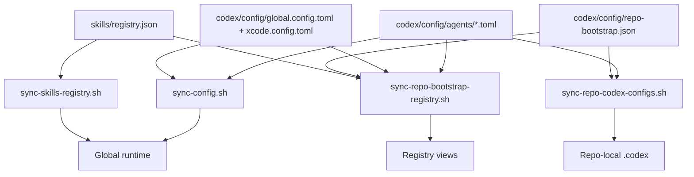

# Capability Bootstrap Model

This repo now has three capability families to bootstrap: skills, MCPs, and agents.

They should not all be modeled the same way. The clean split is:

- **skills** are capability bundles that mainly need an effective per-repo view
- **MCPs** are connection endpoints that need both per-repo assignment and scope-aware registry views
- **agents** are role definitions plus role assignments, so they need both a role-centric registry and a per-repo effective view

The design rule is simple: keep **definitions** canonical in `~/.agents`, keep **scope assignment** in the smallest registry that makes sense, and keep **runtime materialization** in sync scripts.

## Figure 1: Control-Plane Shape

## Skills

### Source of truth

- `skills/registry.json`

### Scope model

- `global`
- `repo`
- unmanaged `repo_local`

### Apply path

- `scripts/sync-skills-registry.sh`

### Generated views

- `docs/references/registry/skills.base`
- effective per-repo skill fields in `repo-bootstrap.base`

### Why this shape

Skills are mainly a **repo-facing capability surface**. The important question is usually:

> what skills are available in this repo right now?

That is why the effective per-repo view matters more than a separate skill-scope registry.

## MCPs

### Source of truth

- global MCP declarations in `codex/config/global.config.toml` and `codex/config/xcode.config.toml`
- repo MCP presets in `codex/config/repo-bootstrap.json`

### Scope model

- global terminal
- global Xcode
- repo
- mixed

### Apply path

- `codex/scripts/sync-config.sh` for global runtime MCPs
- `codex/scripts/sync-repo-codex-configs.sh` for repo-local MCPs

### Generated views

- per-repo MCP assignments in `repo-bootstrap.base`
- role-centric MCP scope registry in `mcp-registry.base`

### Why this shape

MCPs are endpoints and transports. The important questions are:

- which repos get this MCP?
- is this MCP global, repo-only, or mixed?

That is why MCPs need a separate scope-aware registry.

## Agents

### Source of truth

- durable global agent declarations in:
  - `codex/config/global.config.toml`
  - `codex/config/xcode.config.toml`
- canonical role behavior in:
  - `codex/config/agents/*.toml`
- repo-scoped agent assignment in:
  - `codex/config/repo-bootstrap.json`
    - `custom_agents`
    - `agent_presets`

### Scope model

- global terminal
- global Xcode
- repo-scoped custom agent
- mixed

### Apply path

- `codex/scripts/sync-config.sh` for global runtime role declarations and role files
- `codex/scripts/sync-repo-codex-configs.sh` for repo-local role declarations and repo-local `.codex/agents/*.toml`

### Generated views

- per-repo effective agent fields in `repo-bootstrap.base`
  - `global_agents`
  - `custom_agents`
  - `agents`
- role-centric scope and capability registry in `agent-registry.base`

### Why this shape

Agents have two different concerns:

1. **role behavior**
2. **where that role is enabled**

So the model separates:

- canonical role definition in `codex/config/agents/*.toml`
- global declaration in the managed global config templates
- repo-scoped exposure in `repo-bootstrap.json`

The important simplification is that agent capabilities stay on the role itself.
Repo bootstrap does not re-define per-agent MCP/tool policy.

## Working Rules

### 1. Keep canonical behavior in one place

- skill content stays in `skills-source/`
- MCP preset definitions stay in canonical config/registry files
- agent role behavior stays in `codex/config/agents/*.toml`

### 2. Put scope assignment in the narrowest correct registry

- skills: `skills/registry.json`
- MCP repo assignment: `repo-bootstrap.json`
- agent repo assignment: `repo-bootstrap.json`

### 3. Do not promote repo-specific roles globally too early

Global agents should stay minimal.

Use repo-scoped `custom_agents` when a role is:

- experimental
- workflow-specific
- tied to one repo’s tooling or operating style

### 4. Do not override built-in role names accidentally

Custom agent names must stay distinct from built-in Codex role names unless override is deliberate.

## Recommended mental model

- **Skills** answer: _what helper knowledge/capabilities are available here?_
- **MCPs** answer: _what external endpoints can this repo or runtime connect to?_
- **Agents** answer: _what specialized worker/reviewer/researcher roles can Codex spawn here?_

That is the clean structure to preserve.

## Related docs

- [Codex Control Plane](/Users/dobby/.agents/docs/architecture/codex-control-plane.md)
- [Codex Config Layers](/Users/dobby/.agents/docs/architecture/codex-config-layers.md)
- [Repo-Scoped Agent Bootstrap](/Users/dobby/.agents/docs/architecture/repo-scoped-agent-bootstrap.md)
- [Registry Views](/Users/dobby/.agents/docs/references/registry/AGENTS.md)
