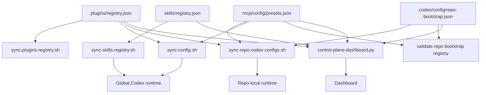

# Capability Bootstrap Model

This repo has three capability families: Codex plugins, standalone skills, and standalone MCPs.

Agent delegation is intentionally not modeled here. Codex can still spawn subagents through its native runtime behavior, but this control plane does not keep a registry of named agents or assign those agents to repos.

## Control-Plane Shape

```mermaid
flowchart TD
    P[plugins/registry.json]
    A[skills/registry.json]
    B[codex/config/repo-bootstrap.json]
    C[mcp/config/presets.json]
    PS[sync-plugins-registry.sh]
    E[sync-skills-registry.sh]
    F[sync-repo-codex-configs.sh]
    G[sync-config.sh]
    H[validate repo bootstrap registry]
    D[control-plane-dashboard.py]
    I[Global Codex runtime]
    J[Repo-local runtime]
    K[Dashboard]

    P --> PS
    P --> G
    P --> F
    P --> D
    A --> E
    A --> D
    B --> F
    B --> H
    B --> D
    C --> F
    C --> G
    C --> H
    C --> D
    E --> I
    F --> J
    G --> I
    D --> K
```

## Codex Plugins

Source of truth:

- `plugins/registry.json`

Plugins remain native Codex plugins. The registry supports `global`, `repo`, and `dormant` scope: global entries render into `~/.codex/config.toml`, repo entries render only into assigned repo `.codex/config.toml`, and dormant entries stay tracked without rendering. Bundled plugin discovery points at the marketplace inside `Codex.app`; the control plane only seeds the installed plugin cache for enabled bundled plugins. The control plane does not automatically split plugin packages into skill or MCP registries.

## Skills

Source of truth:

- `skills/registry.json`

Skills are standalone agent guidance. They can be global, repo-scoped, unmanaged repo-local, or explicitly linked from tracked plugin source through `managed_plugin_skills`. The dashboard shows effective skill availability per repo.

## MCPs

Source of truth:

- shared MCP preset definitions in `mcp/config/presets.json`
- repo MCP assignment in `codex/config/repo-bootstrap.json`

MCPs are standalone endpoints and transports. If a plugin contains MCP internally, that remains plugin-owned unless it is manually promoted into this registry.

## Working Rules

- Keep Codex plugin scope and state in `plugins/registry.json`.
- Keep skill content in `skills-source/`.
- Keep MCP preset definitions in `mcp/config/presets.json`.
- Keep repo inventory and repo MCP/default assignments in `codex/config/repo-bootstrap.json`.
- Do not automatically project plugin package contents into skills or MCPs.
- When a plugin capability must be reliable in one repo without enabling the native plugin globally, explicitly link its bundled skills through `skills/registry.json` `managed_plugin_skills` and promote any needed MCP server into `mcp/config/presets.json`.

## Related Docs

- [Codex Control Plane](/Users/dobby/GitHub/agents/docs/architecture/codex-control-plane.md)
- [Codex Config Layers](/Users/dobby/GitHub/agents/docs/architecture/codex-config-layers.md)
- [Control Plane Dashboard](/Users/dobby/GitHub/agents/docs/references/control-plane-dashboard.md)
