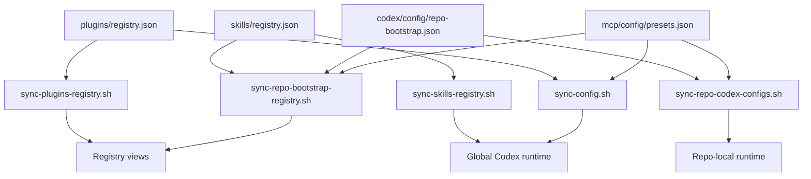

# Capability Bootstrap Model

This repo has three capability families: Codex plugins, standalone skills, and standalone MCPs.

Agent delegation is intentionally not modeled here. Codex and Claude can still spawn subagents through their native runtime behavior, but this control plane does not keep a registry of named agents or assign those agents to repos.

## Control-Plane Shape

```mermaid
flowchart TD
    P[plugins/registry.json]
    A[skills/registry.json]
    B[codex/config/repo-bootstrap.json]
    C[mcp/config/presets.json]
    PS[sync-plugins-registry.sh]
    E[sync-skills-registry.sh]
    F[sync-repo-codex-configs.sh]
    G[sync-config.sh]
    H[sync-repo-bootstrap-registry.sh]
    I[Global Codex runtime]
    J[Repo-local runtime]
    K[Registry views]

    P --> PS
    P --> G
    PS --> K
    A --> E
    A --> H
    B --> F
    B --> H
    C --> F
    C --> G
    C --> H
    E --> I
    F --> J
    G --> I
    H --> K
```

## Codex Plugins

Source of truth:

- `plugins/registry.json`

Plugins remain native Codex plugins. The registry renders plugin enable/disable state into Codex config; it does not split plugin packages into skill or MCP registries.

## Skills

Source of truth:

- `skills/registry.json`

Skills are standalone agent guidance. They can be global, repo-scoped, or unmanaged repo-local. The generated repo bootstrap views include effective skill availability per repo.

## MCPs

Source of truth:

- shared MCP preset definitions in `mcp/config/presets.json`
- repo MCP assignment in `codex/config/repo-bootstrap.json`

MCPs are standalone endpoints and transports. If a plugin contains MCP internally, that remains plugin-owned unless it is manually promoted into this registry.

## Working Rules

- Keep Codex plugin state in `plugins/registry.json`.
- Keep skill content in `skills-source/`.
- Keep MCP preset definitions in `mcp/config/presets.json`.
- Keep repo inventory and repo MCP/default assignments in `codex/config/repo-bootstrap.json`.
- Do not automatically project plugin package contents into skills or MCPs.

## Related Docs

- [Codex Control Plane](/Users/dobby/.agents/docs/architecture/codex-control-plane.md)
- [Codex Config Layers](/Users/dobby/.agents/docs/architecture/codex-config-layers.md)
- [Registry Views](/Users/dobby/.agents/docs/references/registry/AGENTS.md)
