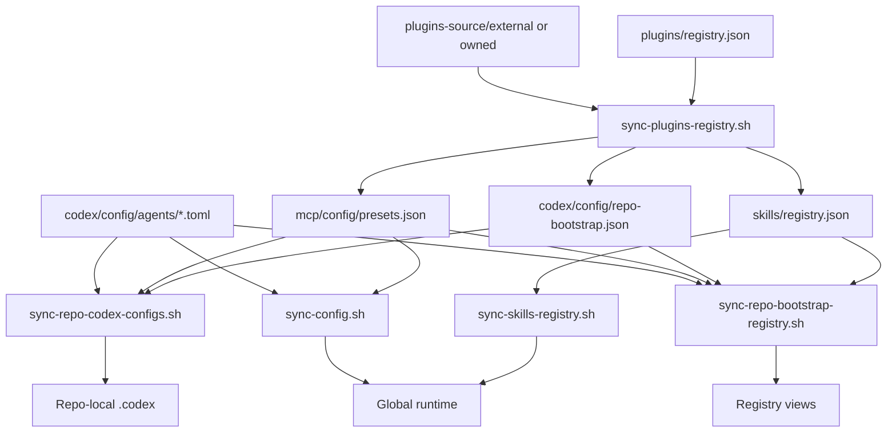

# Capability Bootstrap Model

This repo now has four capability families to think about: plugin source packages, skills, MCPs, and agents.

They should not all be modeled the same way. The clean split is:

- **plugin source packages** are upstream bundles that can feed other capability families
- **skills** are capability bundles that mainly need an effective per-repo view
- **MCPs** are connection endpoints that need both per-repo assignment and scope-aware registry views
- **agents** are role definitions plus role assignments, so they need both a role-centric registry and a per-repo effective view

The design rule is simple: keep **definitions** canonical in `~/.agents`, keep **scope assignment** in the smallest registry that makes sense, and keep **runtime materialization** in sync scripts.

## Figure 1: Control-Plane Shape

```mermaid
flowchart TD
    P[plugins/registry.json]
    P2[plugins-source/external or owned]
    A[skills/registry.json]
    B[codex/config/repo-bootstrap.json]
    C[mcp/config/presets.json]
    D[codex/config/agents/*.toml]
    PS[sync-plugins-registry.sh]
    E[sync-skills-registry.sh]
    F[sync-repo-codex-configs.sh]
    G[sync-config.sh]
    H[sync-repo-bootstrap-registry.sh]
    I[Global runtime]
    J[Repo-local .codex]
    K[Registry views]

    P --> PS
    P2 --> PS
    PS --> A
    PS --> B
    PS --> C
    A --> E
    A --> H
    B --> F
    B --> H
    C --> F
    C --> G
    C --> H
    D --> F
    D --> G
    D --> H
    E --> I
    F --> J
    G --> I
    H --> K
```

## Plugin Source Packages

### Source of truth

- `plugins/registry.json`
- canonical mirrored or owned source in `plugins-source/`

### Scope model

- source packages can be `external` or `owned`
- extracted skills can be `global` or `repo`
- extracted MCP can be `global` or `repo`

### Apply path

- `scripts/refresh-external-plugins.sh`
- `scripts/sync-plugins-registry.sh`

### Generated views

- `docs/references/registry/plugins.base`
- `docs/references/registry/plugins-items/`

### Why this shape

Plugins are not the runtime abstraction in this control plane.

The important question is:

> what durable capabilities should this upstream bundle contribute to the normal skills and MCP flows?

That is why plugin source packages feed the other registries instead of becoming a separate runtime install system.

## Skills

### Source of truth

- `skills/registry.json`

### Scope model

- `global`
- `repo`
- unmanaged `repo_local`

### Apply path

- `scripts/sync-skills-registry.sh`

### Generated views

- `docs/references/registry/skills.base`
- effective per-repo skill fields in `repo-bootstrap.base`

### Why this shape

Skills are mainly a **repo-facing capability surface**. The important question is usually:

> what skills are available in this repo right now?

That is why the effective per-repo view matters more than a separate skill-scope registry.

## MCPs

### Source of truth

- shared MCP preset definitions in `mcp/config/presets.json`
- repo MCP assignment in `codex/config/repo-bootstrap.json`

### Scope model

- global terminal
- global Xcode
- repo
- mixed

### Apply path

- `codex/scripts/sync-config.sh` for global runtime MCPs
- `codex/scripts/sync-repo-codex-configs.sh` for repo-local MCPs

### Generated views

- per-repo MCP assignments in `repo-bootstrap.base`
- role-centric MCP scope registry in `mcp-registry.base`

### Why this shape

MCPs are endpoints and transports. The important questions are:

- which repos get this MCP?
- is this MCP global, repo-only, or mixed?

That is why MCPs need a separate scope-aware registry.

## Agents

### Source of truth

- shared agent exposure in:
  - `agents/registry.json`
- canonical role behavior in:
  - `codex/config/agents/*.toml`
- canonical Claude prompt bodies in:
  - `claude/config/agents/*.md`
- repo inventory in:
  - `codex/config/repo-bootstrap.json`

### Scope model

- global terminal
- global Xcode
- global Claude
- repo-scoped agent

### Apply path

- `codex/scripts/sync-config.sh` for global runtime role declarations and role files
- `codex/scripts/sync-repo-codex-configs.sh` for repo-local role declarations and repo-local `.codex/agents/*.toml`
- `claude/scripts/sync-subagents.sh` for global and repo Claude `.claude/agents/*.md`

### Generated views

- per-repo effective agent fields in `repo-bootstrap.base`
  - `global_agents`
  - `custom_agents`
  - `agents`
- role-centric scope and capability registry in `agent-registry.base`

### Why this shape

Agents have two different concerns:

1. **role behavior**
2. **where that role is enabled**

So the model separates:

- canonical role definition in `codex/config/agents/*.toml`
- canonical Claude prompt definition in `claude/config/agents/*.md`
- shared exposure in `agents/registry.json`
- repo inventory in `repo-bootstrap.json`

The important simplification is that agent capabilities stay on the role itself.
Repo bootstrap does not re-define per-agent MCP/tool policy.

## Working Rules

### 1. Keep canonical behavior in one place

- plugin source stays in `plugins-source/`
- skill content stays in `skills-source/`
- MCP preset definitions stay in `mcp/config/presets.json`
- agent role behavior stays in `codex/config/agents/*.toml`

### 2. Put scope assignment in the narrowest correct registry

- skills: `skills/registry.json`
- MCP repo assignment: `repo-bootstrap.json`
- agent repo assignment: `agents/registry.json`

### 3. Do not promote repo-specific roles globally too early

Global agents should stay minimal.

Use repo-scoped managed agents when a role is:

- experimental
- workflow-specific
- tied to one repo’s tooling or operating style

### 4. Do not override built-in role names accidentally

Custom agent names must stay distinct from built-in Codex role names unless override is deliberate.

## Recommended mental model

- **Skills** answer: _what helper knowledge/capabilities are available here?_
- **Plugin source packages** answer: _what upstream bundle should feed the shared skills/MCP system?_
- **MCPs** answer: _what external endpoints can this repo or runtime connect to?_
- **Agents** answer: _what specialized worker/reviewer/researcher roles can Codex spawn here?_

That is the clean structure to preserve.

## Related docs

- [Codex Control Plane](/Users/dobby/.agents/docs/architecture/codex-control-plane.md)
- [Codex Config Layers](/Users/dobby/.agents/docs/architecture/codex-config-layers.md)
- [Repo-Scoped Agent Bootstrap](/Users/dobby/.agents/docs/architecture/repo-scoped-agent-bootstrap.md)
- [Registry Views](/Users/dobby/.agents/docs/references/registry/AGENTS.md)
