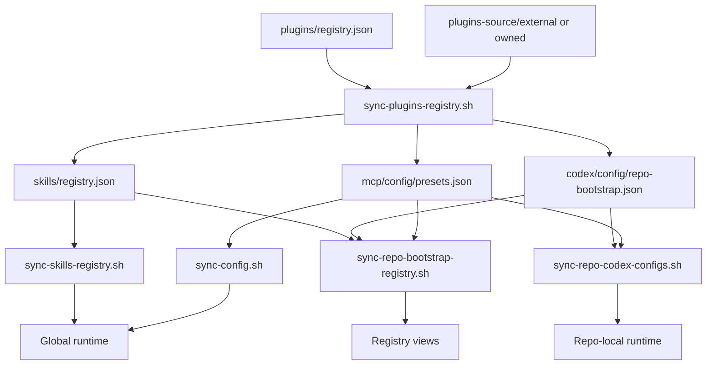

# Capability Bootstrap Model

This repo now has three managed capability families: plugin source packages, skills, and MCPs.

Agent delegation is intentionally not modeled here anymore. Codex and Claude can still spawn subagents through their native runtime behavior, but this control plane no longer keeps a registry of named agents or assigns those agents to individual repos.

## Control-Plane Shape

```mermaid
flowchart TD
    P[plugins/registry.json]
    P2[plugins-source/external or owned]
    A[skills/registry.json]
    B[codex/config/repo-bootstrap.json]
    C[mcp/config/presets.json]
    PS[sync-plugins-registry.sh]
    E[sync-skills-registry.sh]
    F[sync-repo-codex-configs.sh]
    G[sync-config.sh]
    H[sync-repo-bootstrap-registry.sh]
    I[Global runtime]
    J[Repo-local runtime]
    K[Registry views]

    P --> PS
    P2 --> PS
    PS --> A
    PS --> B
    PS --> C
    A --> E
    A --> H
    B --> F
    B --> H
    C --> F
    C --> G
    C --> H
    E --> I
    F --> J
    G --> I
    H --> K
```

## Plugin Source Packages

Source of truth:

- `plugins/registry.json`
- canonical mirrored or owned source in `plugins-source/`

Plugins are upstream bundles that can feed normal skills and MCP flows. They are not a separate runtime install system.

## Skills

Source of truth:

- `skills/registry.json`

Skills can be global, repo-scoped, or unmanaged repo-local. The generated repo bootstrap views include effective skill availability per repo.

## MCPs

Source of truth:

- shared MCP preset definitions in `mcp/config/presets.json`
- repo MCP assignment in `codex/config/repo-bootstrap.json`

MCPs are endpoints and transports. The registry views answer which repos get which MCPs, and whether an MCP is global, repo-only, or mixed.

## Agents

There is no managed agent bootstrap layer.

Do not add a new `agents/registry.json`, repo-scoped subagent assignment map, or generated `.codex/agents` / `.claude/agents` materialization path unless there is a concrete new need. The default is to let the runtime delegate naturally when a task benefits from subagents.

## Working Rules

- Keep plugin source in `plugins-source/`.
- Keep skill content in `skills-source/`.
- Keep MCP preset definitions in `mcp/config/presets.json`.
- Keep repo inventory and repo MCP/default assignments in `codex/config/repo-bootstrap.json`.
- Do not track which subagent belongs to which repo in this control plane.

## Related Docs

- [Codex Control Plane](/Users/dobby/.agents/docs/architecture/codex-control-plane.md)
- [Codex Config Layers](/Users/dobby/.agents/docs/architecture/codex-config-layers.md)
- [Registry Views](/Users/dobby/.agents/docs/references/registry/AGENTS.md)
