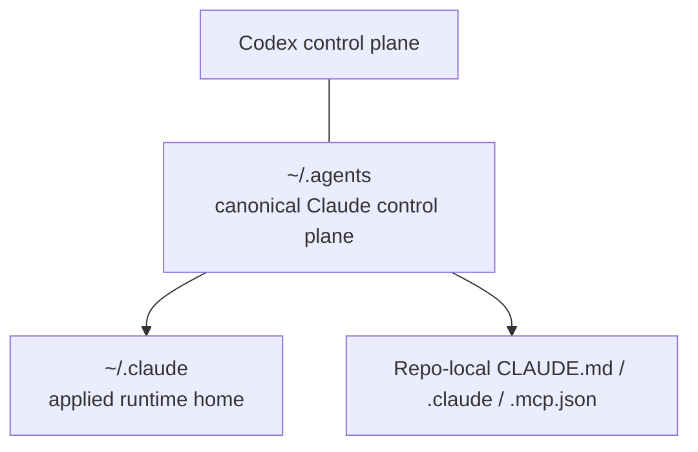

# Claude Control Plane

This repo now carries a sibling personal control plane for Claude. The rule is the same one used for Codex: keep durable source in `~/.agents`, keep the applied runtime in `~/.claude`, and keep repo-local behavior close to the repo that needs it.

The first pass is local-only and generic. It does not try to solve the `adi` `soul.md` prompt override yet.

## Figure 1: Ownership Layout

```mermaid
flowchart TD
    A[~/.agents<br/>canonical Claude control plane]
    B[~/.claude<br/>applied runtime home]
    C[Repo-local CLAUDE.md / .claude / .mcp.json]
    D[Codex control plane]

    A --> B
    A --> C
    D --- A
```

## Main Parts

### `~/.agents/claude`

Owns the canonical Claude bootstrap inputs:

- `config/global.claude.md`
- `config/settings.json`
- `config/bootstrap.json`
- `scripts/` for stable shell entrypoints
- `control_plane/` for the importable Python renderer and validation modules behind those entrypoints

Shared inputs Claude reads from outside `claude/`:

- `../codex/config/repo-bootstrap.json`
- `../agents/registry.json`
- `../mcp/config/presets.json`
- `../skills/registry.json`
- shared machine-facing wrappers in `../scripts/`

### `~/.claude`

Owns the applied local runtime state:

- `CLAUDE.md`
- `settings.json`
- `settings.local.json`
- `skills/`
- `agents/`
- `*.json` runtime caches and history

### Repo-local files

The generic project contract is:

- root `CLAUDE.md` containing `@AGENTS.md`
- nested `CLAUDE.md` containing `@AGENTS.md` wherever nested `AGENTS.md` exists
- `.claude/settings.json`
- `.mcp.json`
- `.claude/skills/`
- `.claude/agents/`

`AGENTS.md` remains the shared repo instruction source. `CLAUDE.md` is only the compatibility entrypoint.

## Layering

Claude has both global and project layers:

- global `~/.claude/CLAUDE.md`
- global `~/.claude/settings.json`
- global `~/.claude.json` for user MCP/runtime state
- project `CLAUDE.md`
- project `.claude/settings.json`
- project `.mcp.json`
- project `.claude/skills/`
- global `~/.claude/agents/`
- project `.claude/agents/`

The first pass keeps the same permissive default posture at both scopes where Anthropic allows it:

- `permissions.defaultMode = "bypassPermissions"`
- `sandbox.enabled = false`
- `skipDangerousModePermissionPrompt = true` at user/global scope

## First-Pass Scope

This baseline includes:

- root and nested `CLAUDE.md` import files for generic repo compatibility
- permissive Claude settings
- project MCP via `.mcp.json`
- global MCP via `~/.claude.json`
- global and project skills
- global and project subagents rendered from the shared agent registry

This baseline intentionally defers:

- host/runtime `systemPrompt` replacement parity
- VS Code cloud/remote agent behavior
- any repo-specific Claude prompt override that would fork the generic model

## Model

The mental model is:

1. `AGENTS.md` stays the shared repo contract.
2. Claude compatibility is added on top of it.
3. `~/.agents/claude/` defines the managed canonical inputs.
4. `~/.agents/agents/registry.json` defines which shared agents should materialize in Claude.
5. Shared machine-facing apply enters through `~/.agents/scripts/bootstrap-machine-agent-control-planes.sh` or `~/.agents/scripts/auto-apply-agent-control-planes.sh`.
6. `~/.claude/` is the applied machine state.

That keeps Claude as a sibling control plane, not a replacement for the existing Codex bootstrap.

## Related Docs

- [Claude Control Plane Operations](/Users/dobby/.agents/docs/references/claude-control-plane-operations.md)
- [Anthropic Settings Research](/Users/dobby/.agents/docs/projects/claude-control-plane-bootstrap/resources/anthropic-settings-research.md)
- [Anthropic Agent Surfaces Research](/Users/dobby/.agents/docs/projects/claude-control-plane-bootstrap/resources/anthropic-agent-surfaces.md)
