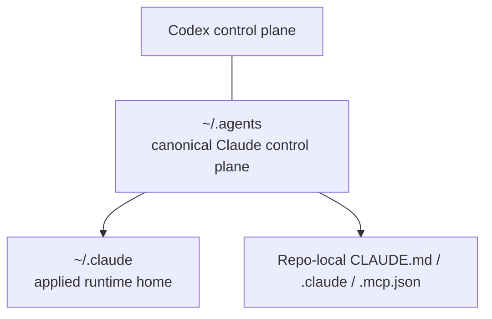

# Claude Control Plane

This repo carries a sibling personal control plane for Claude. The rule is the same one used for Codex: keep durable source in `~/.agents`, keep the applied runtime in `~/.claude`, and keep repo-local behavior close to the repo that needs it.

The current baseline is local-first and generic. Repo-specific prompt overrides stay explicit follow-up work rather than becoming part of the shared default.

## Figure 1: Ownership Layout

```mermaid
flowchart TD
    A[~/.agents<br/>canonical Claude control plane]
    B[~/.claude<br/>applied runtime home]
    C[Repo-local CLAUDE.md / .claude / .mcp.json]
    D[Codex control plane]

    A --> B
    A --> C
    D --- A
```

## Main Parts

### `~/.agents/claude`

Owns the canonical Claude bootstrap inputs:

- `config/global.claude.md`, a symlink alias to `../codex/config/global.agents.md`
- `config/settings.json`
- `config/bootstrap.json`
- `scripts/` for stable shell entrypoints
- `control_plane/` for the importable Python renderer and validation modules behind those entrypoints

Shared inputs Claude reads from outside `claude/`:

- `../codex/config/global.agents.md`
- `../codex/config/repo-bootstrap.json`
- `../agents/registry.json`
- `../hooks/registry.json`
- `../mcp/config/presets.json`
- `../skills/registry.json`
- shared machine-facing wrappers in `../scripts/`

### `~/.claude`

Owns the applied local runtime state:

- `CLAUDE.md`
- `settings.json`
- `settings.local.json`
- `skills/`
- `agents/`
- `*.json` runtime caches and history

### Repo-local files

The generic project contract is:

- root `CLAUDE.md` containing `@AGENTS.md`
- nested `CLAUDE.md` containing `@AGENTS.md` wherever nested `AGENTS.md` exists
- `.claude/settings.json`
- `.mcp.json`
- `.claude/skills/`
- `.claude/agents/`

`AGENTS.md` remains the shared repo instruction source. `CLAUDE.md` is only the compatibility entrypoint.

## Layering

Claude has both global and project layers:

- global `~/.claude/CLAUDE.md`
- global `~/.claude/settings.json`
- global `~/.claude.json` for user MCP/runtime state
- project `CLAUDE.md`
- project `.claude/settings.json`
- project `.mcp.json`
- project `.claude/skills/`
- global `~/.claude/agents/`
- project `.claude/agents/`

Managed lifecycle hooks render into project `.claude/settings.json` when
`hooks/registry.json` assigns them to that repo. Current global Claude settings
stay generic.

The baseline keeps the same permissive default posture at both scopes where Anthropic allows it:

- `permissions.defaultMode = "bypassPermissions"`
- `sandbox.enabled = false`
- `skipDangerousModePermissionPrompt = true` at user/global scope

## Baseline Scope

This baseline includes:

- root and nested `CLAUDE.md` import files for generic repo compatibility
- permissive Claude settings
- project MCP via `.mcp.json`
- global MCP via `~/.claude.json`
- global and project skills
- global and project subagents rendered from the shared agent registry

This baseline intentionally defers:

- host/runtime `systemPrompt` replacement parity
- VS Code cloud/remote agent behavior
- any repo-specific Claude prompt override that would fork the generic model

## Model

The mental model is:

1. `codex/config/global.agents.md` stays the shared global machine guidance.
2. `AGENTS.md` stays the shared repo contract.
3. Claude compatibility is added on top of those shared sources.
4. `~/.agents/claude/` defines Claude-specific managed inputs such as settings, MCP, skills, and subagents.
5. `~/.agents/agents/registry.json` defines which shared agents should materialize in Claude.
6. Shared machine-facing apply enters through `~/.agents/scripts/bootstrap-machine-agent-control-planes.sh` or `~/.agents/scripts/auto-apply-agent-control-planes.sh`.
7. `~/.claude/` is the applied machine state.

That keeps Claude as a sibling control plane, not a replacement for the existing Codex bootstrap.

## Related Docs

- [Claude Control Plane Operations](/Users/dobby/.agents/docs/references/claude-control-plane-operations.md)
- [Unified Codex And Claude Agent Model](/Users/dobby/.agents/docs/architecture/unified-codex-claude-agent-model.md)
