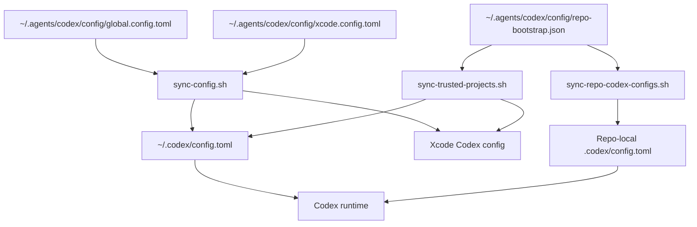

# Codex Config Layers

This page explains how Codex config is layered in this setup.

The short version is: canonical config lives in `~/.agents`, live machine config lives in `~/.codex`, and repo-specific behavior lives in repo-local `.codex/config.toml`. The important detail is that trusted repo-local config is additive, while the machine config sync is managed from templates.

## Figure 1: Config Layers

## Main Parts

### Canonical Templates

- `global.config.toml` defines the managed baseline for terminal Codex.
- `xcode.config.toml` defines the managed baseline for Xcode Codex.
- `config/agents/*.toml` defines managed role-specific overrides for custom multi-agent roles such as `external_researcher`, plus the canonical role behavior files reused by repo-scoped roles.
  - built-in `explorer` remains available upstream for local repo and runtime exploration.
  - `external_researcher` is the managed custom role for information outside the local repo and runtime, using docs, MCP servers, skills, and web sources as needed.
  - repo-scoped roles such as `visual_reviewer` are assigned from `repo-bootstrap.json` and materialized into repo-local `.codex/agents/` folders instead of being enabled globally.
- `repo-bootstrap.json` defines:
  - which repos are managed
  - which MCP presets each repo gets
  - optional per-repo model, reasoning, and service-tier overrides

These files are the source of truth.

### Live Machine Config

- `sync-config.sh` writes the managed baseline into `~/.codex/config.toml` and Xcode Codex config.
- `sync-config.sh` also syncs managed role config files into `~/.codex/agents/` and the Xcode Codex runtime `agents/` folder so relative `config_file` paths resolve from the live runtime config.
- It preserves machine-specific/runtime-specific state that should not live in git.
- It also prunes stale managed keys when the canonical template no longer wants them, including global terminal MCP server sections that are no longer declared in the canonical template.

Example:
- `service_tier = "fast"` used to be in the canonical templates.
- After removing it from the templates, `sync-config.sh` now removes stale top-level copies from the live configs.

### Trusted Repo Config

- `sync-trusted-projects.sh` writes exact trusted repo roots into the live machine configs.
- That matters because repo-local `.codex/config.toml` is only loaded when the repo is trusted.

So trust sync is part of config layering, not a separate unrelated feature.

### Repo-Local Config

- `sync-repo-codex-configs.sh` generates repo-local `.codex/config.toml` files from `repo-bootstrap.json`.
- Most repos can have a minimal managed file with no repo-local overrides.
- Some repos get MCP presets or later model-specific overrides.
- `sync-repo-bootstrap-registry.sh` regenerates user-facing Obsidian views for the same registry under [`docs/references/registry/`](/Users/dobby/.agents/docs/references/registry) so the current repo assignments stay visible in Obsidian, including effective skills merged from [`skills/registry.json`](/Users/dobby/.agents/skills/registry.json).
  - the per-repo view now includes:
    - `global_agents`
    - `custom_agents`
    - `agents`
  - and the generated registry now also includes a role-centric [`agent-registry.base`](/Users/dobby/.agents/docs/references/registry/agent-registry.base)

Current per-repo fields in `repo-bootstrap.json`:
- `mcp_presets`
- `custom_agents`
- `model`
- `model_reasoning_effort`
- `service_tier`
- `notes`

Additional shared bootstrap metadata in `repo-bootstrap.json`:
- `agent_presets`

## Main Flow

1. Edit canonical config in `~/.agents/codex/config/`.
2. Run `sync-config.sh` to update live machine config.
3. Run `sync-trusted-projects.sh` so Codex will load repo-local config for managed repos.
4. Run `sync-repo-codex-configs.sh` to render repo-local `.codex/config.toml` files.
5. Codex starts with `~/.codex/config.toml` and layers trusted repo-local config on top.

## Notes

- Use `docs/architecture/` to understand the shape of the system.
- Use [Capability Bootstrap Model](/Users/dobby/.agents/docs/architecture/capability-bootstrap-model.md) for the consolidated skills / MCPs / agents model.
- Use [Codex Control Plane Operations](/Users/dobby/.agents/docs/references/codex-control-plane-operations.md) for exact commands.
- Use [Codex Control Plane Ownership](/Users/dobby/.agents/docs/references/codex-control-plane-ownership.md) for the keep/move/generate split.
