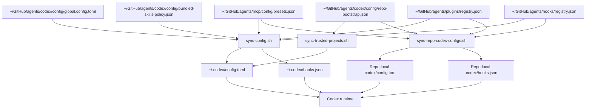

# Codex Config Layers

This page explains how Codex config is layered in this setup.

The short version: canonical Codex config inputs live in `~/GitHub/agents`, live machine config lives in `~/.codex`, Codex user-scope skills live in `~/.agents/skills`, and repo-specific behavior lives in repo-local `.codex/config.toml` plus `.codex/hooks.json`.

## Figure 1: Config Layers

```mermaid
flowchart TD
    A["~/GitHub/agents/codex/config/global.config.toml"]
    C["~/GitHub/agents/codex/config/repo-bootstrap.json"]
    D["~/GitHub/agents/mcp/config/presets.json"]
    P["~/GitHub/agents/plugins/registry.json"]
    H["~/GitHub/agents/hooks/registry.json"]
    L["~/GitHub/agents/codex/config/bundled-skills-policy.json"]
    K["sync-config.sh"]
    T["sync-trusted-projects.sh"]
    R["sync-repo-codex-configs.sh"]
    G["~/.codex/config.toml"]
    J["~/.codex/hooks.json"]
    I["Repo-local .codex/config.toml"]
    Q["Repo-local .codex/hooks.json"]
    Z["Codex runtime"]

    A --> K
    L --> K
    D --> K
    P --> K
    H --> K
    C --> T
    C --> R
    D --> R
    P --> R
    H --> R
    K --> G
    K --> J
    T --> G
    R --> I
    R --> Q
    G --> Z
    J --> Z
    I --> Z
    Q --> Z
```

## Canonical Templates

- `codex/config/global.config.toml` defines the managed baseline for terminal Codex.
- `codex/config/bundled-skills-policy.json` classifies OpenAI-bundled runtime skills as allowed or disabled so upstream bundled skills cannot silently drift into the local control plane.
- `mcp/config/presets.json` defines shared MCP presets and machine-wide global MCP defaults.
- `plugins/registry.json` defines native Codex plugin scope and enable/disable state.
- `hooks/registry.json` defines shared lifecycle hooks rendered into global and repo-local Codex hook files.
- `codex/config/repo-bootstrap.json` defines managed repos, trust behavior, repo MCP presets, and optional per-repo model/personality/service-tier overrides.

## Live Machine Config

- `codex/scripts/sync-config.sh` writes the managed baseline into `~/.codex/config.toml`.
- It also renders Xcode Codex parity into `~/Library/Developer/Xcode/CodingAssistant/codex/config.toml` and `rules/xcode.rules`, preserving Xcode-owned MCP/session/tool blocks.
- It seeds Xcode's own coding-assistant no-prompt permission default so Xcode conversations match terminal Codex's `approval_policy = "never"` stance.
- When normal Codex file-based credentials exist, it links Xcode Codex `auth.json` and `.credentials.json` back to `~/.codex/auth.json` and `~/.codex/.credentials.json` instead of copying secrets.
- It preserves machine-specific and runtime-specific state that should not live in git.
- It renders global-scope native Codex plugin entries from `plugins/registry.json`.
- It writes disabled bundled-skill entries from `bundled-skills-policy.json`.
- It renders global `~/.codex/hooks.json` from `hooks/registry.json`.
- It prunes stale managed keys when canonical templates no longer want them.

## Trusted Repo Config

- `codex/scripts/sync-trusted-projects.sh` writes exact trusted repo roots into the live machine config.
- Managed repo entries can set `codex_trust: false` to keep repo-local generated files and hook management while removing the repo from global Codex trusted-project config.
- Repo-local `.codex/config.toml` is only loaded when the repo is trusted.

## Repo-Local Config

- `codex/scripts/sync-repo-codex-configs.sh` generates repo-local `.codex/config.toml` files from `repo-bootstrap.json`, shared MCP presets, and plugin assignments.
- The same script renders repo-local `.codex/hooks.json` for repo-scoped hooks.
- Most repos can have a minimal managed file with no repo-local overrides.
- Some repos get MCP presets, model overrides, or project-root markers.
- `scripts/control-plane-dashboard.py` serves the same registry data through the local dashboard, including effective plugins from [`plugins/registry.json`](/Users/dobby/GitHub/agents/plugins/registry.json) and effective skills from [`skills/registry.json`](/Users/dobby/GitHub/agents/skills/registry.json).

Current per-repo fields in `repo-bootstrap.json`:

- `codex_trust`
- `mcp_presets`
- `model`
- `model_auto_compact_token_limit`
- `model_reasoning_effort`
- `model_verbosity`
- `personality`
- `model_instructions_file`
- `developer_instructions`
- `project_root_markers`
- `features`
- `service_tier`

## Main Flow

1. Edit canonical config in `~/GitHub/agents/codex/config/`, `~/GitHub/agents/mcp/`, `~/GitHub/agents/plugins/`, or `~/GitHub/agents/hooks/`.
2. Run `~/GitHub/agents/codex/scripts/bootstrap-machine-codex.sh --apply` for Codex-only apply, or `~/GitHub/agents/scripts/bootstrap-machine-agent-control-planes.sh --apply` for all client surfaces.
3. Codex starts with `~/.codex/config.toml` and layers trusted repo-local config on top.

## Notes

- `~/.agents/skills` is part of Codex skill discovery, not the canonical config tree.
- Use [Capability Bootstrap Model](/Users/dobby/GitHub/agents/docs/architecture/capability-bootstrap-model.md) for the consolidated skills / MCPs model.
- Use [Codex Control Plane Operations](/Users/dobby/GitHub/agents/docs/references/codex-control-plane-operations.md) for exact commands.
- Use [Codex Control Plane Ownership](/Users/dobby/GitHub/agents/docs/references/codex-control-plane-ownership.md) for the keep/move/generate split.
