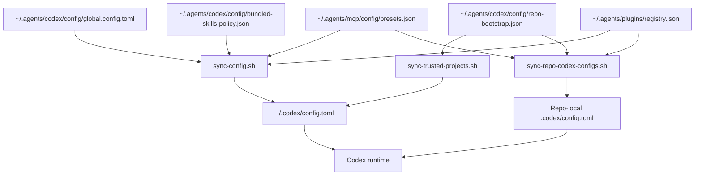

# Codex Config Layers

This page explains how Codex config is layered in this setup.

The short version is: canonical config lives in `~/.agents`, live machine config lives in `~/.codex`, and repo-specific behavior lives in repo-local `.codex/config.toml`. The important detail is that trusted repo-local config is additive, while the machine config sync is managed from templates.

## Figure 1: Config Layers

```mermaid
flowchart TD
    A[~/.agents/codex/config/global.config.toml]
    C[~/.agents/codex/config/repo-bootstrap.json]
    D[~/.agents/mcp/config/presets.json]
    P[~/.agents/plugins/registry.json]
    L[~/.agents/codex/config/bundled-skills-policy.json]
    E[sync-trusted-projects.sh]
    F[sync-repo-codex-configs.sh]
    K[sync-config.sh]
    G[~/.codex/config.toml]
    I[Repo-local .codex/config.toml]
    J[Codex runtime]

    A --> K
    L --> K
    C --> E
    C --> F
    D --> K
    D --> F
    P --> K
    P --> F
    K --> G
    E --> G
    F --> I
    G --> J
    I --> J
```

## Main Parts

### Canonical Templates

- `global.config.toml` defines the managed baseline for terminal Codex.
- `bundled-skills-policy.json` classifies OpenAI-bundled runtime skills as allowed or disabled so new upstream bundled skills cannot silently drift into the local control plane.
- `../mcp/config/presets.json` defines the shared MCP presets and machine-wide global MCP defaults.
- `../../plugins/registry.json` defines native Codex plugin scope and enable/disable state.
- `repo-bootstrap.json` defines:
  - which repos are managed
  - which MCP presets each repo gets
  - optional per-repo model, reasoning, and service-tier overrides

These files are the source of truth.

### Live Machine Config

- `sync-config.sh` writes the managed baseline into `~/.codex/config.toml`.
- `sync-config.sh` prunes stale managed agent role declarations and role files from older versions of this control plane.
- It preserves machine-specific/runtime-specific state that should not live in git.
- It renders only global-scope native Codex plugin entries from `plugins/registry.json` and writes disabled bundled-skill entries from `bundled-skills-policy.json`.
- It points Codex at the native bundled plugin marketplace inside `Codex.app` and only seeds `~/.codex/plugins/cache` for bundled plugins that are explicitly enabled by the registry.
- It also prunes stale managed keys when the canonical templates no longer want them, while preserving unrelated runtime MCP sections and only injecting the shared global MCP defaults.

Example:
- If a top-level key is removed from the canonical templates, `sync-config.sh` removes stale managed copies from the live configs.

### Trusted Repo Config

- `sync-trusted-projects.sh` writes exact trusted repo roots into the live machine config.
- That matters because repo-local `.codex/config.toml` is only loaded when the repo is trusted.

So trust sync is part of config layering, not a separate unrelated feature.

### Repo-Local Config

- `sync-repo-codex-configs.sh` generates repo-local `.codex/config.toml` files from `repo-bootstrap.json`, shared MCP presets, and repo-scoped plugin assignments from `plugins/registry.json`.
- Most repos can have a minimal managed file with no repo-local overrides.
- Some repos get MCP presets or later model-specific overrides.
- `control-plane-dashboard.py` serves the same registry data through the local dashboard, including effective plugins from [`plugins/registry.json`](/Users/dobby/.agents/plugins/registry.json) and effective skills from [`skills/registry.json`](/Users/dobby/.agents/skills/registry.json).

Current per-repo fields in `repo-bootstrap.json`:
- `mcp_presets`
- `model`
- `model_auto_compact_token_limit`
- `model_reasoning_effort`
- `model_verbosity`
- `personality`
- `model_instructions_file`
- `developer_instructions`
- `project_root_markers`
- `features`
- `service_tier`

Shared MCP definitions live in `mcp/config/presets.json`.

Bundled Codex runtime skill policy lives in `codex/config/bundled-skills-policy.json`.

## Main Flow

1. Edit canonical config in `~/.agents/codex/config/`.
2. Run `sync-config.sh` to update live machine config.
3. Run `sync-trusted-projects.sh` so Codex will load repo-local config for managed repos.
4. Run `sync-repo-codex-configs.sh` to render repo-local `.codex/config.toml` files.
5. Codex starts with `~/.codex/config.toml` and layers trusted repo-local config on top.

## Notes

- Use `docs/architecture/` to understand the shape of the system.
- Use [Capability Bootstrap Model](/Users/dobby/.agents/docs/architecture/capability-bootstrap-model.md) for the consolidated skills / MCPs model.
- Use [Codex Control Plane Operations](/Users/dobby/.agents/docs/references/codex-control-plane-operations.md) for exact commands.
- Use [Codex Control Plane Ownership](/Users/dobby/.agents/docs/references/codex-control-plane-ownership.md) for the keep/move/generate split.
