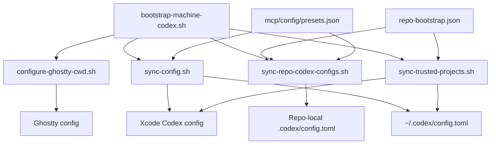
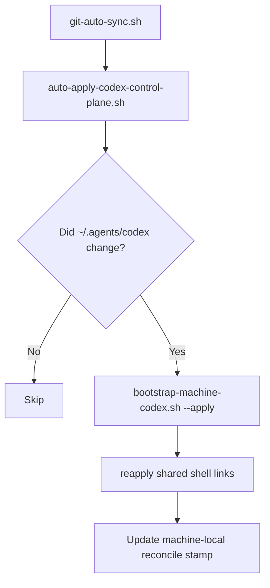
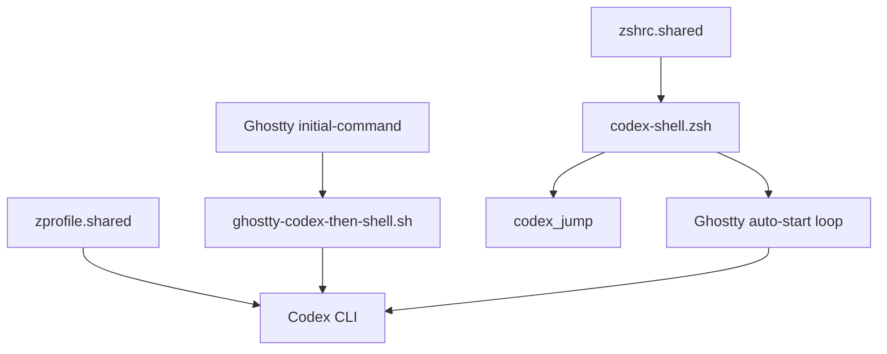
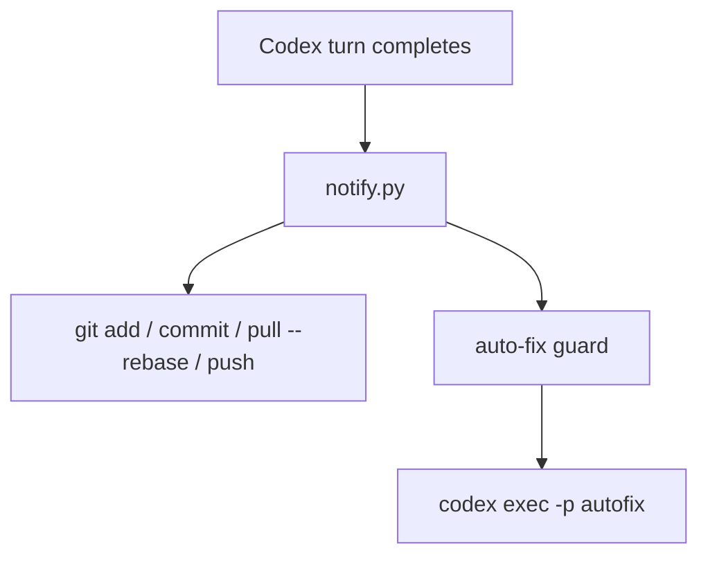
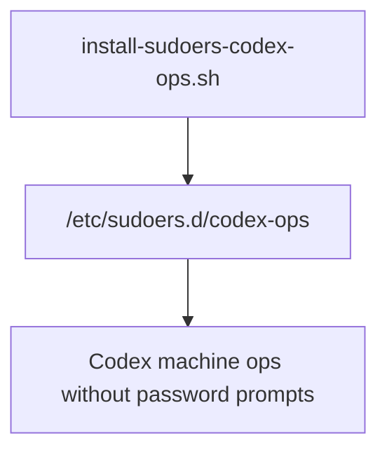

# Codex Control Plane Script Flows

This page breaks the Codex control-plane scripts into smaller figures.

Use [Codex Control Plane](/Users/dobby/.agents/docs/architecture/codex-control-plane.md) for the top-level system shape.
Use [Codex Control Plane Operations](/Users/dobby/.agents/docs/references/codex-control-plane-operations.md) for exact commands and checks.

## Overview

The scripts are easier to understand if you split them into three groups:

- apply scripts that write config and trust state
- post-sync reconcile scripts that auto-apply new control-plane revisions
- startup scripts that shape the terminal and Ghostty experience
- post-turn scripts that run after Codex finishes a turn

## Figure 1: Apply Scripts

### What This Group Does

- [`bootstrap-machine-codex.sh`](/Users/dobby/.agents/codex/scripts/bootstrap-machine-codex.sh)
  - orchestrates the main Codex-specific bootstrap batch
- [`sync-config.sh`](/Users/dobby/.agents/codex/scripts/sync-config.sh)
  - writes the managed terminal and Xcode Codex config
  - injects machine-wide global MCP servers from [`mcp/config/presets.json`](/Users/dobby/.agents/mcp/config/presets.json)
- [`sync-trusted-projects.sh`](/Users/dobby/.agents/codex/scripts/sync-trusted-projects.sh)
  - writes exact trust entries for discovered Git repos
- [`sync-repo-codex-configs.sh`](/Users/dobby/.agents/codex/scripts/sync-repo-codex-configs.sh)
  - renders managed repo-local `.codex/config.toml` files for all registered repos
  - also materializes repo-local `.codex/agents/*.toml` files for assigned repo-scoped custom agents
  - resolves repo MCP presets through [`mcp/config/presets.json`](/Users/dobby/.agents/mcp/config/presets.json)
- [`repo-bootstrap.json`](/Users/dobby/.agents/codex/config/repo-bootstrap.json)
  - defines the managed repo set, repo MCP assignment, repo-scoped custom agents, and per-repo model/service-tier/reasoning overrides
- [`configure-ghostty-cwd.sh`](/Users/dobby/.agents/codex/scripts/configure-ghostty-cwd.sh)
  - rewrites Ghostty config so Codex startup and cwd handling stay consistent

## Figure 2: Post-Sync Reconcile

### What This Group Does

- [`git-auto-sync.sh`](/Users/dobby/GitHub/scripts/sync/git-auto-sync.sh)
  - remains the launchd-driven machine sync loop in the generic `scripts` repo
- [`auto-apply-codex-control-plane.sh`](/Users/dobby/.agents/codex/scripts/auto-apply-codex-control-plane.sh)
  - checks whether the current `~/.agents` revision contains new Codex control-plane changes since the last successful reconcile on that machine
  - runs the full Codex bootstrap only when needed
  - keeps a machine-local stamp under `~/.local/state/codex-control-plane/`
  - the surrounding `~/GitHub/scripts/sync/git-auto-sync.sh` loop also reapplies the shared `~/.zshrc` and `~/.zprofile` links after the Codex auto-apply step

## Figure 3: Shell And Startup Scripts

### What This Group Does

- [`zshrc.shared`](/Users/dobby/GitHub/scripts/setup/codex/zshrc.shared)
  - generic shared shell file that sources the Codex shell fragment
- [`zprofile.shared`](/Users/dobby/GitHub/scripts/setup/codex/zprofile.shared)
  - shared login-shell bootstrap that hydrates machine-local shared env and trusted repo-local env for `zsh -lc` shells
- [`codex-shell.zsh`](/Users/dobby/.agents/codex/shell/codex-shell.zsh)
  - defines Codex shell behavior such as the jump picker and Ghostty auto-start logic
- [`ghostty-codex-then-shell.sh`](/Users/dobby/.agents/codex/scripts/ghostty-codex-then-shell.sh)
  - runs Codex first, then falls back to a normal login shell
- [`link-shared-zshrc.sh`](/Users/dobby/GitHub/scripts/setup/codex/link-shared-zshrc.sh)
  - links `~/.zshrc` to the tracked shared shell file
- [`link-shared-zprofile.sh`](/Users/dobby/GitHub/scripts/setup/codex/link-shared-zprofile.sh)
  - links `~/.zprofile` to the tracked shared login-shell file

## Figure 4: Post-Turn Automation

### What This Group Does

- [`notify.py`](/Users/dobby/.agents/codex/scripts/notify.py)
  - runs after a Codex turn and automates the git loop
- [`notify-wrapper.sh`](/Users/dobby/.agents/codex/scripts/notify-wrapper.sh)
  - thin shell entrypoint that logs and calls `notify.py`

## Figure 5: Optional Machine Policy Script

### What This Script Does

- [`install-sudoers-codex-ops.sh`](/Users/dobby/.agents/codex/scripts/install-sudoers-codex-ops.sh)
  - installs the narrow sudo policy used by Codex machine-ops workflows

## Reading Order

If you want the fastest mental model, read in this order:

1. [Codex Control Plane](/Users/dobby/.agents/docs/architecture/codex-control-plane.md)
2. [Codex Control Plane Script Flows](/Users/dobby/.agents/docs/architecture/codex-control-plane-script-flows.md)
3. [Codex Control Plane Operations](/Users/dobby/.agents/docs/references/codex-control-plane-operations.md)
