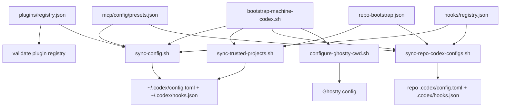
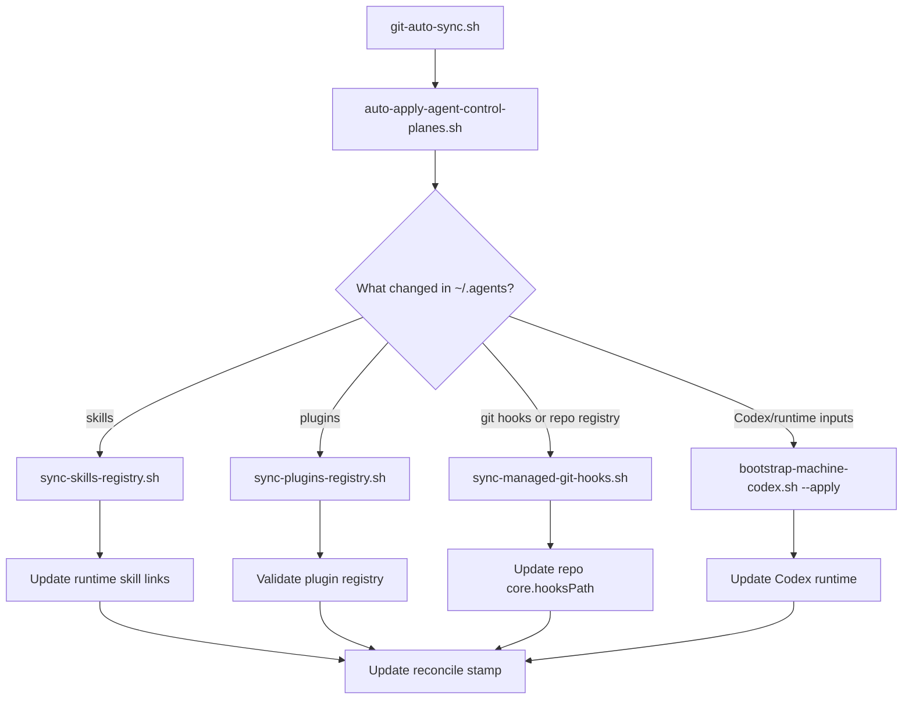
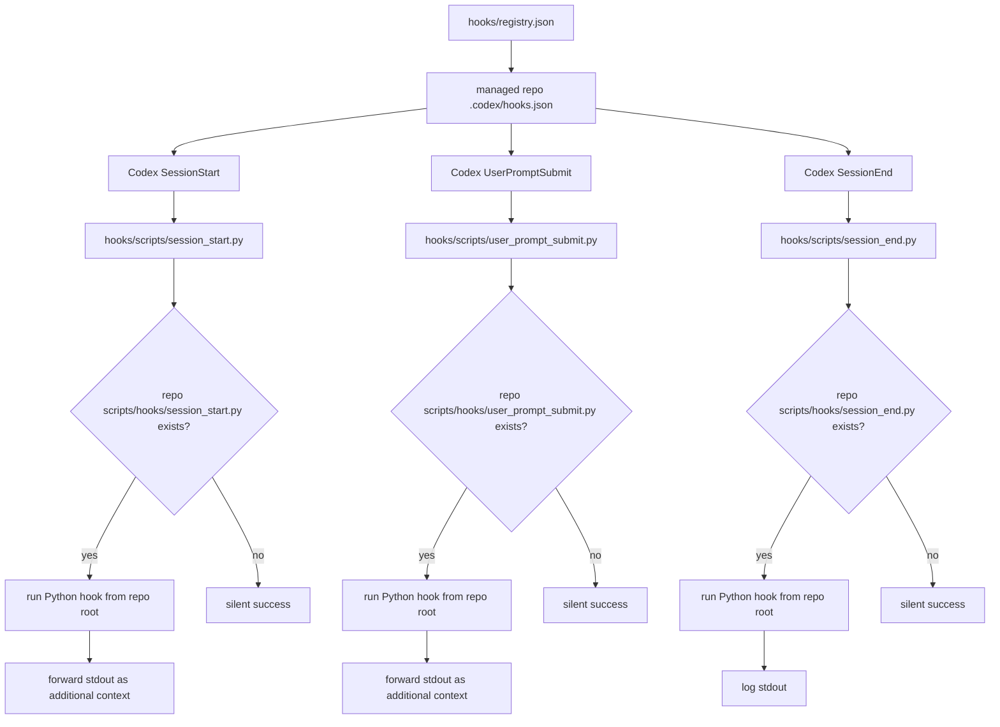
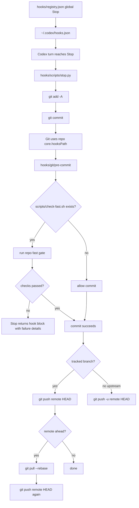

# Codex Control Plane Script Flows

This page breaks the Codex control-plane scripts into a few small flows. Use
[Codex Control Plane](/Users/dobby/.agents/docs/architecture/codex-control-plane.md)
for the top-level system shape and
[Codex Control Plane Operations](/Users/dobby/.agents/docs/references/codex-control-plane-operations.md)
for exact commands.

## Apply Flow

```mermaid
flowchart TD
    P["plugins/registry.json"] --> Q["validate plugin registry"]
    P --> B["sync-config.sh"]
    A["bootstrap-machine-codex.sh"] --> B
    A --> C["sync-trusted-projects.sh"]
    A --> D["sync-repo-codex-configs.sh"]
    A --> E["configure-ghostty-cwd.sh"]
    R["repo-bootstrap.json"] --> C
    R --> D
    M["mcp/config/presets.json"] --> B
    M --> D
    H["hooks/registry.json"] --> B
    H --> D
    B --> F["~/.codex/config.toml + ~/.codex/hooks.json"]
    C --> F
    D --> G["repo .codex/config.toml + .codex/hooks.json"]
    E --> I["Ghostty config"]
```

Main scripts:

- `codex/scripts/bootstrap-machine-codex.sh`: Codex-specific bootstrap batch.
- `codex/scripts/sync-config.sh`: global Codex config, global hooks, MCPs, and global plugins.
- `codex/scripts/sync-repo-codex-configs.sh`: managed repo `.codex/config.toml` and `.codex/hooks.json`.
- `scripts/sync-plugins-registry.sh`: validates the plugin registry.
- `codex/config/repo-bootstrap.json`: managed repo set and repo-local Codex overrides.

## Post-Sync Reconcile

```mermaid
flowchart TD
    A["git-auto-sync.sh"] --> B["auto-apply-agent-control-planes.sh"]
    B --> C{"What changed in ~/.agents?"}
    C -->|"skills"| D["sync-skills-registry.sh"]
    C -->|"plugins"| E["sync-plugins-registry.sh"]
    C -->|"git hooks or repo registry"| F["sync-managed-git-hooks.sh"]
    C -->|"Codex/runtime inputs"| G["bootstrap-machine-codex.sh --apply"]
    D --> H["Update runtime skill links"]
    E --> I["Validate plugin registry"]
    F --> J["Update repo core.hooksPath"]
    G --> K["Update Codex runtime"]
    H --> L["Update reconcile stamp"]
    I --> L
    J --> L
    K --> L
```

`scripts/auto-apply-agent-control-planes.sh` keeps a machine-local stamp under
`~/.local/state/agents-control-plane/` so each machine can apply only changes it
has not already reconciled.

## Session And Prompt Dispatch

```mermaid
flowchart TD
    A["hooks/registry.json"] --> B["managed repo .codex/hooks.json"]
    B --> C["Codex SessionStart"]
    C --> D["hooks/scripts/session_start.py"]
    D --> E{"repo scripts/hooks/session_start.py exists?"}
    E -->|"yes"| F["run Python hook from repo root"]
    F --> G["forward stdout as additional context"]
    E -->|"no"| H["silent success"]

    B --> I["Codex UserPromptSubmit"]
    I --> J["hooks/scripts/user_prompt_submit.py"]
    J --> K{"repo scripts/hooks/user_prompt_submit.py exists?"}
    K -->|"yes"| L["run Python hook from repo root"]
    L --> M["forward stdout as additional context"]
    K -->|"no"| N["silent success"]


    B --> U["Codex SessionEnd"]
    U --> V["hooks/scripts/session_end.py"]
    V --> W{"repo scripts/hooks/session_end.py exists?"}
    W -->|"yes"| X["run Python hook from repo root"]
    X --> Y["log stdout"]
    W -->|"no"| Z["silent success"]
```

The shared dispatcher resolves the git root from the hook payload `cwd`, passes a
normalized JSON payload to the repo hook on stdin, and sets
`AGENT_HOOK_EVENT`, `AGENT_HOOK_RUNTIME`, `AGENT_REPO_ROOT`, and
`AGENT_HOOK_SCHEMA_VERSION`.

## Post-Turn Automation

```mermaid
flowchart TD
    A["hooks/registry.json global Stop"] --> B["~/.codex/hooks.json"]
    B --> C["Codex turn reaches Stop"]
    C --> D["hooks/scripts/stop.py"]
    D --> E["git add -A"]
    E --> F["git commit"]
    F --> G["Git uses repo core.hooksPath"]
    G --> H["hooks/git/pre-commit"]
    H --> I{"scripts/check-fast.sh exists?"}
    I -->|"yes"| J["run repo fast gate"]
    I -->|"no"| K["allow commit"]
    J --> L{"checks passed?"}
    L -->|"no"| M["Stop returns hook block with failure details"]
    L -->|"yes"| N["commit succeeds"]
    K --> N
    N --> O{"tracked branch?"}
    O -->|"yes"| P["git push remote HEAD"]
    P --> Q{"remote ahead?"}
    Q -->|"yes"| R["git pull --rebase"]
    R --> S["git push remote HEAD again"]
    Q -->|"no"| T["done"]
    O -->|"no upstream"| U["git push -u remote HEAD"]
```

`scripts/check-fast.sh` is the repo-owned fast commit gate for agent-made
changes. Put slower repo-wide validation in `scripts/check-full.sh` or another
explicit command.
