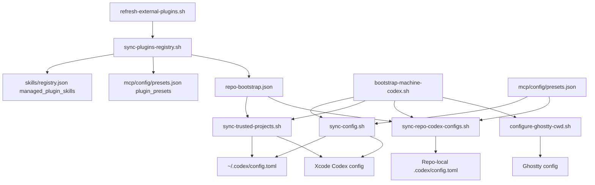
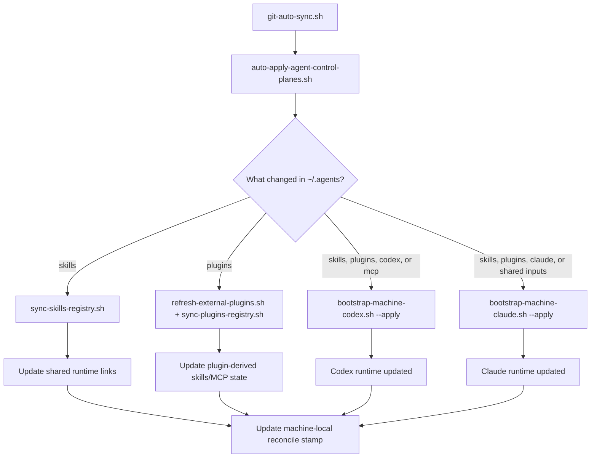
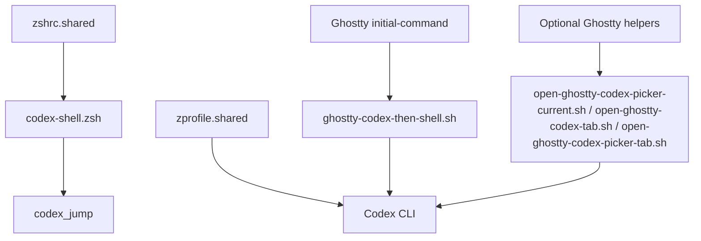
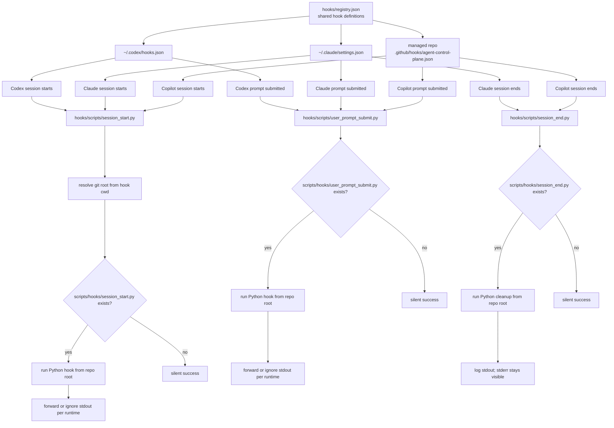
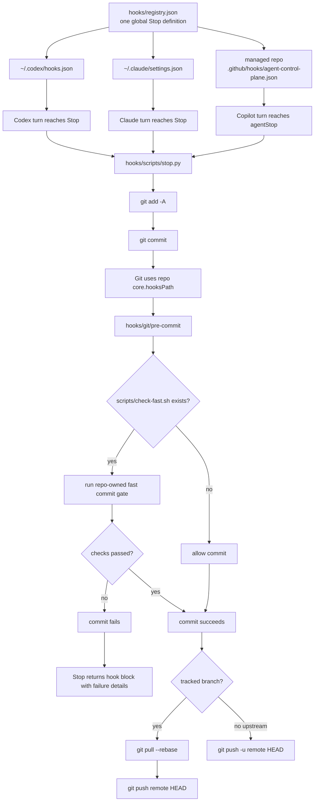
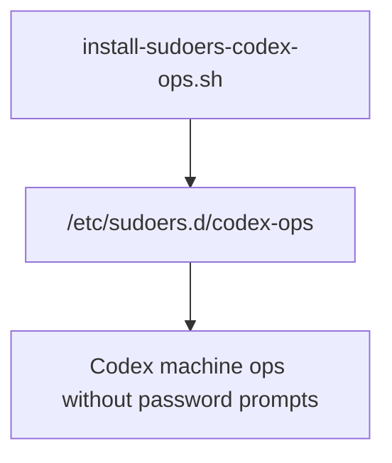

# Codex Control Plane Script Flows

This page breaks the Codex control-plane scripts into smaller figures.

Use [Codex Control Plane](/Users/dobby/.agents/docs/architecture/codex-control-plane.md) for the top-level system shape.
Use [Codex Control Plane Operations](/Users/dobby/.agents/docs/references/codex-control-plane-operations.md) for exact commands and checks.

## Overview

The scripts are easier to understand if you split them into three groups:

- plugin-source refresh/sync scripts that feed skills and MCP
- apply scripts that write config and trust state
- post-sync reconcile scripts that auto-apply new control-plane revisions
- startup scripts that shape the terminal and Ghostty experience
- shared hook scripts that run at session start, prompt submit, turn stop, and supported session end events

## Figure 1: Plugin Source And Apply Scripts

```mermaid
flowchart TD
    P[refresh-external-plugins.sh] --> Q[sync-plugins-registry.sh]
    Q --> S[skills/registry.json managed_plugin_skills]
    Q --> T[mcp/config/presets.json plugin_presets]
    Q --> R[repo-bootstrap.json plugin_mcp_presets]
    A[bootstrap-machine-codex.sh] --> B[sync-config.sh]
    A --> C[sync-trusted-projects.sh]
    A --> D[sync-repo-codex-configs.sh]
    A --> E[configure-ghostty-cwd.sh]
    R[repo-bootstrap.json] --> C
    R --> D
    M[mcp/config/presets.json] --> B
    M --> D
    B --> F[~/.codex/config.toml]
    B --> G[Xcode Codex config]
    C --> F
    C --> G
    D --> H[Repo-local .codex/config.toml]
    E --> I[Ghostty config]
```

### What This Group Does

- [`refresh-external-plugins.sh`](/Users/dobby/.agents/scripts/refresh-external-plugins.sh)
  - refreshes mirrored plugin source under `plugins-source/external/`
- [`sync-plugins-registry.sh`](/Users/dobby/.agents/scripts/sync-plugins-registry.sh)
  - validates `plugins/registry.json`
  - writes plugin registry views
  - derives plugin-provided skills into `skills/registry.json`
  - derives plugin-provided MCP presets into `mcp/config/presets.json`
  - derives repo MCP assignments into `codex/config/repo-bootstrap.json`
- [`bootstrap-machine-codex.sh`](/Users/dobby/.agents/codex/scripts/bootstrap-machine-codex.sh)
  - orchestrates the main Codex-specific bootstrap batch
- [`sync-config.sh`](/Users/dobby/.agents/codex/scripts/sync-config.sh)
  - writes the managed terminal and Xcode Codex config
  - injects machine-wide global MCP servers from [`mcp/config/presets.json`](/Users/dobby/.agents/mcp/config/presets.json)
- [`sync-trusted-projects.sh`](/Users/dobby/.agents/codex/scripts/sync-trusted-projects.sh)
  - writes exact trust entries for discovered Git repos
- [`sync-repo-codex-configs.sh`](/Users/dobby/.agents/codex/scripts/sync-repo-codex-configs.sh)
  - renders managed repo-local `.codex/config.toml` files for all registered repos
  - also materializes repo-local `.codex/agents/*.toml` files for assigned repo-scoped custom agents
  - resolves repo MCP presets through [`mcp/config/presets.json`](/Users/dobby/.agents/mcp/config/presets.json)
- [`repo-bootstrap.json`](/Users/dobby/.agents/codex/config/repo-bootstrap.json)
  - defines the managed repo set, repo MCP assignment, repo-scoped custom agents, and per-repo model/service-tier/reasoning overrides
- [`configure-ghostty-cwd.sh`](/Users/dobby/.agents/codex/scripts/configure-ghostty-cwd.sh)
  - rewrites Ghostty config so Codex startup and cwd handling stay consistent

## Figure 2: Post-Sync Reconcile

```mermaid
flowchart TD
    A[git-auto-sync.sh] --> B[auto-apply-agent-control-planes.sh]
    B --> C{What changed in ~/.agents?}
    C -->|skills| D[sync-skills-registry.sh]
    C -->|plugins| P[refresh-external-plugins.sh + sync-plugins-registry.sh]
    C -->|skills, plugins, codex, or mcp| E[bootstrap-machine-codex.sh --apply]
    C -->|skills, plugins, claude, or shared inputs| F[bootstrap-machine-claude.sh --apply]
    D --> G[Update shared runtime links]
    P --> G2[Update plugin-derived skills/MCP state]
    E --> H[Codex runtime updated]
    F --> I[Claude runtime updated]
    G --> J[Update machine-local reconcile stamp]
    G2 --> J
    H --> J
    I --> J
```

### What This Group Does

- [`git-auto-sync.sh`](/Users/dobby/GitHub/scripts/sync/git-auto-sync.sh)
  - remains the launchd-driven machine sync loop in the generic `scripts` repo
- [`auto-apply-agent-control-planes.sh`](/Users/dobby/.agents/scripts/auto-apply-agent-control-planes.sh)
  - checks whether the current `~/.agents` revision contains new runtime-relevant shared control-plane changes since the last successful reconcile on that machine
  - runs the minimum shared apply steps needed for skills, Codex, and Claude
  - keeps a machine-local stamp under `~/.local/state/agents-control-plane/`
  - the surrounding `~/GitHub/scripts/sync/git-auto-sync.sh` loop also reapplies the shared `~/.zshrc` and `~/.zprofile` links after the shared agent reconcile step
- [`auto-apply-codex-control-plane.sh`](/Users/dobby/.agents/codex/scripts/auto-apply-codex-control-plane.sh)
  - remains the lower-level Codex-only reconcile helper for targeted Codex-only troubleshooting or component-scoped automation

## Figure 3: Shell And Startup Scripts

```mermaid
flowchart TD
    A[zshrc.shared] --> B[codex-shell.zsh]
    A2[zprofile.shared] --> G[Codex CLI]
    C[Ghostty initial-command] --> D[ghostty-codex-then-shell.sh]
    B --> E[codex_jump]
    H[Optional Ghostty helpers] --> I[open-ghostty-codex-picker-current.sh / open-ghostty-codex-tab.sh / open-ghostty-codex-picker-tab.sh]
    D --> G[Codex CLI]
    I --> G
```

### What This Group Does

- [`zshrc.shared`](/Users/dobby/GitHub/scripts/setup/codex/zshrc.shared)
  - generic shared shell file that sources the Codex shell fragment
- [`zprofile.shared`](/Users/dobby/GitHub/scripts/setup/codex/zprofile.shared)
  - shared login-shell bootstrap that hydrates machine-local shared env and trusted repo-local env for `zsh -lc` shells
- [`codex-shell.zsh`](/Users/dobby/.agents/codex/shell/codex-shell.zsh)
  - defines Codex shell behavior such as the jump picker and Ghostty auto-start logic
- [`ghostty-codex-then-shell.sh`](/Users/dobby/.agents/codex/scripts/ghostty-codex-then-shell.sh)
  - runs Codex first, then falls back to a normal login shell
- [`link-shared-zshrc.sh`](/Users/dobby/GitHub/scripts/setup/codex/link-shared-zshrc.sh)
  - links `~/.zshrc` to the tracked shared shell file
- [`link-shared-zprofile.sh`](/Users/dobby/GitHub/scripts/setup/codex/link-shared-zprofile.sh)
  - links `~/.zprofile` to the tracked shared login-shell file

## Figure 4: Session And Prompt Dispatch

One global hook registry renders native hook files for each client surface. Codex and Claude use global runtime config; GitHub Copilot uses repo-local `.github/hooks/agent-control-plane.json` files in managed repos. The shared dispatchers stay generic: repo-specific context or cleanup lives in optional repo-owned scripts.

```mermaid
flowchart TD
    A[hooks/registry.json<br/>shared hook definitions] --> B[~/.codex/hooks.json]
    A --> C[~/.claude/settings.json]
    A --> Y[managed repo<br/>.github/hooks/agent-control-plane.json]
    B --> D[Codex session starts]
    C --> E[Claude session starts]
    Y --> Z[Copilot session starts]
    D --> F[hooks/scripts/session_start.py]
    E --> F
    Z --> F
    F --> G[resolve git root from hook cwd]
    G --> H{scripts/hooks/session_start.py exists?}
    H -->|yes| I[run Python hook from repo root]
    I --> J[forward or ignore stdout per runtime]
    H -->|no| K[silent success]
    B --> L[Codex prompt submitted]
    C --> M[Claude prompt submitted]
    Y --> M2[Copilot prompt submitted]
    L --> N[hooks/scripts/user_prompt_submit.py]
    M --> N
    M2 --> N
    N --> O{scripts/hooks/user_prompt_submit.py exists?}
    O -->|yes| P[run Python hook from repo root]
    P --> Q[forward or ignore stdout per runtime]
    O -->|no| R[silent success]
    C --> S[Claude session ends]
    Y --> S2[Copilot session ends]
    S --> T[hooks/scripts/session_end.py]
    S2 --> T
    T --> U{scripts/hooks/session_end.py exists?}
    U -->|yes| V[run Python cleanup from repo root]
    V --> W[log stdout; stderr stays visible]
    U -->|no| X[silent success]
```

### What This Group Does

- [`session_start.py`](/Users/dobby/.agents/hooks/scripts/session_start.py)
  - runs as the shared Codex, Claude, and GitHub Copilot `SessionStart` hook
  - resolves the current git root from the hook payload `cwd`
  - runs repo-owned `scripts/hooks/session_start.py` when present
  - passes a normalized JSON adapter payload to the repo Python hook on stdin; the original runtime payload is kept under `raw_payload`
  - sets `AGENT_HOOK_EVENT`, `AGENT_HOOK_RUNTIME`, `AGENT_REPO_ROOT`, and `AGENT_HOOK_SCHEMA_VERSION`
  - forwards repo script stdout as startup context for runtimes that process it, capped at a rough `30000` token budget (`120000` characters); Copilot currently ignores `sessionStart` output
- [`user_prompt_submit.py`](/Users/dobby/.agents/hooks/scripts/user_prompt_submit.py)
  - runs as the shared Codex, Claude, and GitHub Copilot prompt-submit hook
  - runs repo-owned `scripts/hooks/user_prompt_submit.py` when present
  - passes the same normalized JSON adapter payload shape, with `hook_event_name=UserPromptSubmit`
  - forwards repo script stdout as additional prompt context for runtimes that process it, capped at a rough `30000` token budget (`120000` characters); Copilot currently ignores `userPromptSubmitted` output
- [`session_end.py`](/Users/dobby/.agents/hooks/scripts/session_end.py)
  - runs as the shared Claude and GitHub Copilot `SessionEnd` hook
  - runs repo-owned `scripts/hooks/session_end.py` when present
  - passes the same normalized JSON adapter payload shape, with `hook_event_name=SessionEnd`
  - logs repo script stdout instead of injecting context because the session is ending
- `scripts/hooks/session_start.py`
  - optional repo-owned startup context command
  - should stay fast, deterministic, and non-interactive
  - should print only the context the agent should receive at session start
- `scripts/hooks/user_prompt_submit.py`
  - optional repo-owned prompt context command
  - should stay fast, deterministic, and non-interactive
  - should print only context that should be added before processing that prompt
- `scripts/hooks/session_end.py`
  - optional Claude and GitHub Copilot cleanup command
  - should stay fast and local because it runs while the agent exits the session

## Figure 5: Post-Turn Automation

One global `Stop` hook definition is rendered into Codex and Claude as `Stop`, and into GitHub Copilot as `agentStop`. This is the shared turn-stop hook. It owns turn finalization, while each repo owns its fast commit gate through `scripts/check-fast.sh`.

```mermaid
flowchart TD
    A[hooks/registry.json<br/>one global Stop definition] --> B[~/.codex/hooks.json]
    A --> C[~/.claude/settings.json]
    A --> Y[managed repo<br/>.github/hooks/agent-control-plane.json]
    B --> D[Codex turn reaches Stop]
    C --> E[Claude turn reaches Stop]
    Y --> E2[Copilot turn reaches agentStop]
    D --> F[hooks/scripts/stop.py]
    E --> F
    E2 --> F
    F --> G[git add -A]
    G --> H[git commit]
    H --> I[Git uses repo core.hooksPath]
    I --> J[hooks/git/pre-commit]
    J --> K{scripts/check-fast.sh exists?}
    K -->|yes| L[run repo-owned fast commit gate]
    K -->|no| M[allow commit]
    L --> N{checks passed?}
    N -->|no| O[commit fails]
    O --> P[Stop returns hook block with failure details]
    N -->|yes| Q[commit succeeds]
    M --> Q
    Q --> R{tracked branch?}
    R -->|yes| S[git pull --rebase]
    S --> T[git push remote HEAD]
    R -->|no upstream| U[git push -u remote HEAD]
```

### What This Group Does

- [`stop.py`](/Users/dobby/.agents/hooks/scripts/stop.py)
  - runs as the shared turn-stop hook for Codex, Claude, and GitHub Copilot
  - stages all repo changes and runs `git commit`
  - does not directly call repo validation; Git calls the shared local hook because managed repos set `core.hooksPath` to [`hooks/git/`](/Users/dobby/.agents/hooks/git)
  - if commit checks fail, returns hook continuation JSON with the failure output so the current agent can fix it
  - for tracked branches, commits then runs `git pull --rebase` followed by push
  - for brand-new local branches without upstream tracking, uses `git push -u <remote> HEAD` to establish upstream automatically
- [`hooks/git/pre-commit`](/Users/dobby/.agents/hooks/git/pre-commit)
  - shared local Git hook used by managed repos
  - delegates to repo-owned `scripts/check-fast.sh` when present
  - exits successfully when a repo has no `scripts/check-fast.sh`
- `scripts/check-fast.sh`
  - repo-owned fast commit gate for agent-made changes
  - should contain fast deterministic checks that answer whether the commit is acceptable
  - should not become a general after-turn lifecycle hook; use a future explicit lifecycle hook for non-validation side effects
- Hook dispatch scripts:
  - `session_start.py` runs optional repo-owned `scripts/hooks/session_start.py`
  - `user_prompt_submit.py` runs optional repo-owned `scripts/hooks/user_prompt_submit.py`
  - `session_end.py` runs optional Claude and GitHub Copilot repo-owned `scripts/hooks/session_end.py`

## Figure 6: Optional Machine Policy Script

```mermaid
flowchart TD
    A[install-sudoers-codex-ops.sh] --> B["/etc/sudoers.d/codex-ops"]
    B --> C[Codex machine ops without password prompts]
```

### What This Script Does

- [`install-sudoers-codex-ops.sh`](/Users/dobby/.agents/codex/scripts/install-sudoers-codex-ops.sh)
  - installs the narrow sudo policy used by Codex machine-ops workflows

## Reading Order

If you want the fastest mental model, read in this order:

1. [Codex Control Plane](/Users/dobby/.agents/docs/architecture/codex-control-plane.md)
2. [Codex Control Plane Script Flows](/Users/dobby/.agents/docs/architecture/codex-control-plane-script-flows.md)
3. [Codex Control Plane Operations](/Users/dobby/.agents/docs/references/codex-control-plane-operations.md)
