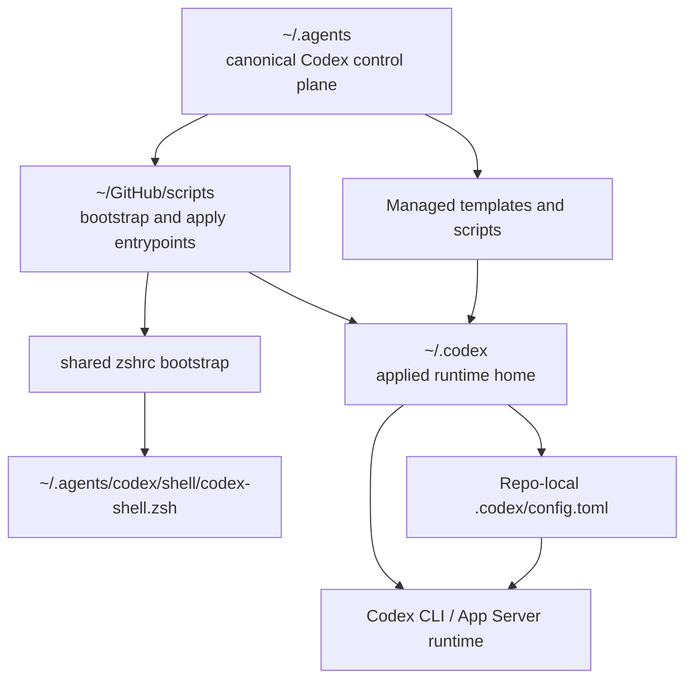

# Codex Control Plane

This repo is becoming the canonical personal control plane for Codex across both machines. The core idea is simple: keep the durable source of truth in `~/.agents`, keep the live runtime home in `~/.codex`, and keep `~/GitHub/scripts` limited to generic machine bootstrap plus shared shell glue that is not Codex-owned.

That split keeps Codex-specific policy, MCP presets, skills, docs, and managed scripts in one synced place without pretending that auth, sessions, logs, or runtime databases belong in git.

## Main Parts

### `~/.agents`

Owns the durable, synced source of truth for Codex-specific setup:

- managed config fragments and presets
- Codex-specific scripts and wrappers
- skills, references, and architecture docs
- migration and ownership documentation

This is the repo a future agent should edit first when changing personal Codex behavior across machines.

### `~/GitHub/scripts`

Owns only generic machine bootstrap and shared shell glue that is broader than Codex:

- machine-wide setup flows
- non-Codex launchd/install helpers
- shared shell files that source Codex fragments from `~/.agents`

This repo should remain useful for bootstrapping a fresh machine, but it should stop owning Codex-specific wrappers, templates, and policy.

### `~/.codex`

Owns applied runtime state and generated live configuration:

- live `config.toml`
- auth/session/history/log/cache/db state
- runtime-installed skills and generated artifacts
- any scripts that must exist at runtime because Codex points to them directly

`~/.codex` is where Codex runs, not where the long-term design should live.

### Repo-local `.codex/`

Owns project-specific Codex overrides when a repo needs different behavior:

- repo MCP enablement
- repo-local tool or app toggles
- project-specific model or trust settings

These settings stay close to the repo because they describe how Codex should behave in that repo, not across the whole machine.

## Main Flow

1. Canonical Codex policy and assets are edited in `~/.agents`.
2. Generic machine bootstrap can call into that control plane when needed.
3. Those commands apply managed outputs into `~/.codex`.
4. Codex starts from `~/.codex/config.toml` and any trusted repo-local `.codex/config.toml`.
5. Repo-local overrides refine behavior for one project without changing the global control plane.

## Key Boundaries

- Canonical and sync-worthy belongs in `~/.agents`.
- Applied runtime and volatile state belongs in `~/.codex`.
- Generic machine bootstrap belongs in `~/GitHub/scripts`.
- Repo-specific Codex behavior belongs in repo-local `.codex/`.

## Notes

- `~/.codex` can remain git-tracked temporarily during migration, but the target mental model should still treat it as an applied runtime home.
- If a file must exist under `~/.codex` for Codex to call it directly, the preferred pattern is to keep the canonical source in `~/.agents` and sync or link it into place.
- Deeper keep / move / generate decisions live in the ownership reference.

See [Codex Control Plane Ownership](/Users/dobby/.agents/docs/references/codex-control-plane-ownership.md) for the exact split.
