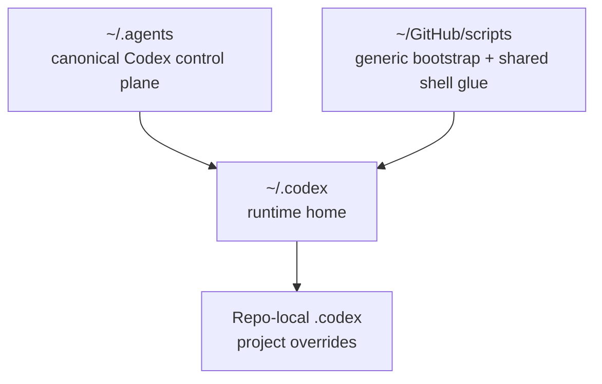
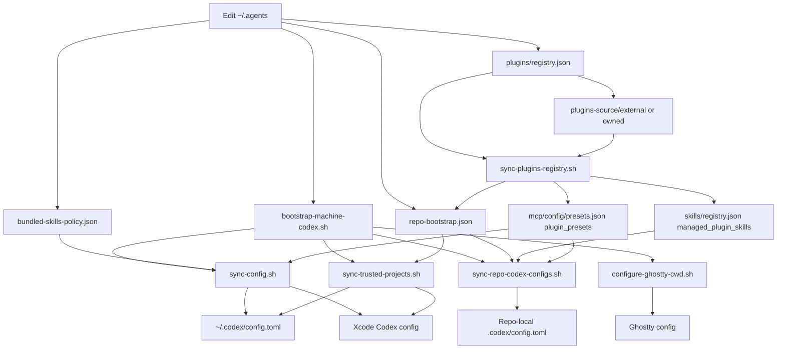
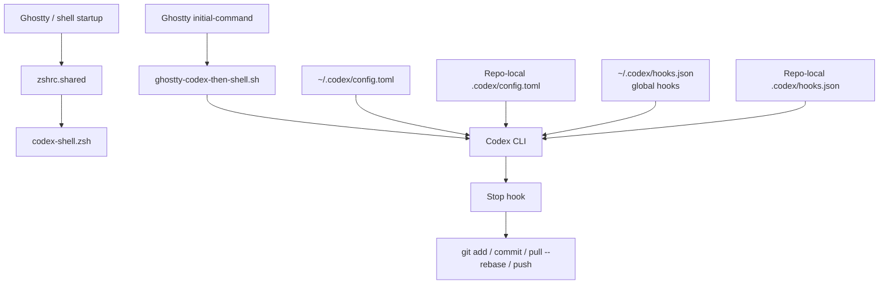

# Codex Control Plane

This repo is the canonical personal control plane for Codex across both machines. The core idea is simple: keep the durable source of truth in `~/.agents`, keep the live runtime home in `~/.codex`, and keep `~/GitHub/scripts` limited to generic machine bootstrap plus shared shell glue that is not Codex-owned.

That split keeps Codex-specific policy, repo assignment, shared MCP presets, skills, docs, and managed scripts in one synced place without pretending that auth, sessions, logs, or runtime databases belong in git.

The control plane includes plugin-source extraction plus the repo bootstrap registry in `~/.agents/codex/config/repo-bootstrap.json`.

Plugin source packages now live under `~/.agents/plugins-source/`. They are not the runtime abstraction. Instead, the control plane mirrors upstream plugin bundles there, then extracts:

- bundled `skills/` into the normal managed skills flow
- bundled `.mcp.json` into the normal shared MCP flow

The repo bootstrap registry in `~/.agents/codex/config/repo-bootstrap.json` then acts as the canonical source for:

- which repos are managed
- which extra repos live outside `~/GitHub`
- which repo-local MCP presets should be enabled
- which repo-scoped custom agents should be enabled
- which repo-local `.codex/config.toml` files should be generated

Shared MCP preset definitions themselves now live in `~/.agents/mcp/config/presets.json`.

OpenAI-bundled Codex runtime skills are handled separately by `~/.agents/codex/config/bundled-skills-policy.json`. That file classifies runtime-installed bundled skills as either allowed or disabled so new upstream bundled skills do not silently become part of the local control plane without review.

At the machine boundary, external repos such as `~/GitHub/scripts` should call the shared root wrappers in `~/.agents/scripts/` rather than reaching into Codex internals directly. The low-level Codex scripts still live in `codex/scripts/`, but machine-facing orchestration now happens one layer up.

## Figure 1: Ownership Layout

```mermaid
flowchart TD
    A[~/.agents<br/>canonical Codex control plane]
    B[~/GitHub/scripts<br/>generic bootstrap + shared shell glue]
    C[~/.codex<br/>runtime home]
    D[Repo-local .codex<br/>project overrides]

    A --> C
    B --> C
    C --> D
```

## Figure 2: Apply Flow

```mermaid
flowchart TD
    A[Edit ~/.agents] --> B[bootstrap-machine-codex.sh]
    A --> P[plugins/registry.json]
    A --> R[repo-bootstrap.json]
    P --> Q[sync-plugins-registry.sh]
    P --> S[plugins-source/external or owned]
    A --> V[bundled-skills-policy.json]
    S --> Q
    B --> C[sync-config.sh]
    B --> D[sync-trusted-projects.sh]
    B --> E[sync-repo-codex-configs.sh]
    B --> F[configure-ghostty-cwd.sh]
    Q --> T[skills/registry.json managed_plugin_skills]
    Q --> U[mcp/config/presets.json plugin_presets]
    Q --> R
    C --> G[~/.codex/config.toml]
    C --> H[Xcode Codex config]
    V --> C
    R --> D
    R --> E
    T --> E
    U --> C
    U --> E
    D --> G
    D --> H
    E --> I[Repo-local .codex/config.toml]
    F --> J[Ghostty config]
```

## Figure 3: Runtime Flow

```mermaid
flowchart TD
    A[Ghostty / shell startup] --> B[zshrc.shared]
    B --> C[codex-shell.zsh]
    H[Ghostty initial-command] --> I[ghostty-codex-then-shell.sh]
    I --> J[Codex CLI]
    D[~/.codex/config.toml] --> J
    E[Repo-local .codex/config.toml] --> J
    K[~/.codex/hooks.json<br/>global hooks] --> J
    L[Repo-local .codex/hooks.json] --> J
    J --> F[Stop hook]
    F --> G[git add / commit / pull --rebase / push]
```

## Main Parts

### `~/.agents`

Owns the durable, synced source of truth for Codex-specific setup:

- managed config fragments and presets
- bundled Codex skill allow/disable policy
- repo bootstrap registry
- hook registry and shared hook dispatch scripts
- plugin source registry and plugin source packages
- Codex-specific scripts and wrappers
- skills, references, and architecture docs
- ownership and operations documentation

This is the repo a future agent should edit first when changing personal Codex behavior across machines.

### `~/GitHub/scripts`

Owns only generic machine bootstrap and shared shell glue that is broader than Codex:

- machine-wide setup flows
- non-Codex launchd/install helpers
- shared shell files that source Codex fragments from `~/.agents`

This repo remains useful for bootstrapping a fresh machine, but Codex-specific wrappers, templates, and policy live in `~/.agents`.

### `~/.codex`

Owns applied runtime state and generated live configuration:

- live `config.toml`
- auth/session/history/log/cache/db state
- runtime-installed skills and generated artifacts
- any scripts that must exist at runtime because Codex points to them directly

`~/.codex` is where Codex runs, not where the long-term design should live.
It is now treated as runtime-only rather than as a git-tracked control-plane repo.

### Repo-local `.codex/`

Owns project-specific Codex overrides when a repo needs different behavior:

- generated or hand-owned repo-local config
- generated repo-local hook config
- repo MCP enablement
- repo-local tool or app toggles
- project-specific model or trust settings

These settings stay close to the repo because they describe how Codex should behave in that repo, not across the whole machine.

## Main Flow

1. Canonical Codex policy and assets are edited in `~/.agents`.
2. Shared machine-facing apply enters through `~/.agents/scripts/bootstrap-machine-agent-control-planes.sh` or `~/.agents/scripts/auto-apply-agent-control-planes.sh`.
3. The global templates drive machine config in `~/.codex` and Xcode Codex config.
4. Managed plugin source is refreshed under `plugins-source/`, then extracted into shared skills and MCP registries.
5. The repo bootstrap registry drives both trusted repo discovery and managed repo-local `.codex/config.toml` generation.
6. The hook registry drives managed repo-local `.codex/hooks.json` generation.
7. Codex starts from `~/.codex/config.toml` and any trusted repo-local `.codex/config.toml` and `.codex/hooks.json` in real project repos.
8. Repo-local overrides refine behavior for one project without changing the global control plane.

## Key Boundaries

- Canonical and sync-worthy belongs in `~/.agents`.
- Applied runtime and volatile state belongs in `~/.codex`.
- Generic machine bootstrap belongs in `~/GitHub/scripts`.
- Repo-specific Codex behavior belongs in repo-local `.codex/`.
- Plugin source belongs in `plugins-source/`; extracted skills and MCP belong in the normal shared skills/MCP registries.
- The repo registry decides which repos get generated repo-local config and which MCP presets they receive.
- The same registry also decides which repo-local agent role files should be rendered from canonical role templates plus repo policy.

## Notes

- `~/.codex` should be treated as an applied runtime home, not as a tracked repo.
- If a file must exist under `~/.codex` for Codex to call it directly, the preferred pattern is to keep the canonical source in `~/.agents` and sync or link it into place.
- Deeper keep / move / generate decisions live in the ownership reference.

See [Codex Control Plane Ownership](/Users/dobby/.agents/docs/references/codex-control-plane-ownership.md) for the exact split.
See [Codex Control Plane Operations](/Users/dobby/.agents/docs/references/codex-control-plane-operations.md) for exact commands, healthy-state checks, and common failure modes.
See [Capability Bootstrap Model](/Users/dobby/.agents/docs/architecture/capability-bootstrap-model.md) for the holistic skills / MCPs / agents structure.
See [Codex Config Layers](/Users/dobby/.agents/docs/architecture/codex-config-layers.md) for the config-specific layering model.
See [Repo-Scoped Agent Bootstrap](/Users/dobby/.agents/docs/architecture/repo-scoped-agent-bootstrap.md) for the repo-specific custom sub-agent design bootstrapped from the same control plane.
See [Codex Control Plane Script Flows](/Users/dobby/.agents/docs/architecture/codex-control-plane-script-flows.md) for smaller diagrams showing what each main script group does.
