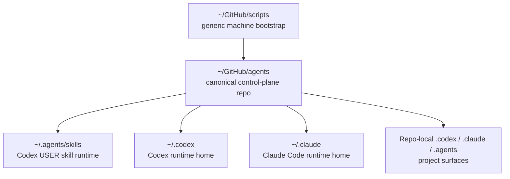
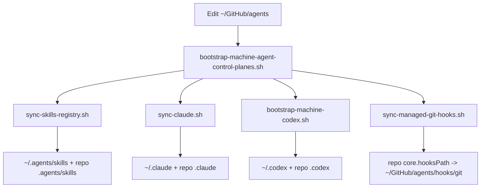

# Codex Control Plane

This repo is the canonical personal agent control plane across both machines. The durable source of truth lives in `~/GitHub/agents`; the live Codex runtime home lives in `~/.codex`; Codex user-scope skills are rendered into `~/.agents/skills`.

That split keeps reusable skills, registries, docs, hooks, MCP presets, plugins, and client bootstrap scripts in one normal GitHub checkout without using `~/.agents` as a catch-all repo. `~/.agents` remains useful because Codex natively discovers user skills there, but it should be a thin runtime surface, not the canonical checkout.

## Figure 1: Ownership Layout

```mermaid
flowchart TD
    A["~/GitHub/agents<br/>canonical control-plane repo"]
    B["~/.agents/skills<br/>Codex USER skill runtime"]
    C["~/.codex<br/>Codex runtime home"]
    D["~/.claude<br/>Claude Code runtime home"]
    E["Repo-local .codex / .claude / .agents<br/>project surfaces"]
    F["~/GitHub/scripts<br/>generic machine bootstrap"]

    A --> B
    A --> C
    A --> D
    A --> E
    F --> A
```

## Canonical Inputs

- `config/global.agents.md`: shared machine-wide guidance source rendered into `~/.codex/AGENTS.md` and `~/.claude/CLAUDE.md`.
- `skills/registry.json`: canonical managed skill registry.
- `skills-source/owned/` and `skills-source/external/`: canonical managed skill content.
- `plugins/registry.json`: native Codex plugin scope and enablement.
- `mcp/config/presets.json`: shared MCP definitions and repository/client target matrix.
- `hooks/registry.json` and `hooks/scripts/`: shared lifecycle hook definitions and dispatchers.
- `codex/config/repo-bootstrap.json`: managed repo inventory and repo-local Codex behavior.
- `dev-servers/registry.json`: opt-in repo agent-preview surface for Claude Code, Codex, and the GitHub Copilot app. It is for short-lived local dev previews only; public Cloudflare/LaunchAgent service ports stay in `~/GitHub/scripts`.
- `dashboard-app/`: source for the local read-only control-plane dashboard; production serves a
  versioned external release, not tracked build output.

## Generated Runtime Surfaces

- `~/.agents/skills/<skill>`: Codex user-scope skill symlinks.
- `~/.codex/AGENTS.md`: symlink or rendered link to `config/global.agents.md`.
- `~/.codex/config.toml` and `~/.codex/hooks.json`: live global Codex runtime config.
- repo `.codex/config.toml` and `.codex/hooks.json`: generated repo-local Codex behavior.
- repo `.agents/skills/<skill>`: Codex repo-scope skill symlinks.
- `~/.claude/CLAUDE.md`: global Claude Code guidance linked to `config/global.agents.md`.
- `~/.claude/skills/<skill>` and repo `.claude/skills/<skill>`: Claude Code skill links.
- repo `.claude/CLAUDE.md`: small bridge file with `@../AGENTS.md`, leaving room for Claude-specific instructions later.
- repo `.claude/launch.json`: generated agent-preview launch configs for repos listed in `dev-servers/registry.json`.
- repo `.codex/environments/environment.toml`: generated Codex action for the same agent-preview target.
- repo `.github/github-app.yml`: generated GitHub Copilot app Run/browser-ready config for the same agent-preview target.

## Main Flow

```mermaid
flowchart TD
    A["Edit ~/GitHub/agents"] --> B["bootstrap-machine-agent-control-planes.sh"]
    B --> C["sync-skills-registry.sh"]
    B --> D["sync-claude.sh"]
    B --> E["bootstrap-machine-codex.sh"]
    B --> F["sync-managed-git-hooks.sh"]
    C --> G["~/.agents/skills + repo .agents/skills"]
    D --> H["~/.claude + repo .claude"]
    E --> I["~/.codex + repo .codex"]
    F --> J["repo core.hooksPath -> ~/GitHub/agents/hooks/git"]
```

## Key Boundaries

- Canonical and sync-worthy belongs in `~/GitHub/agents`.
- Codex user skill discovery belongs in `~/.agents/skills`.
- Applied Codex runtime and volatile state belongs in `~/.codex`.
- Applied Claude Code runtime and volatile state belongs in `~/.claude`.
- Generic machine bootstrap belongs in `~/GitHub/scripts`.
- Repo-specific agent behavior belongs in repo-local `.codex/`, `.claude/`, and `.agents/` surfaces generated from this repo unless the repo intentionally owns it.

## Notes

- Do not symlink the entire `~/GitHub/agents` checkout to `~/.agents`; that would mix canonical source, generated runtime links, dashboard assets, and client-specific state in one discovery path.
- Keep global skills minimal. Promote repo-local skills only when they are genuinely useful across repos.
- If a file must exist under a runtime home for a client to load it, keep the canonical source in `~/GitHub/agents` and render or link it into place.

See [Codex Control Plane Ownership](/Users/dobby/GitHub/agents/docs/references/codex-control-plane-ownership.md) for the exact split.
See [Codex Control Plane Operations](/Users/dobby/GitHub/agents/docs/references/codex-control-plane-operations.md) for exact commands, healthy-state checks, and common failure modes.
See [Capability Bootstrap Model](/Users/dobby/GitHub/agents/docs/architecture/capability-bootstrap-model.md) for the skills / MCPs / plugins structure.
See [Codex Config Layers](/Users/dobby/GitHub/agents/docs/architecture/codex-config-layers.md) for the config-specific layering model.
See [Codex Control Plane Script Flows](/Users/dobby/GitHub/agents/docs/architecture/codex-control-plane-script-flows.md) for smaller diagrams showing what each main script group does.
