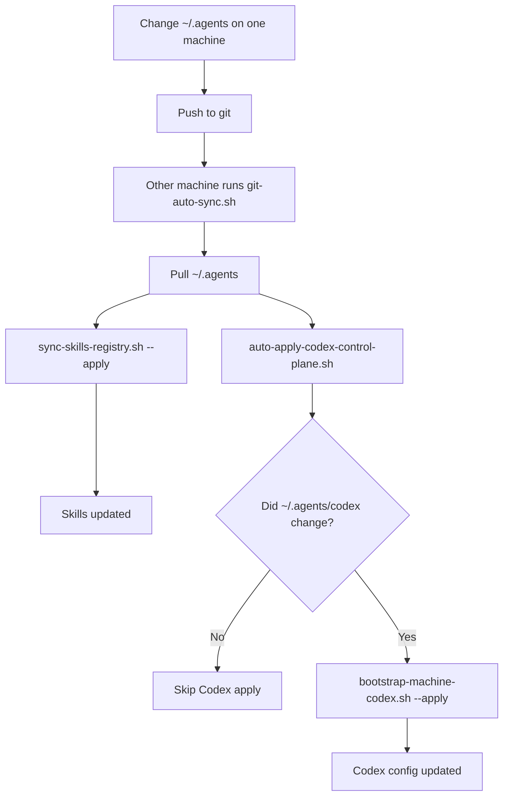

# Codex Sync Simple

This is the simplest explanation of how `~/.agents` changes spread across both machines.

The short version:
- you edit `~/.agents` on one machine
- git sync moves that change to the other machine
- the other machine automatically reapplies skills
- if the change touched `~/.agents/codex/`, the other machine also auto-applies the Codex control plane

## Figure 1: What Happens Every 15 Minutes

## Main Parts

- `skills/registry.json`
  - source of truth for managed skills
- `skills-source/`
  - canonical skill content
- `codex/config/`
  - canonical Codex machine config and repo bootstrap inputs
- `codex/config/repo-bootstrap.json`
  - source of truth for repo-local Codex behavior such as MCP presets, model, reasoning, and service tier
- `~/GitHub/scripts/sync/git-auto-sync.sh`
  - the launchd-driven 15-minute machine sync loop

## What Auto-Sync Actually Does

Every 15 minutes, each machine runs the same sync loop.

For `~/.agents`, that loop does two important follow-up steps:

1. Skills reconcile
   - runs `~/.agents/scripts/sync-skills-registry.sh --apply`
   - this keeps skill links and generated Obsidian Base artifacts correct

2. Codex reconcile
   - runs `~/.agents/codex/scripts/auto-apply-codex-control-plane.sh --apply`
   - this checks whether `~/.agents/codex/` changed since the last successful reconcile on that machine
   - if yes, it runs the full Codex bootstrap apply

## What You Need To Edit

If you want to change skills:
- edit `skills/registry.json`
- edit canonical skill content under `skills-source/`

If you want to change Codex behavior:
- edit files under `codex/config/`
- edit `codex/config/repo-bootstrap.json`
- edit Codex-specific scripts under `codex/scripts/`

You do not need to hand-edit:
- generated repo-local `.codex/config.toml` files
- generated Base artifacts
- live `~/.codex/config.toml`

## What Happens If A Machine Is Offline

Nothing breaks.

If the MacBook or Mac mini is asleep, offline, or away from the network:
- it misses one or more 15-minute sync cycles
- when it comes back and the next sync runs, it pulls the latest `~/.agents`
- then it reapplies skills and Codex state as needed

So the system is eventually consistent, not instantly consistent.

## Practical Rule

- edit canonical state in `~/.agents`
- let git move it across machines
- let the 15-minute sync loop apply it automatically

If you want the next level of detail after this page:
- read [Codex Control Plane Script Flows](/Users/dobby/.agents/docs/architecture/codex-control-plane-script-flows.md)
- then read [Codex Control Plane Operations](/Users/dobby/.agents/docs/references/codex-control-plane-operations.md)
