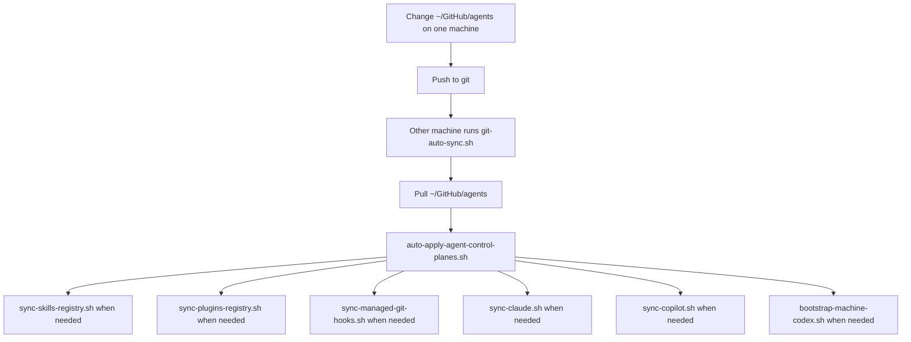

# Agent Control-Plane Sync Simple

This is the simplest explanation of how `~/GitHub/agents` changes spread across the machines.

The short version:

- edit `~/GitHub/agents` on one machine
- git sync moves that change to the other machine
- the other machine automatically reapplies the agent control plane


```mermaid
flowchart TD
    A["Change ~/GitHub/agents on one machine"] --> B["Push to git"]
    B --> C["Other machine runs git-auto-sync.sh"]
    C --> D["Pull ~/GitHub/agents"]
    D --> E["auto-apply-agent-control-planes.sh"]
    E --> F["sync-skills-registry.sh when needed"]
    E --> G["sync-plugins-registry.sh when needed"]
    E --> H["sync-managed-git-hooks.sh when needed"]
    E --> I["sync-claude.sh when needed"]
    E --> K["sync-copilot.sh when needed"]
    E --> J["bootstrap-machine-codex.sh when needed"]
```

## Main Parts

- `skills/registry.json`: source of truth for managed skills.
- `skills-source/`: canonical skill content.
- `plugins/registry.json`: native Codex plugin scope and enablement.
- `config/global.agents.md`: shared global guidance rendered into Codex and Claude.
- `codex/config/`: canonical Codex machine config and repo bootstrap inputs.
- `mcp/config/presets.json`: shared MCP definitions and repository/client targets.
- `codex/config/repo-bootstrap.json`: managed repo inventory and repo-local Codex behavior.
- `dev-servers/registry.json`: shared Claude Code, Codex, and GitHub Copilot app agent-preview launch configs.
- `~/GitHub/scripts/sync/git-auto-sync.sh`: launchd-driven 15-minute machine sync loop.

## What Auto-Sync Does

Every 15 minutes, each machine runs the same sync loop. For `~/GitHub/agents`, that loop runs:

```bash
~/GitHub/agents/scripts/auto-apply-agent-control-planes.sh --apply
```

The script checks whether runtime-relevant files changed since the last successful reconcile on that machine, then applies only the needed sync steps.

## Practical Rule

- edit canonical state in `~/GitHub/agents`
- let git move it across machines
- let the sync loop apply it automatically

For exact commands, read [Agent Control-Plane Operations](../references/agent-control-plane-operations.md).
