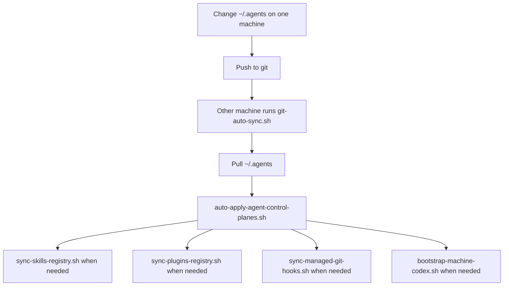

# Codex Control-Plane Sync Simple

This is the simplest explanation of how `~/.agents` changes spread across the
machines.

The short version:

- edit `~/.agents` on one machine
- git sync moves that change to the other machine
- the other machine automatically reapplies the Codex control plane


```mermaid
flowchart TD
    A["Change ~/.agents on one machine"] --> B["Push to git"]
    B --> C["Other machine runs git-auto-sync.sh"]
    C --> D["Pull ~/.agents"]
    D --> E["auto-apply-agent-control-planes.sh"]
    E --> F["sync-skills-registry.sh when needed"]
    E --> G["sync-plugins-registry.sh when needed"]
    E --> H["sync-managed-git-hooks.sh when needed"]
    E --> I["bootstrap-machine-codex.sh when needed"]
```

## Main Parts

- `skills/registry.json`: source of truth for managed skills
- `skills-source/`: canonical skill content
- `plugins/registry.json`: native Codex plugin scope and enablement
- `codex/config/`: canonical Codex machine config and repo bootstrap inputs
- `mcp/config/presets.json`: shared MCP preset definitions
- `codex/config/repo-bootstrap.json`: managed repo inventory and repo-local Codex behavior
- `~/GitHub/scripts/sync/git-auto-sync.sh`: launchd-driven 15-minute machine sync loop

## What Auto-Sync Does

Every 15 minutes, each machine runs the same sync loop. For `~/.agents`, that
loop runs:

```bash
~/.agents/scripts/auto-apply-agent-control-planes.sh --apply
```

The script checks whether runtime-relevant files changed since the last
successful reconcile on that machine, then applies only the needed Codex sync
steps.

## Practical Rule

- edit canonical state in `~/.agents`
- let git move it across machines
- let the sync loop apply it automatically

For exact commands, read [Agent Control-Plane Operations](../references/agent-control-plane-operations.md).
