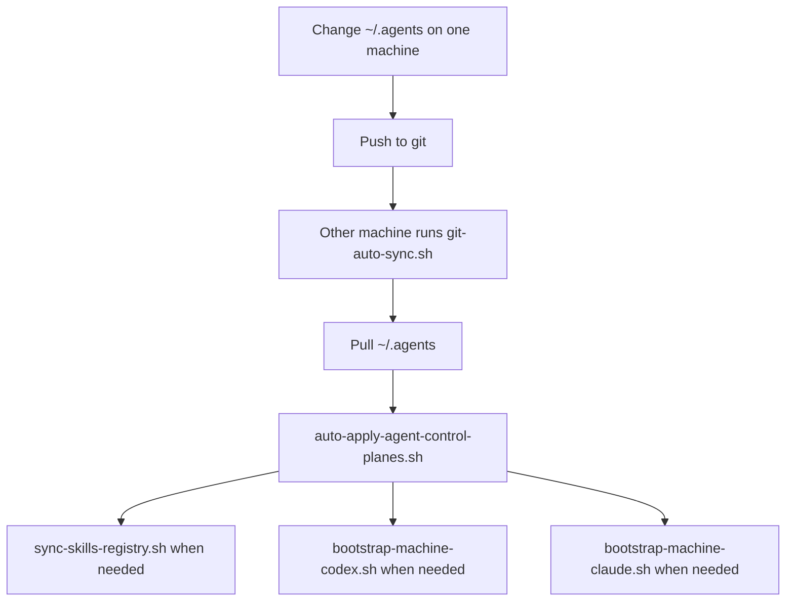

# Agent Control-Plane Sync Simple

This is the simplest explanation of how `~/.agents` changes spread across both machines.

The short version:
- you edit `~/.agents` on one machine
- git sync moves that change to the other machine
- the other machine automatically reapplies the shared agent control planes

## Figure 1: What Happens Every 15 Minutes

```mermaid
flowchart TD
    A[Change ~/.agents on one machine] --> B[Push to git]
    B --> C[Other machine runs git-auto-sync.sh]
    C --> D[Pull ~/.agents]
    D --> E[auto-apply-agent-control-planes.sh]
    E --> F[sync-skills-registry.sh when needed]
    E --> G[bootstrap-machine-codex.sh when needed]
    E --> H[bootstrap-machine-claude.sh when needed]
```

## Main Parts

- `skills/registry.json`
  - source of truth for managed skills
- `skills-source/`
  - canonical skill content
- `codex/config/`
  - canonical Codex machine config and repo bootstrap inputs
- `claude/config/`
  - canonical Claude machine config and repo-local compatibility inputs
- `mcp/config/presets.json`
  - source of truth for shared MCP preset definitions and machine-wide global MCP defaults
- `codex/config/repo-bootstrap.json`
  - source of truth for shared repo-local Codex and Claude behavior such as MCP assignment, model, reasoning, and service tier
- `~/GitHub/scripts/sync/git-auto-sync.sh`
  - the launchd-driven 15-minute machine sync loop

## What Auto-Sync Actually Does

Every 15 minutes, each machine runs the same sync loop.

For `~/.agents`, that loop now does one shared follow-up step:

1. Agent control-plane reconcile
   - runs `~/.agents/scripts/auto-apply-agent-control-planes.sh --apply`
   - this checks whether runtime-relevant `~/.agents` files changed since the last successful reconcile on that machine
   - if shared skill inputs changed, it refreshes managed skill links and reruns both Codex and Claude bootstrap so runtime-side skill dependencies and repo skill materialization stay converged
   - if Codex inputs changed, it runs the Codex bootstrap
   - if Claude inputs changed, it runs the Claude bootstrap

## What You Need To Edit

If you want to change skills:
- edit `skills/registry.json`
- edit canonical skill content under `skills-source/`

If you want to change Codex behavior:
- edit files under `codex/config/`
- edit `codex/config/repo-bootstrap.json`
- edit Codex-specific scripts under `codex/scripts/`

If you want to change Claude behavior:
- edit files under `claude/config/`
- edit Claude-specific scripts under `claude/scripts/`
- edit shared repo assignment or MCP inputs under `codex/config/repo-bootstrap.json` and `mcp/config/presets.json`

You do not need to hand-edit:
- generated repo-local `.codex/config.toml` files
- generated Base artifacts
- live `~/.codex/config.toml`

## What Happens If A Machine Is Offline

Nothing breaks.

If the MacBook or Mac mini is asleep, offline, or away from the network:
- it misses one or more 15-minute sync cycles
- when it comes back and the next sync runs, it pulls the latest `~/.agents`
- then it reapplies shared skills, Codex state, and Claude state as needed

So the system is eventually consistent, not instantly consistent.

## Practical Rule

- edit canonical state in `~/.agents`
- let git move it across machines
- let the 15-minute sync loop apply it automatically

If you want the next level of detail after this page:
- read [Agent Control-Plane Operations](/Users/adi/.agents/docs/references/agent-control-plane-operations.md)
- then read [Codex Control Plane Operations](/Users/dobby/.agents/docs/references/codex-control-plane-operations.md)
- then read [Claude Control Plane Operations](/Users/adi/.agents/docs/references/claude-control-plane-operations.md)
