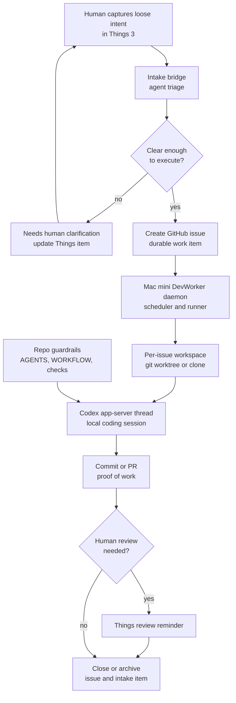

# DevWorker Orchestration

DevWorker is the planned always-on Mac mini workflow for turning loose human intent into local Codex implementation work. Things 3 stays the capture surface, GitHub Issues becomes the durable execution queue, and Codex app-server runs the actual coding sessions inside isolated workspaces.

The main design choice is to keep capture flexible. A Things task can be a short natural-language note. The intake bridge uses an agent-native policy to decide whether it is clear enough to promote, needs clarification, or should be ignored.

## Figure 1: End-To-End Flow

## Main Parts

### Things 3

Things is the human attention and capture layer. It should not become a strict ticket form.

The bridge can watch a Things project, a tag, or both. Tags are routing hints, not required schema. A captured item can be rough if the intent is still obvious enough for an agent to turn into a GitHub issue.

### Intake Bridge

The bridge reads candidate Things items and runs a small agent-native triage pass.

Its job is to answer:

- Is this actually DevWorker work?
- Which repo should own it?
- Is the task clear enough for autonomous execution?
- What acceptance signal should the worker use?

If the answer is clear, the bridge promotes the item to GitHub. If not, it updates the Things item with a concise clarification request and leaves it in the human attention loop.

### GitHub Issues

GitHub Issues is the source of truth after promotion. It carries the durable work item, repo link, status, comments, PR links, and audit trail.

This replaces Linear for the first version. Symphony is Linear-first in its reference spec, but the useful pattern is the tracker-backed orchestration model, not Linear itself.

### Mac Mini DevWorker

The DevWorker daemon runs on the Mac mini and watches eligible GitHub issues. It owns scheduling, claiming, retries, cancellation, and high-level observability.

It should stay a scheduler and runner. It should not contain detailed repo implementation logic. Repo-specific behavior should live in repo docs, `AGENTS.md`, `WORKFLOW.md`, skills, checks, and the Codex prompt.

### Per-Issue Workspace

Each issue runs in its own workspace, most likely a `git worktree` under a DevWorker workspace root.

This is the right exception to the normal solo direct-main preference because the Mac mini may run multiple background tasks concurrently.

### Codex App-Server Thread

The worker starts Codex through `codex app-server`, creates a thread for the issue, starts a turn, and streams events back to the worker.

The GitHub issue or local worker ledger should record the Codex `thread_id`. That should be treated as a debugging and resume handle, not as the primary source of truth.

### Repo Guardrails

The repo being changed still owns the work contract:

- `AGENTS.md` for local agent guidance
- `WORKFLOW.md` for DevWorker execution policy when the repo needs one
- `scripts/check-fast.sh` for fast local validation
- tests, linting, and review expectations

Repeated failures should become repo docs, skills, or mechanical checks.

## Main Flow

1. The human captures intent in Things 3 using normal language.
2. The intake bridge reads candidate Things items and performs agent triage.
3. If the task is unclear, the bridge asks for clarification in Things and stops.
4. If the task is clear, the bridge creates a GitHub issue and marks the Things item as promoted.
5. The Mac mini DevWorker claims eligible GitHub issues.
6. The worker creates or reuses a per-issue workspace.
7. The worker starts a Codex app-server thread in that workspace.
8. Codex implements, validates, and updates the issue or PR according to repo guidance.
9. If human review is needed, the system creates a Things reminder.
10. When the issue reaches a terminal state, the worker archives or cleans up the workspace according to policy.

## Boundaries

- Things is for capture and human attention.
- GitHub Issues is the durable execution queue.
- DevWorker owns scheduling, retries, workspaces, and Codex process supervision.
- Codex owns implementation inside the workspace.
- The target repo owns local rules, checks, and acceptance expectations.
- The Codex app sidebar is useful for observation, but correctness should not depend on it.

## Skill Fit

This workflow should eventually become a small DevWorker intake skill. The skill should encode the judgment policy for promotion without forcing the human into a strict template.

Good skill behavior:

- infer repo and acceptance criteria when obvious
- promote clear items automatically
- ask for the smallest useful clarification when blocked
- avoid creating GitHub issues for vague reminders or personal tasks
- preserve the human's wording in the promoted issue

## Notes

- Use GitHub before Linear for the first version because the work is repo-native and GitHub is already authenticated locally.
- Store Codex thread IDs for recovery and debugging, but keep GitHub issue state authoritative.
- Verify early whether app-server-created threads appear exactly as desired in the Codex desktop app. The architecture should still work if observation happens through worker logs or an optional local dashboard.

## References

- [OpenAI Symphony blog](https://openai.com/index/open-source-codex-orchestration-symphony/)
- [Symphony SPEC.md](https://github.com/openai/symphony/blob/main/SPEC.md)
- [Codex app-server docs](https://developers.openai.com/codex/app-server)
