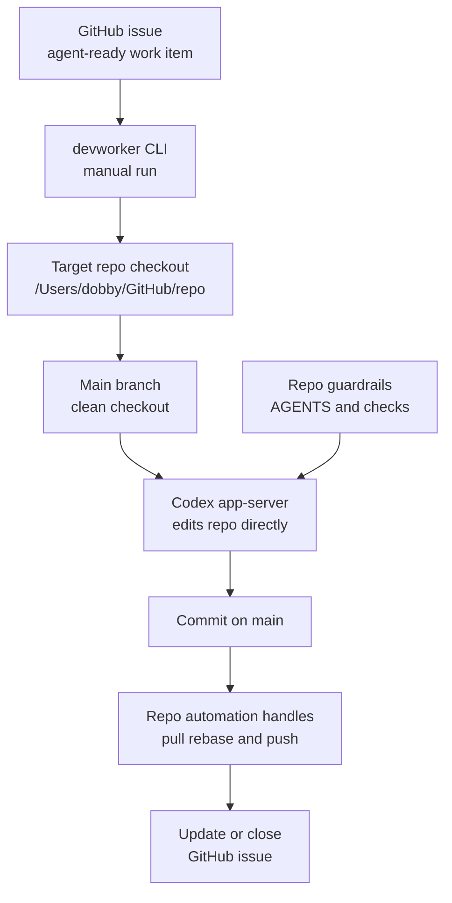

# DevWorker Orchestration

DevWorker is the planned Mac mini workflow for turning loose human intent into local Codex implementation work. Things 3 stays the capture surface, GitHub Issues becomes the durable execution queue, and Codex app-server runs the actual coding session in a target repo checkout.

The first implementation should be intentionally small: one issue at a time, existing repo checkout on `main`, local checks, commit/push through the repo's normal flow, and GitHub issue updates. Branches, worktrees, SQLite state, launchd, and Things automation are later layers after the core loop works.

## Figure 1: MVP Flow

## Main Parts

### Things 3

Things is the human attention and capture layer. It should not become a strict ticket form.

For the MVP, Things automation is deferred. The first durable queue is GitHub Issues. Later, a bridge can watch a Things project, a tag, or both. Tags should be routing hints, not required schema.

### Intake Bridge

The bridge reads candidate Things items and runs a small agent-native triage pass.

Its job is to answer:

- Is this actually DevWorker work?
- Which repo should own it?
- Is the task clear enough for autonomous execution?
- What acceptance signal should the worker use?

The intake bridge is not part of the MVP. When added later, if the answer is clear, the bridge promotes the item to GitHub. If not, it updates the Things item with a concise clarification request and leaves it in the human attention loop.

### GitHub Issues

GitHub Issues is the source of truth after promotion. It carries the durable work item, repo link, status, comments, PR links, and audit trail.

This replaces Linear for the first version. Symphony is Linear-first in its reference spec, but the useful pattern is the tracker-backed orchestration model, not Linear itself.

### DevWorker CLI

The first DevWorker is a manual CLI in `/Users/dobby/GitHub/devworker`. It takes one GitHub issue, verifies the target repo is a clean `main` checkout, starts Codex app-server, runs checks, and updates the issue after Codex commits through the repo's normal flow.

It should stay a runner, not a place for repo-specific implementation rules. Repo-specific behavior should live in repo docs, `AGENTS.md`, checks, and the Codex prompt.

### Target Repo Checkout

The MVP runs in the existing target repo checkout under `/Users/dobby/GitHub/<repo>` on `main`.

That means it is one issue at a time per repo. The checkout must be on `main` and clean before DevWorker starts. This keeps the first version understandable and avoids adding branch/worktree cleanup before it is needed.

### Codex App-Server Thread

The worker starts Codex through `codex app-server`, creates a thread for the issue, starts a turn, and streams events until the run finishes.

For MVP, record the Codex `thread_id` in the GitHub issue comment or local log if easy. It is useful for debugging, but GitHub issue state remains authoritative.

### Repo Guardrails

The repo being changed still owns the work contract:

- `AGENTS.md` for local agent guidance
- `WORKFLOW.md` for DevWorker execution policy when the repo needs one
- `scripts/check-fast.sh` for fast local validation
- tests, linting, and review expectations

Repeated failures should become repo docs, skills, or mechanical checks.

## Main Flow

1. The human captures intent in Things 3 using normal language.
2. The intake bridge reads candidate Things items and performs agent triage.
3. If the task is unclear, the bridge asks for clarification in Things and stops.
4. The human or a later bridge creates a GitHub issue and applies the ready label.
5. The human runs `devworker run <issue-url>` or equivalent.
6. DevWorker verifies the target repo checkout is clean.
7. DevWorker starts a Codex app-server thread in the target repo checkout on `main`.
8. Codex implements, validates, and commits through the repo's normal flow.
9. DevWorker runs or verifies the repo fast checks.
10. DevWorker comments on the issue and closes it when the run clearly succeeded.

## Boundaries

- Things is for capture and human attention, later.
- GitHub Issues is the durable execution queue.
- DevWorker MVP owns one manual issue run at a time.
- Codex owns implementation inside the target repo checkout.
- The target repo owns local rules, checks, and acceptance expectations.
- The Codex app sidebar is useful for observation, but correctness should not depend on it.

## Later Layers

These are useful, but not part of the first implementation:

- Things intake bridge
- launchd always-on daemon
- issue branches
- per-issue git worktrees under `~/.devworker/worktrees`
- SQLite runtime ledger under `~/.devworker/state`
- retry queue and stale-claim recovery
- dashboard or status server

Add branches/worktrees when DevWorker needs parallel runs or when modifying the normal repo checkout becomes too disruptive. Add SQLite when local crash recovery needs more than GitHub labels/comments and JSONL logs.

## Skill Fit

The Things-to-GitHub workflow should eventually become a small DevWorker intake skill. The skill should encode the judgment policy for promotion without forcing the human into a strict template.

Good skill behavior:

- infer repo and acceptance criteria when obvious
- promote clear items automatically
- ask for the smallest useful clarification when blocked
- avoid creating GitHub issues for vague reminders or personal tasks
- preserve the human's wording in the promoted issue

## Notes

- Use GitHub before Linear because the work is repo-native and GitHub is already authenticated locally.
- Do not use branches, SQLite, or worktrees in the MVP. They are reliability/concurrency layers, not prerequisites.
- Store Codex thread IDs for recovery and debugging if easy, but keep GitHub issue state authoritative.
- Verify early whether app-server-created threads appear exactly as desired in the Codex desktop app. The architecture should still work if observation happens through worker logs or an optional local dashboard.

## References

- [OpenAI Symphony blog](https://openai.com/index/open-source-codex-orchestration-symphony/)
- [Symphony SPEC.md](https://github.com/openai/symphony/blob/main/SPEC.md)
- [Codex app-server docs](https://developers.openai.com/codex/app-server)
