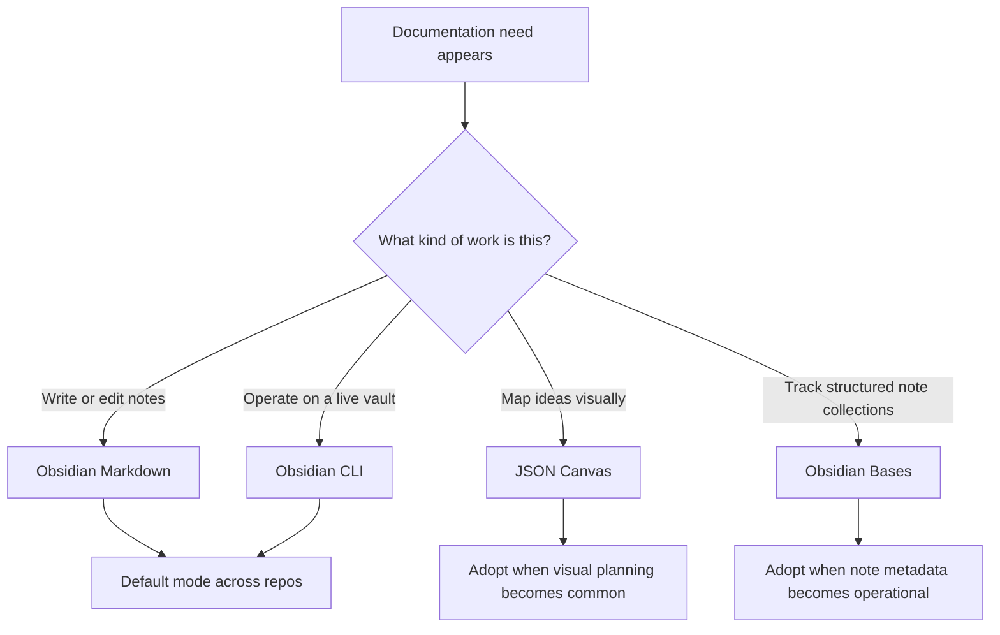

# Obsidian Documentation Modes

This is the short reference for how to think about Obsidian inside the `.agents` control plane.

The main idea is simple:
- use Obsidian Markdown as the default documentation surface
- use Obsidian CLI when an agent needs to operate on a live vault
- add Canvas only when visual mapping becomes part of the workflow
- add Bases only when note collections become structured enough to need filtered views

## Figure 1: Recommended Obsidian Expansion Path

## Current Baseline

The current baseline should stay narrow:

- `obsidian-markdown`
  - default for writing and editing notes, architecture docs, wikilinks, callouts, embeds, and properties
- `obsidian-cli`
  - use when an agent must search, read, create, or update notes in a running Obsidian vault
- `defuddle`
  - use when web content should be converted into clean markdown before bringing it into notes

This gives a strong default setup without committing to more specialized Obsidian workflows too early.

## When To Use Each Mode

### Obsidian Markdown

Use this when the work is document-first:

- architecture notes
- project notes
- linked knowledge pages
- durable references
- meeting notes, plans, and summaries

This should be the default mode for most repos.

### Obsidian CLI

Use this when the work is vault-first:

- search the vault
- create or update notes programmatically
- append to daily notes
- inspect tasks, tags, properties, or backlinks
- support plugin or theme development

This is operational glue, not a replacement for note structure.

### JSON Canvas

Use this when the work is spatial and exploratory:

- brainstorm a topic
- map a system visually
- cluster ideas before writing
- lay out research, links, screenshots, and notes on a board

Choose Canvas when position, grouping, and visual relationships matter more than fields or filters.

### Obsidian Bases

Use this when the work is structured and queryable:

- content calendars
- reading lists
- project trackers
- note collections with consistent metadata
- dashboards over notes with filtering, grouping, and summaries

Choose Bases when rows, properties, and views matter more than freeform layout.

## Recommended Expansion Strategy For Adi

Use this progression:

1. Start with Markdown everywhere.
2. Use CLI where agents need to interact with the live vault.
3. Add Canvas only when visual mapping becomes a repeated habit, not as a default.
4. Add Bases only when note metadata becomes consistent enough to support real table/card/list views.

That keeps the system simple at the start:

- Markdown handles most documentation
- CLI handles automation
- Canvas handles visual thinking
- Bases handles structured tracking

## Practical Rule

If the question is "where should this information live?", prefer a Markdown note first.

Only move to Canvas when the note is turning into a map.
Only move to Bases when the note collection is turning into a database.
