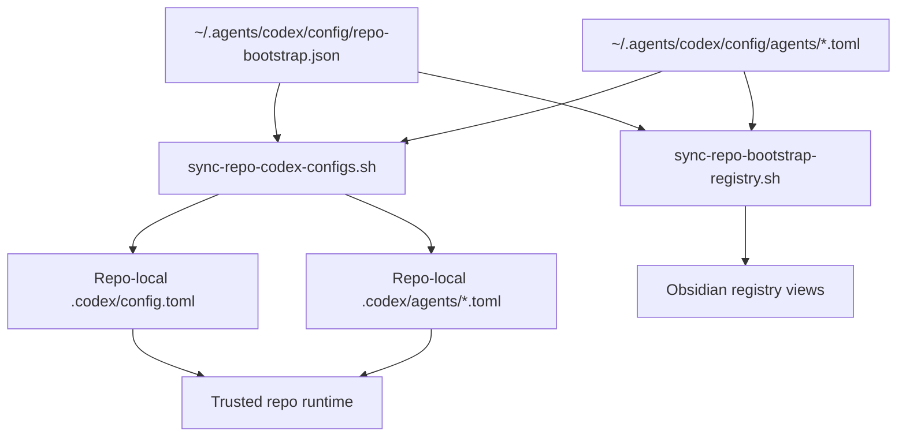
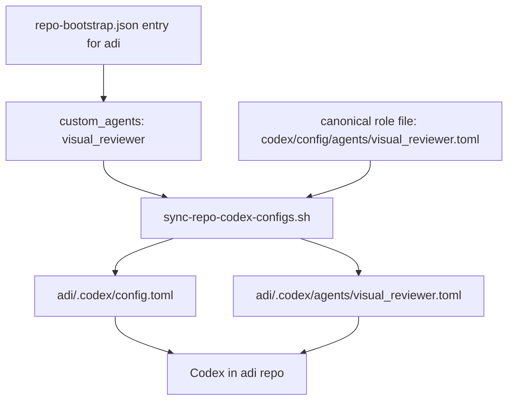

# Repo-Scoped Agent Bootstrap

This page describes the current architecture for repo-scoped Codex sub-agents and repo-scoped sub-agent policy.

The goal is simple: keep one canonical control plane in `~/.agents`, but allow specific repos to:

- receive specific custom agent roles
- tighten or narrow a global agent such as `writer` for one repo
- expose only the MCP surface that makes sense in that repo

The control plane bootstraps repo-local `.codex/config.toml` files from `codex/config/repo-bootstrap.json`, and it now extends that same path to repo-local agent policy instead of relying on hand-edited role TOMLs.

## Overview

We want a single source of truth for:

- which repos are managed
- which MCP presets each repo gets
- which repo-scoped custom agents each repo gets
- which repo-scoped agent-policy overlays each repo gets
- which reusable repo-scoped agent presets exist
- which reusable repo-scoped agent-policy presets exist
- which canonical role-definition files back those repo-scoped agents

The key constraint is that a repo-local `[agents.<name>]` declaration is not enough by itself. If a role uses `config_file = "agents/<role>.toml"`, that file must exist in the repo-local `.codex/agents/` folder after bootstrap.

## Figure 1: Target Shape



## Current State

The repo bootstrap system now does three important jobs:

1. `sync-repo-codex-configs.sh` renders repo-local `.codex/config.toml` from `repo-bootstrap.json`
2. `sync-repo-codex-configs.sh` also materializes repo-local `.codex/agents/*.toml` for any assigned repo-scoped custom agents
3. `sync-repo-bootstrap-registry.sh` generates the Obsidian Base views under `docs/references/registry/`

The registry now models:

- repo path
- scalar Codex overrides like model and reasoning
- feature flags
- MCP presets
- repo-scoped custom agent exposure
- repo-scoped agent-policy overlays

Canonical agent identity still lives globally through:

- `codex/config/global.config.toml`
- `codex/config/xcode.config.toml`
- `codex/config/agents/*.toml`

That split is deliberate:

- global config decides what a role is
- repo bootstrap decides what that role can use here

## Current Architecture

### 1. Canonical role definitions stay in `~/.agents`

Canonical role behavior files should continue to live in:

- `codex/config/agents/<role>.toml`

This keeps the actual role definitions synced, reviewable, and reusable across machines.

### 2. Repo bootstrap registry declares reusable agent presets, policy presets, and repo assignments

`codex/config/repo-bootstrap.json` should hold:

- top-level `agent_presets`
- top-level `agent_policy_presets`
- repo-level `custom_agents`
- repo-level `agent_policies`

Example shape:

```json
{
  "agent_presets": {
    "writer": {
      "description": "Writing-focused sub-agent. Highly encouraged for copywriting, rewriting, and tone-sensitive drafting.",
      "config_file": "writer.toml",
      "nickname_candidates": ["Quill", "Scribe", "Muse"]
    },
    "visual_reviewer": {
      "description": "Read-only reviewer for visual work such as screenshots, layouts, hierarchy, and clarity.",
      "config_file": "visual_reviewer.toml",
      "nickname_candidates": ["Lens", "Critic", "Review"]
    }
  },
  "agent_policy_presets": {
    "writer_no_mcp": {
      "mcp": { "mode": "deny_all" }
    },
    "visual_reviewer_paper_only": {
      "mcp": { "mode": "allow_list", "presets": ["paper"] }
    }
  },
  "repos": [
    {
      "path": "~/GitHub/adi",
      "mcp_presets": ["openaiDeveloperDocs", "paper"],
      "custom_agents": ["visual_reviewer"],
      "agent_policies": {
        "writer": "writer_no_mcp",
        "visual_reviewer": "visual_reviewer_paper_only"
      }
    }
  ]
}
```

This means:

- the repo should receive a repo-local `[agents.visual_reviewer]` block because it is a repo-scoped custom role
- the repo should also receive `.codex/agents/visual_reviewer.toml`
- the repo should receive a repo-local `[agents.writer]` block even though `writer` is globally available, because this repo wants a narrower local policy than the global role file

The registry should remain declarative. It carries:

- declaration metadata needed to expose the role in repo-local config
- reusable repo-local policy overlays such as MCP allow-lists

The actual role identity still lives in `codex/config/agents/*.toml`.

### 3. Repo config sync renders declaration and policy-shaped role files

`sync-repo-codex-configs.sh` is the repo-local Codex config renderer that writes:

- `.codex/config.toml`
- `.codex/agents/*.toml` for assigned custom agents
- `.codex/agents/*.toml` for any globally-defined agent that has a repo-local policy overlay

That script becomes the canonical place that patches together:

- repo assignment from `repo-bootstrap.json`
- role definition source from `codex/config/agents/*.toml`
- repo-local policy from `repo-bootstrap.json`
- repo-local output under `.codex/`

So the render model is now:

1. start from canonical role template
2. apply repo-local policy overlay
3. materialize the final repo-local role TOML

That is what makes future MCP expansion safer. If a repo gains a new MCP preset later, the render step can explicitly disable it for an agent-policy preset such as `writer_no_mcp` without anyone hand-editing the role file.

### 4. Obsidian registry exposes repo-scoped agents and policy overlays

The generated registry views now show, per repo:

- `custom_agent_count`
- `custom_agents`
- `repo_agent_count`
- `repo_agents`
- `agent_policy_count`
- `agent_policy_agents`
- `agent_policy_bindings`
- `global_agents`
- `agents`

And there is now a separate agent-scope registry:

- `agent-registry.base`
- `agent-registry-items/`

There is also an effective capability registry:

- `agent-capabilities.base`
- `agent-capabilities-items/`

That view is the quickest way to inspect which MCPs, tools, and feature flags are actually enabled for each repo-local agent runtime.

That keeps the control plane auditable in Obsidian the same way MCPs and skills already are.

## Figure 2: Repo-Level Flow



## Role Boundaries

### Global roles

Keep a role global only when it is truly durable across many repos.

Examples:

- `external_researcher`

Global roles belong in:

- `codex/config/global.config.toml`
- `codex/config/agents/*.toml`
- live runtime `~/.codex/`

But a global role may still receive a repo-local policy overlay when one repo needs a narrower MCP surface or tool posture.

### Repo-scoped roles

Use repo-scoped bootstrap when the role is:

- experimental
- workflow-specific
- tied to one repo's MCPs or operating style
- not worth exposing everywhere

Examples:

- `visual_reviewer`
- a repo-specific `docs_researcher`
- a repo-specific `browser_debugger`

Repo-scoped roles should be assigned from `repo-bootstrap.json`, not promoted into the global config by default.

### Repo-scoped policy overlays

Use repo-scoped policy overlays when the role identity is stable, but the repo needs different operational constraints.

Examples:

- `writer` should exist globally, but `adi` should render it with `mcp.mode = "deny_all"`
- `visual_reviewer` should be able to use `paper`, but not every repo MCP preset

Repo-scoped policy overlays should also be assigned from `repo-bootstrap.json`, not hand-edited into canonical role files.

## Important Constraints

### Do not override built-in role names by accident

Codex already ships built-in roles such as:

- `default`
- `worker`
- `explorer`
- `monitor`

If we define a custom role with one of those names, the custom role takes precedence. So repo-scoped and global custom roles should use unique names unless deliberate override is the goal.

### Do not render broken role declarations

A repo-local agent declaration that points at a missing `config_file` is broken.

So the bootstrap must treat these as one unit:

- `[agents.<name>]` declaration in `.codex/config.toml`
- matching `.codex/agents/<name>.toml`

### Keep the registry declarative

`repo-bootstrap.json` should not copy full role behavior into the registry.

Keep this split:

- role template = identity and durable defaults
- repo policy = repo-local MCP/tool narrowing

That keeps:

- role behavior canonical in one place
- repo assignment easy to audit
- future role edits fan out cleanly across assigned repos

## Why this architecture

This keeps the control plane simple:

- one canonical repo owns the source of truth
- one registry decides repo assignment
- one sync script materializes repo-local config
- one registry generator exposes the state in Obsidian

It avoids the two bad extremes:

- polluting global config with repo-specific roles
- creating a second parallel agent-bootstrap system outside the existing repo bootstrap path

## What this architecture gives us now

1. one canonical repo owns the control plane
2. global roles stay minimal and durable
3. repo-specific roles can be bootstrapped centrally without polluting the global runtime
4. Obsidian can show both:
   - effective per-repo agents
   - role-centric scope across terminal, Xcode, and repo usage

## Related docs

- [Codex Control Plane](/Users/dobby/.agents/docs/architecture/codex-control-plane.md)
- [Codex Config Layers](/Users/dobby/.agents/docs/architecture/codex-config-layers.md)
- [Codex Control Plane Script Flows](/Users/dobby/.agents/docs/architecture/codex-control-plane-script-flows.md)
- [Codex Control Plane Operations](/Users/dobby/.agents/docs/references/codex-control-plane-operations.md)
