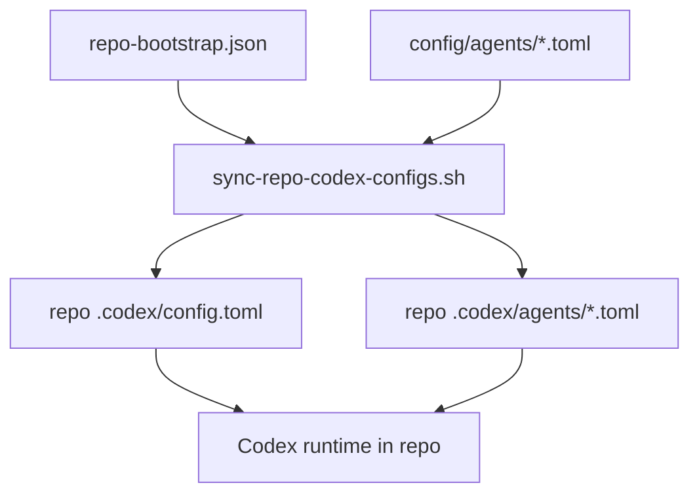

# Repo-Scoped Agent Bootstrap

This page describes the current sub-agent model for the Codex control plane.

The rule is simple:

- canonical agent behavior lives in `codex/config/agents/*.toml`
- repo bootstrap only decides where that agent is exposed

That means this system does **not** use repo-local agent-policy overlays anymore.

## Current Model

There are two separate concerns:

1. what an agent is allowed to do
2. which repos should expose that agent

Those map to two different sources of truth:

- [`codex/config/agents/*.toml`](/Users/dobby/.agents/codex/config/agents)
  - agent behavior and restrictions
  - model
  - sandbox level
  - web search posture
  - tool disables
  - feature disables such as `js_repl`
  - MCP allow/deny configuration
- [`codex/config/repo-bootstrap.json`](/Users/dobby/.agents/codex/config/repo-bootstrap.json)
  - repo-local exposure only
  - `custom_agents`
  - repo MCP presets
  - repo model and feature defaults

## Why This Shape

This is simpler to reason about than repo-level overlays.

The mental model becomes:

- if you want to change what `writer` can do, edit [`writer.toml`](/Users/dobby/.agents/codex/config/agents/writer.toml)
- if you want `writer` to appear in a repo, add it to that repo’s `custom_agents`

That keeps behavior stable and avoids a second layer of sub-agent policy hidden in the repo registry.

## Tradeoff

This design is simpler, but it is less automatic than the discarded overlay model.

If a new MCP is introduced later and a role should never see it, the canonical role TOML must be updated explicitly.

That is an intentional tradeoff:

- fewer moving parts
- less registry complexity
- easier operator understanding
- slightly more manual maintenance when agent capabilities change

## Figure 1: Bootstrap Flow



## What Gets Rendered

For each managed repo:

- `.codex/config.toml`
  - repo defaults
  - repo MCP presets
  - repo-local `[agents.<name>]` declarations for `custom_agents`
- `.codex/agents/*.toml`
  - direct render of the canonical role TOMLs for those repo-local agents

There is no repo-local mutation step for agent capability anymore.

## Current Usage Pattern

Good candidates for repo-scoped bootstrap:

- specialized reviewers
- niche workflow helpers
- roles tied to a narrow repo workflow

Examples in the current control plane:

- `visual_reviewer`
  - repo-scoped
  - only exposed where visual review is useful
- `writer`
  - repo-scoped right now
  - capability restrictions still live in the canonical role file

Good candidates for global declaration:

- durable roles used across many unrelated repos
- roles that should always be available

Example:

- `external_researcher`

## Registry View

The generated lookup path is now:

- [`repo-bootstrap.base`](/Users/dobby/.agents/docs/references/registry/repo-bootstrap.base)
  - per-repo exposure, including `custom_agents`
- [`agent-registry.base`](/Users/dobby/.agents/docs/references/registry/agent-registry.base)
  - per-agent scope and capability view
  - model
  - reasoning
  - sandbox
  - web search
  - `js_repl`
  - enabled and disabled MCPs
  - enabled and disabled tools

There is no separate `agent-capabilities.base` anymore. That information now lives in `agent-registry.base`.

## Recommended Editing Rule

When you need to change sub-agents:

- change [`codex/config/agents/*.toml`](/Users/dobby/.agents/codex/config/agents) if the capability itself should change
- change [`codex/config/repo-bootstrap.json`](/Users/dobby/.agents/codex/config/repo-bootstrap.json) if repo exposure should change

Then run:

```bash
~/.agents/codex/scripts/sync-repo-codex-configs.sh --apply
~/.agents/codex/scripts/sync-repo-bootstrap-registry.sh
~/.agents/codex/scripts/check-codex-control-plane.sh
```
