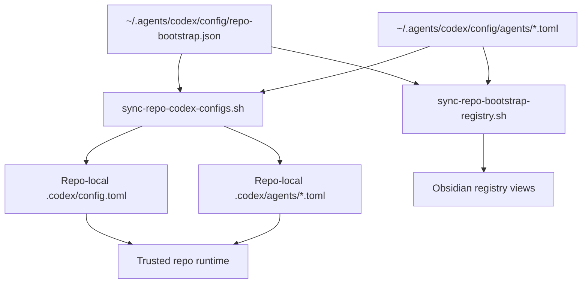
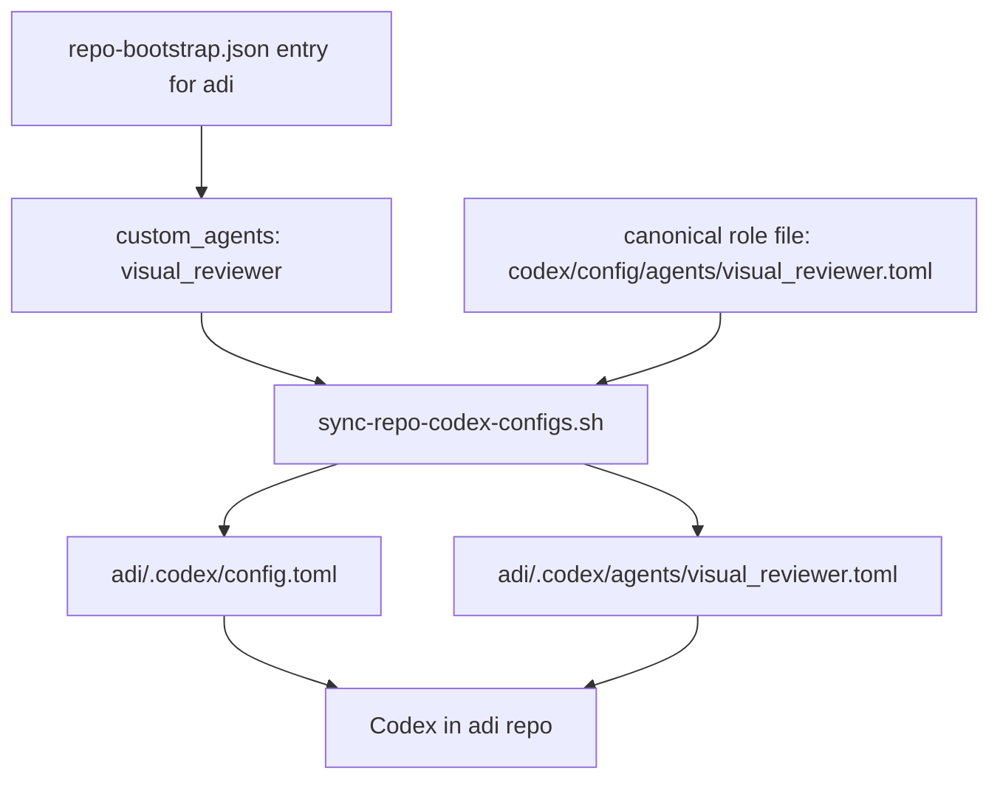

# Repo-Scoped Agent Bootstrap

This page describes the architecture we are moving toward for repo-scoped Codex sub-agents.

The goal is simple: keep one canonical control plane in `~/.agents`, but allow specific repos to receive specific custom agent roles without promoting every experimental role into the global runtime.

Today the control plane already bootstraps repo-local `.codex/config.toml` files from `codex/config/repo-bootstrap.json`. The missing piece is repo-scoped custom agents. The architecture below extends that same bootstrap path instead of introducing a second system.

## Overview

We want a single source of truth for:

- which repos are managed
- which MCP presets each repo gets
- which repo-scoped custom agents each repo gets
- which reusable repo-scoped agent presets exist
- which canonical role-definition files back those repo-scoped agents

The key constraint is that a repo-local `[agents.<name>]` declaration is not enough by itself. If a role uses `config_file = "agents/<role>.toml"`, that file must exist in the repo-local `.codex/agents/` folder after bootstrap.

## Figure 1: Target Shape



## Current State

Today the repo bootstrap system already does two important jobs:

1. `sync-repo-codex-configs.sh` renders repo-local `.codex/config.toml` from `repo-bootstrap.json`
2. `sync-repo-bootstrap-registry.sh` generates the Obsidian Base views under `docs/references/registry/`

But the current registry only models:

- repo path
- scalar Codex overrides like model and reasoning
- feature flags
- MCP presets

Custom agent roles are still defined globally through:

- `codex/config/global.config.toml`
- `codex/config/agents/*.toml`
- `sync-config.sh` into `~/.codex/`

That is good for durable cross-repo roles such as `external_researcher`, but it is the wrong layer for repo-specific roles such as a visual reviewer that should exist only in a design-heavy repo.

## Target Architecture

### 1. Canonical role definitions stay in `~/.agents`

Canonical role behavior files should continue to live in:

- `codex/config/agents/<role>.toml`

This keeps the actual role definitions synced, reviewable, and reusable across machines.

### 2. Repo bootstrap registry declares both reusable agent presets and repo assignments

`codex/config/repo-bootstrap.json` should hold:

- top-level `agent_presets`
- repo-level `custom_agents`

Example shape:

```json
{
  "agent_presets": {
    "visual_reviewer": {
      "description": "Read-only reviewer for visual work such as screenshots, layouts, hierarchy, and clarity.",
      "config_file": "visual_reviewer.toml",
      "nickname_candidates": ["Lens", "Critic", "Review"]
    }
  },
  "repos": [
    {
  "path": "~/GitHub/adi",
  "mcp_presets": ["openaiDeveloperDocs", "paper"],
  "custom_agents": ["visual_reviewer"]
    }
  ]
}
```

This means:

- the repo should receive a repo-local `[agents.visual_reviewer]` block
- the repo should also receive `.codex/agents/visual_reviewer.toml`

The registry should remain declarative. It should carry only the declaration metadata needed to expose the role in repo-local config. The actual role behavior still lives in `codex/config/agents/*.toml`.

### 3. Repo config sync renders both declaration and role files

`sync-repo-codex-configs.sh` should grow from a single-file renderer into a repo-local Codex config renderer that writes:

- `.codex/config.toml`
- `.codex/agents/*.toml` for assigned custom agents

That script becomes the canonical place that patches together:

- repo assignment from `repo-bootstrap.json`
- role definition source from `codex/config/agents/*.toml`
- repo-local output under `.codex/`

### 4. Obsidian registry should expose repo-scoped agents

The generated registry views should show, per repo:

- `custom_agent_count`
- `custom_agents`

That keeps the control plane auditable in Obsidian the same way MCPs and skills already are.

## Figure 2: Repo-Level Flow



## Role Boundaries

### Global roles

Keep a role global only when it is truly durable across many repos.

Examples:

- `external_researcher`

Global roles belong in:

- `codex/config/global.config.toml`
- `codex/config/agents/*.toml`
- live runtime `~/.codex/`

### Repo-scoped roles

Use repo-scoped bootstrap when the role is:

- experimental
- workflow-specific
- tied to one repo's MCPs or operating style
- not worth exposing everywhere

Examples:

- `visual_reviewer`
- a repo-specific `docs_researcher`
- a repo-specific `browser_debugger`

Repo-scoped roles should be assigned from `repo-bootstrap.json`, not promoted into the global config by default.

## Important Constraints

### Do not override built-in role names by accident

Codex already ships built-in roles such as:

- `default`
- `worker`
- `explorer`
- `monitor`

If we define a custom role with one of those names, the custom role takes precedence. So repo-scoped and global custom roles should use unique names unless deliberate override is the goal.

### Do not render broken role declarations

A repo-local agent declaration that points at a missing `config_file` is broken.

So the bootstrap must treat these as one unit:

- `[agents.<name>]` declaration in `.codex/config.toml`
- matching `.codex/agents/<name>.toml`

### Keep the registry declarative

`repo-bootstrap.json` should not copy full role behavior into the registry.

That keeps:

- role behavior canonical in one place
- repo assignment easy to audit
- future role edits fan out cleanly across assigned repos

## Why this architecture

This keeps the control plane simple:

- one canonical repo owns the source of truth
- one registry decides repo assignment
- one sync script materializes repo-local config
- one registry generator exposes the state in Obsidian

It avoids the two bad extremes:

- polluting global config with repo-specific roles
- creating a second parallel agent-bootstrap system outside the existing repo bootstrap path

## What should change next

The next implementation step should be:

1. extend `repo-bootstrap.json` validation to allow `custom_agents`
2. teach `sync-repo-codex-configs.sh` to render repo-local agent declarations and copy the referenced role TOMLs
3. teach `sync-repo-bootstrap-registry.py` to expose custom agents in the generated views
4. only then assign repo-scoped roles such as `visual_reviewer` to repos like `adi`

## Related docs

- [Codex Control Plane](/Users/dobby/.agents/docs/architecture/codex-control-plane.md)
- [Codex Config Layers](/Users/dobby/.agents/docs/architecture/codex-config-layers.md)
- [Codex Control Plane Script Flows](/Users/dobby/.agents/docs/architecture/codex-control-plane-script-flows.md)
- [Codex Control Plane Operations](/Users/dobby/.agents/docs/references/codex-control-plane-operations.md)
