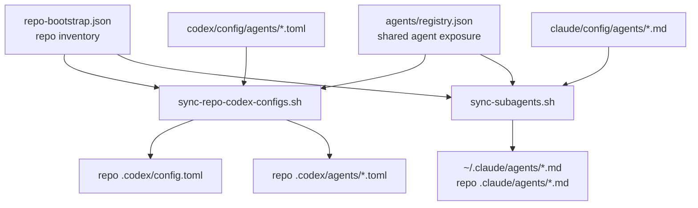

# Repo-Scoped Agent Bootstrap

This page describes the current shared agent model for the Codex and Claude control planes.

The rule is simple:

- shared agent exposure lives in `agents/registry.json`
- Codex role behavior lives in `codex/config/agents/*.toml`
- Claude prompt behavior lives in `claude/config/agents/*.md`
- repo bootstrap only supplies the repo inventory and per-repo defaults

That means this system does **not** use repo-local agent-policy overlays anymore.

## Current Model

There are three separate concerns:

1. what an agent is allowed to do
2. which repos should expose that agent
3. where those repo names resolve on this machine

Those map to two different sources of truth:

- [`agents/registry.json`](/Users/dobby/.agents/agents/registry.json)
  - shared agent identity
  - shared scope
  - repo exposure
  - shared access profile
  - runtime-specific Codex and Claude metadata
- [`codex/config/agents/*.toml`](/Users/dobby/.agents/codex/config/agents)
  - Codex behavior and restrictions
  - model
  - sandbox level
  - web search posture
  - tool disables
  - feature disables such as `js_repl`
  - MCP allow/deny configuration
- [`claude/config/agents/*.md`](/Users/dobby/.agents/claude/config/agents)
  - Claude subagent prompt bodies
- [`codex/config/repo-bootstrap.json`](/Users/dobby/.agents/codex/config/repo-bootstrap.json)
  - repo inventory only
  - repo MCP presets
  - repo model and feature defaults

## Why This Shape

This is simpler to reason about than repo-level overlays.

The mental model becomes:

- if you want to change what `visual_reviewer` can do in Codex, edit [`visual_reviewer.toml`](/Users/dobby/.agents/codex/config/agents/visual_reviewer.toml)
- if you want to change what `visual-reviewer` does in Claude, edit [`visual-reviewer.md`](/Users/dobby/.agents/claude/config/agents/visual-reviewer.md)
- if you want `visual-reviewer` to appear in a repo, change its `repos` list in [`agents/registry.json`](/Users/dobby/.agents/agents/registry.json)

That keeps behavior stable and avoids a second layer of sub-agent policy hidden in the repo registry.

## Tradeoff

This design is simpler, but it is less automatic than the discarded overlay model.

If a new MCP is introduced later and a role should never see it, the canonical role TOML must be updated explicitly.

That is an intentional tradeoff:

- fewer moving parts
- less registry complexity
- easier operator understanding
- slightly more manual maintenance when agent capabilities change

## Figure 1: Bootstrap Flow


```mermaid
flowchart TD
    A[repo-bootstrap.json<br/>repo inventory]
    B[agents/registry.json<br/>shared agent exposure]
    C[codex/config/agents/*.toml]
    D[claude/config/agents/*.md]
    E[sync-repo-codex-configs.sh]
    F[sync-subagents.sh]
    G[repo .codex/config.toml]
    H[repo .codex/agents/*.toml]
    I[~/.claude/agents/*.md<br/>repo .claude/agents/*.md]

    A --> E
    A --> F
    B --> E
    B --> F
    C --> E
    D --> F
    E --> G
    E --> H
    F --> I
```

## What Gets Rendered

For each managed repo:

- `.codex/config.toml`
  - repo defaults
  - repo MCP presets
  - repo-local `[agents.<name>]` declarations derived from `agents/registry.json`
- `.codex/agents/*.toml`
  - direct render of the canonical Codex role TOMLs for those repo-local agents
- `.claude/agents/*.md`
  - rendered Claude subagent definitions for repo-scoped agents

For the machine runtime:

- `~/.claude/agents/*.md`
  - rendered Claude subagent definitions for global agents

There is no repo-local mutation step for agent capability anymore.

## Current Usage Pattern

Good candidates for repo-scoped bootstrap:

- specialized reviewers
- niche workflow helpers
- roles tied to a narrow repo workflow

Examples in the current control plane:

- `visual_reviewer`
  - repo-scoped
  - only exposed where visual review is useful

Good candidates for global declaration:

- durable roles used across many unrelated repos
- roles that should always be available

Example:

- `external_researcher`

## Registry View

The generated lookup path is now:

- [`repo-bootstrap.base`](/Users/dobby/.agents/docs/references/registry/repo-bootstrap.base)
  - per-repo effective agent exposure, including derived `custom_agents`
- [`agent-registry.base`](/Users/dobby/.agents/docs/references/registry/agent-registry.base)
  - per-agent shared scope view across Codex and Claude
  - shared access profile
  - Codex capability details
  - Claude prompt/runtime metadata

There is no separate `agent-capabilities.base` anymore. That information now lives in `agent-registry.base`.

## Recommended Editing Rule

When you need to change sub-agents:

- change [`codex/config/agents/*.toml`](/Users/dobby/.agents/codex/config/agents) if Codex capability should change
- change [`claude/config/agents/*.md`](/Users/dobby/.agents/claude/config/agents) if Claude prompt behavior should change
- change [`agents/registry.json`](/Users/dobby/.agents/agents/registry.json) if scope or repo exposure should change

Then run:

```bash
~/.agents/claude/scripts/sync-subagents.sh --apply
~/.agents/codex/scripts/sync-repo-codex-configs.sh --apply
~/.agents/codex/scripts/sync-repo-bootstrap-registry.sh
~/.agents/scripts/check-agent-control-planes.sh
```
