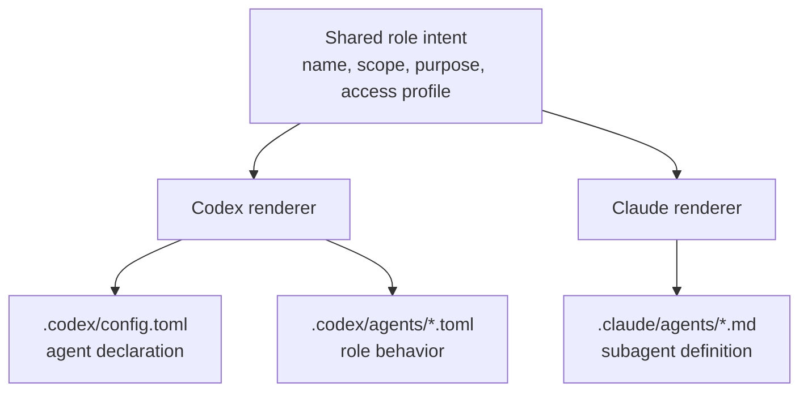

# Unified Codex And Claude Agent Model

This repo is trying to do one simple thing: keep one shared control-plane idea for agent roles, while still rendering the right runtime artifacts for Codex and Claude.

The important rule is that the intent can be unified, but the final files cannot. Codex agents are declared through `config.toml` plus TOML role layers. Claude subagents are Markdown files in `.claude/agents/` or `~/.claude/agents/`.

## Figure 1: One Intent, Two Renderers

## What Stays Shared

These ideas should stay unified across both runtimes:

- the role name
- the role purpose
- whether the role is global or repo-scoped
- which repos get the role
- the high-level access profile
  - read-only
  - workspace-write
  - full-access

That is the stable control-plane layer.

## Where They Differ

| Topic | Codex | Claude |
| --- | --- | --- |
| Runtime artifact | `.codex/config.toml` plus `agents/*.toml` | `.claude/agents/*.md` |
| Role declaration | `agents.<name>.config_file` in config | file name + YAML frontmatter in subagent file |
| Behavior body | TOML config layer | Markdown prompt body |
| MCP exposure | role TOML `[mcp_servers.*]` | `mcpServers` frontmatter |
| Extra tools | inherited from Codex tool surface unless role config constrains behavior | inherits parent tools by default unless `tools` or `disallowedTools` is set |
| Skills preload | normal skill system, not agent-specific by default | explicit `skills` field in subagent frontmatter |
| Full YOLO mode | `approval_policy = "never"` plus `sandbox_mode = "danger-full-access"` | `permissionMode: bypassPermissions` |

## Inheritance Model

### Claude

Claude subagents inherit some things from the main conversation when those fields are omitted:

- `model`: yes
- `tools`: yes
- `permissionMode`: mostly yes

Claude does not automatically inherit:

- `skills`
- `memory`
- subagent-specific hooks

So for Claude, omission is safe for baseline runtime behavior, but not for subagent knowledge loading.

### Codex

Codex works as a config-layer system. The practical model is:

- if a role TOML specifies a key, that role overrides it
- if a role TOML omits a key, Codex falls back to the resolved config stack

So omission usually means "use the normal Codex defaults for this repo or machine".

## Recommended Unified Contract

Keep the shared registry thin. It should describe placement and intent, not duplicate every runtime-specific field.

Recommended shared fields:

- `agent`
- `scope`
  - `global`
  - `repo`
- `repos`
- `purpose`
- `access_profile`
  - `read_only`
  - `workspace_write`
  - `full_access`
- `codex`
  - `enabled`
  - `description`
  - `config_file`
  - `nickname_candidates`
- `claude`
  - `enabled`
  - `source_path`

## Recommended Mapping

The shared `access_profile` should render differently per runtime:

| Shared intent | Codex render | Claude render |
| --- | --- | --- |
| `read_only` | `sandbox_mode = "read-only"` | `permissionMode: plan` or a read-only tool set |
| `workspace_write` | `sandbox_mode = "workspace-write"` with normal approvals | `permissionMode: acceptEdits` or default |
| `full_access` | `approval_policy = "never"` and `sandbox_mode = "danger-full-access"` | `permissionMode: bypassPermissions` |

This keeps one shared control-plane idea without pretending the two runtimes use the same schema.

## Practical Rule

Use one shared registry for:

- which role exists
- where it is exposed
- what kind of access it should have

Use runtime-specific source files for:

- the actual prompt/instruction body
- runtime-only fields
- MCP and tool details that do not map cleanly one-to-one

That is the cleanest way to run Codex and Claude side by side without forcing fake parity.

## Related Docs

- [Codex Control Plane](/Users/dobby/.agents/docs/architecture/codex-control-plane.md)
- [Claude Control Plane](/Users/dobby/.agents/docs/architecture/claude-control-plane.md)
- [Repo-Scoped Agent Bootstrap](/Users/dobby/.agents/docs/architecture/repo-scoped-agent-bootstrap.md)
- [Codex Config Layers](/Users/dobby/.agents/docs/architecture/codex-config-layers.md)
