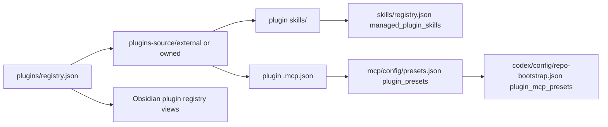

# Plugins Registry Reference

Canonical source of truth: [`plugins/registry.json`](/Users/dobby/.agents/plugins/registry.json)

## What Lives Where

- `plugins/registry.json` is the canonical list of managed plugin source packages.
- Canonical mirrored plugin source lives under:
  - `plugins-source/external/<plugin>/`
  - `plugins-source/owned/<plugin>/`
- `sync-plugins-registry.sh` regenerates:
  - Obsidian plugin registry views under `docs/references/registry/`
  - `skills/registry.json` `managed_plugin_skills`
  - `mcp/config/presets.json` `plugin_presets` and `plugin_global_presets`
  - `codex/config/repo-bootstrap.json` `plugin_mcp_presets`



## Current Model

- A managed plugin entry means:
  - the plugin bundle is a canonical upstream or owned source package
  - bundled `skills/` can be extracted into the normal managed skills flow
  - bundled `.mcp.json` can be extracted into the normal shared MCP flow
- `scope` controls extracted skill scope:
  - `global` adds global managed skills
  - `repo` adds repo-scoped managed skills for the listed repos
- `mcp_scope` controls extracted MCP scope:
  - `global` adds derived MCP presets to `plugin_global_presets`
  - `repo` assigns derived MCP presets to the listed repos through `plugin_mcp_presets`

## Normal Workflow

- Edit `plugins/registry.json`.
- Run `./scripts/refresh-external-plugins.sh --apply` when the source is external and you want the latest upstream bundle.
- Run `./scripts/sync-plugins-registry.sh --apply`.
- Run `./scripts/bootstrap-machine-agent-control-planes.sh --apply`.
- Run `./scripts/check-plugins-registry.sh`.

If you only need to add one managed plugin source, use:

```bash
./scripts/bootstrap-plugin.sh build-ios-apps --repo codexclaw --apply
```

That updates the registry, refreshes upstream source, regenerates plugin-derived skills and MCP state, and reapplies the shared Codex and Claude control planes.

## External Refresh

- `refresh-external-plugins.sh` refreshes canonical mirrored source under `plugins-source/external/`.
- Refresh preserves local `agents/openai.yaml` inside external plugin source folders.
- Plugin source refresh does not install a Codex plugin; it only refreshes the mirrored source package used for skill/MCP extraction.

## Field Quick Reference

- `plugin`: canonical plugin source name, for example `build-ios-apps`
- `origin`: `external` or `owned`
- `scope`: extracted skill scope, `global` or `repo`
- `repos`: target repos for repo-scoped extracted skills
- `mcp_scope`: extracted MCP scope, `global` or `repo`
- `mcp_repos`: target repos for repo-scoped extracted MCP presets
- `source_path`: canonical plugin source path, usually under `plugins-source/external/`
- `upstream_ref`: refresh source like `openai/plugins:plugins/build-ios-apps@main`
- `extract_skills`: whether bundled `skills/` should feed the managed skills flow
- `extract_mcp`: whether bundled `.mcp.json` should feed the shared MCP flow
- `category`: Obsidian registry category only
