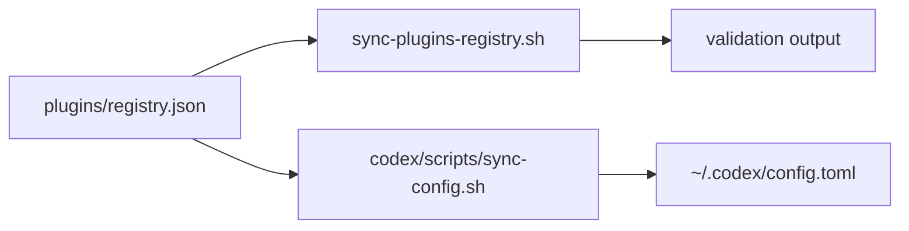

# Plugins Registry Reference

Canonical source of truth: [`plugins/registry.json`](/Users/dobby/GitHub/agents/plugins/registry.json)

## What Lives Where

- `plugins/registry.json` is the canonical list of native Codex plugin scope and state.
- `scripts/sync-codex-plugin-installs.py` installs enabled non-bundled plugin packages into the local Codex runtime cache.
- `codex/scripts/sync-config.sh` renders global plugin sections into the global Codex config.
- `sync-plugins-registry.sh` validates the plugin registry.
- Standalone skills stay in `skills/registry.json`.
- Standalone MCP presets stay in `mcp/config/presets.json`.



## Current Model

A managed plugin entry means:

- Codex should know the plugin by `<plugin>@<marketplace>`
- enabled non-bundled entries should be installed in `~/.codex/plugins/cache` during bootstrap
- global-scope entries should be rendered as enabled or disabled in the global Codex config
- dormant entries are tracked but not rendered
- the plugin remains a plugin, even when its package contains skills, MCP, apps, assets, or helper binaries

This registry does not automatically project plugin contents into the skill or MCP registries. If a capability should become standalone, add it explicitly to `skills/registry.json` or `mcp/config/presets.json`. Plugin-bundled skills that should be available without enabling the native plugin belong under `skills/registry.json` `managed_plugin_skills`, scoped to the repo that needs them.

Native Codex plugin enablement is treated as global/user-level for now. The current OpenAI Codex config schema describes `plugins` as user-level plugin config, and local testing has not shown reliable native plugin skill injection from repo-local `.codex/config.toml`. Do not try to make native plugin UX repo-specific through bootstrap. If a plugin should be used only occasionally, leave it unmanaged and enable it manually in Codex Desktop when needed.

For `openai-bundled` plugins, keep the registry name aligned with the plugin manifest in the Codex app bundle at `/Applications/Codex.app/Contents/Resources/plugins/openai-bundled/plugins/<plugin>`. Do not maintain an outside copy of bundled plugin source. `codex/scripts/sync-config.sh --apply` renders the config, seeds the runtime cache from the app bundle, and prunes bundled cache entries that are no longer enabled in `plugins/registry.json`.

For non-bundled plugins, `scripts/bootstrap-machine-agent-control-planes.sh --apply` runs `scripts/sync-codex-plugin-installs.py --apply` before rendering Codex config. This lets the registry remain declarative: adding an enabled global plugin entry is enough for machine bootstrap to install the package.

Repo-specific native plugin UX is not currently a supported bootstrap target. A local spike with Codex CLI 0.139.0 showed that trusted repo `.codex/config.toml` layers load, but repo-local `[plugins."<plugin>"].enabled` does not control plugin skill injection: user-level plugin enabled state wins. If a plugin-bundled skill or MCP must be available reliably for one repo, link the skill through `managed_plugin_skills` or promote the MCP into `mcp/config/presets.json` and assign it through `codex/config/repo-bootstrap.json`.

## Normal Workflow

- Edit `plugins/registry.json`.
- Run `./scripts/sync-plugins-registry.sh --apply`.
- Run `./scripts/bootstrap-machine-agent-control-planes.sh --apply`.
- Run `./scripts/check-agent-control-planes.sh`.

If you only need to add or update one plugin entry, use:

```bash
./scripts/bootstrap-plugin.sh browser --apply
```

## Field Quick Reference

- `plugin`: plugin name, for example `build-ios-apps`
- `marketplace`: Codex marketplace id, for example `openai-curated` or `openai-bundled`
- `enabled`: whether Codex should enable the plugin
- `scope`: use `global` for native plugin bootstrap, or `dormant` to track a disabled plugin. Avoid `repo` for native plugins until Codex supports repo-scoped plugin activation reliably.
- `repos`: historical field for repo scope; leave empty for global or dormant entries
- `category`: dashboard grouping category only
