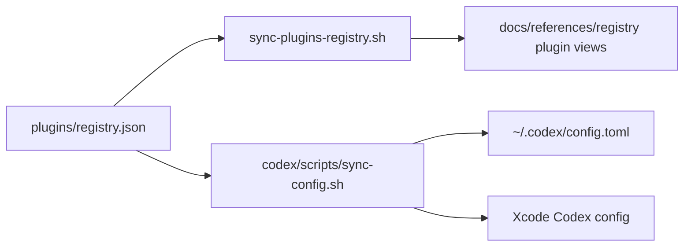

# Plugins Registry Reference

Canonical source of truth: [`plugins/registry.json`](/Users/dobby/.agents/plugins/registry.json)

## What Lives Where

- `plugins/registry.json` is the canonical list of native Codex plugin state.
- `codex/scripts/sync-config.sh` renders plugin sections into the terminal and Xcode Codex configs.
- `sync-plugins-registry.sh` regenerates the Obsidian plugin registry views under `docs/references/registry/`.
- Standalone skills stay in `skills/registry.json`.
- Standalone MCP presets stay in `mcp/config/presets.json`.



## Current Model

A managed plugin entry means:

- Codex should know the plugin by `<plugin>@<marketplace>`
- the plugin should be rendered as enabled or disabled for its configured targets
- the plugin remains a plugin, even when its package contains skills, MCP, apps, assets, or helper binaries

This registry does not project plugin contents into the skill or MCP registries. If a capability should become standalone, add it directly to `skills/registry.json` or `mcp/config/presets.json`.

## Normal Workflow

- Edit `plugins/registry.json`.
- Run `./scripts/sync-plugins-registry.sh --apply`.
- Run `./scripts/bootstrap-machine-agent-control-planes.sh --apply`.
- Run `./scripts/check-plugins-registry.sh`.

If you only need to add or update one plugin entry, use:

```bash
./scripts/bootstrap-plugin.sh build-ios-apps --target global --apply
```

## Field Quick Reference

- `plugin`: plugin name, for example `build-ios-apps`
- `marketplace`: Codex marketplace id, for example `openai-curated` or `openai-bundled`
- `enabled`: whether Codex should enable the plugin
- `targets`: Codex configs to render into, currently `global` and/or `xcode`
- `category`: Obsidian registry category only
