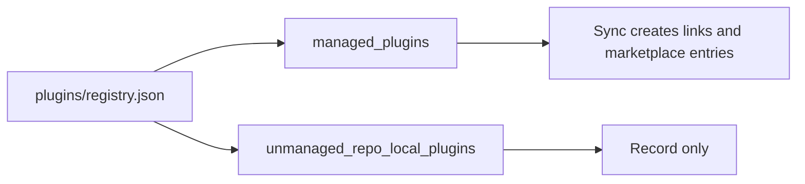
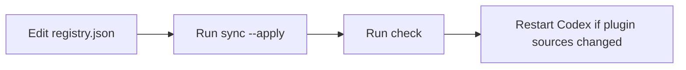
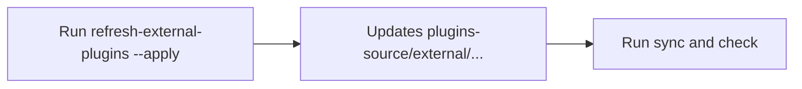

# Plugins Registry Reference

Canonical source of truth: [`plugins/registry.json`](/Users/dobby/.agents/plugins/registry.json)

## 1) What Lives Where

- Real plugin files live in `plugins-source/...`.
- Runtime discovery paths are managed symlinks, not copied plugin folders.
- Codex discovers plugins through marketplace files rendered from the registry.

```mermaid
flowchart LR
    A[plugins/registry.json] --> B[Real plugin folder in plugins-source/...]
    B --> C[Global symlink: ~/.codex/plugins/{plugin}]
    B --> D[Repo symlink: ~/GitHub/{repo}/plugins/{plugin}]
    A --> E[Optional global marketplace: ~/.agents/plugins/marketplace.json]
    A --> F[Generated Obsidian views in docs/references/registry/]
```

## 2) Two Entry Types

- `managed_plugins`: actively synced by this repo.
- `unmanaged_repo_local_plugins`: tracked for visibility only.



## 3) Normal Workflow

- Edit `plugins/registry.json`.
- Run `./scripts/sync-plugins-registry.sh --apply`.
- Run `./scripts/check-plugins-registry.sh`.
- Restart Codex after plugin source or marketplace changes so the local install picks them up.
- Managed plugins default to `policy.installation = INSTALLED_BY_DEFAULT` unless you override it explicitly.
- If there are no global-scoped managed plugins, the personal marketplace file is removed instead of rendering an empty catalog.



## 4) External Refresh

- Use only for external plugins that have `upstream_ref`.
- Run `./scripts/refresh-external-plugins.sh --apply`.
- Then run sync + check again.



## Field Quick Reference

- `plugin`: plugin folder name and manifest name.
- `origin`: `owned` or `external`.
- `scope`: `global` or `repo`.
- `repos`: target repos for repo-scoped plugin runtime links and repo marketplaces.
- `source_path`: real source folder under `plugins-source/...`.
- `upstream_ref`: upstream source for external plugins.
- `category`: marketplace category shown in Codex.
- `policy.installation`: Codex install policy for the marketplace entry. Managed plugins default to `INSTALLED_BY_DEFAULT`.
- `policy.authentication`: when Codex should ask for auth for the marketplace entry.
