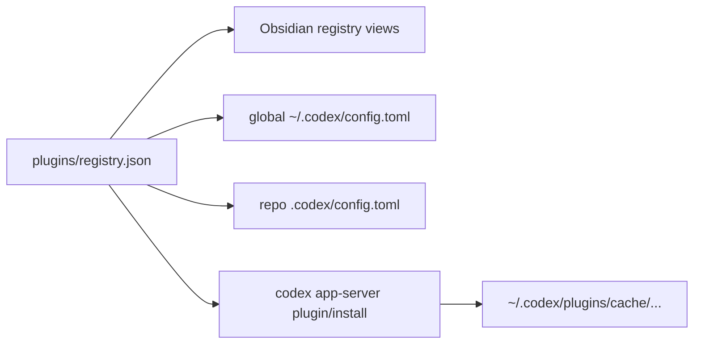
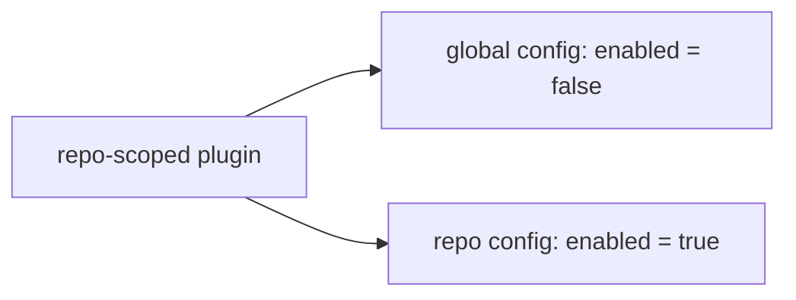

# Plugins Registry Reference

Canonical source of truth: [`plugins/registry.json`](/Users/dobby/.agents/plugins/registry.json)

## What Lives Where

- `plugins/registry.json` is the canonical list of managed Codex plugins.
- Managed official plugins install into Codex through the official marketplace and `codex app-server`.
- Plugin enablement is rendered into:
  - global `~/.codex/config.toml`
  - repo-local `.codex/config.toml` for repo-scoped entries
- Obsidian views are generated under `docs/references/registry/`.
- `plugins-source/owned/` and `plugins-source/external/` remain reserved for future local/custom plugin source, but official OpenAI plugins are not mirrored there.



## Current Model

- A managed plugin entry means:
  - Codex should know about this plugin in the control plane
  - Codex bootstrap should ensure it is installed
  - config sync should render its enabled/disabled state
- `global` scope means:
  - render `[plugins."<id>"] enabled = ...` in `~/.codex/config.toml`
- `repo` scope means:
  - render the plugin disabled globally
  - render the repo-local override in the assigned repos' `.codex/config.toml`

That is the selective-control pattern:



## Normal Workflow

- Edit `plugins/registry.json`.
- Run `./scripts/sync-plugins-registry.sh --apply`.
- Run `./codex/scripts/bootstrap-machine-codex.sh --apply`.
- Run `./scripts/check-plugins-registry.sh`.

If you only need to add one managed plugin, use:

```bash
./scripts/bootstrap-plugin.sh build-ios-apps --repo codexclaw --apply
```

That updates the registry, regenerates the Obsidian views, syncs Codex config, and ensures the plugin is installed in Codex.

## External Refresh

- `refresh-external-plugins.sh` is now only for future locally mirrored plugin source under `plugins-source/external/`.
- Official OpenAI plugins do not need local source refresh because Codex installs them from the official marketplace.

## Field Quick Reference

- `plugin_id`: canonical plugin id, e.g. `build-ios-apps@openai-curated`
- `scope`: `global` or `repo`
- `repos`: target repos for repo-scoped enablement
- `enabled`: desired enabled state in that scope
- `category`: Obsidian registry category only
