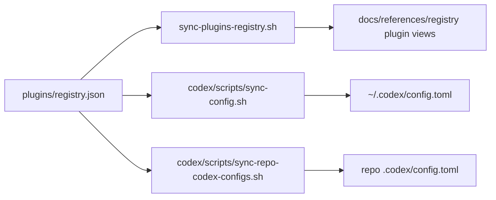

# Plugins Registry Reference

Canonical source of truth: [`plugins/registry.json`](/Users/dobby/.agents/plugins/registry.json)

## What Lives Where

- `plugins/registry.json` is the canonical list of native Codex plugin scope and state.
- `codex/scripts/sync-config.sh` renders global plugin sections into the global Codex config.
- `codex/scripts/sync-repo-codex-configs.sh` renders repo-scoped plugin sections into assigned repo-local Codex configs.
- `sync-plugins-registry.sh` regenerates the Obsidian plugin registry views under `docs/references/registry/`.
- Standalone skills stay in `skills/registry.json`.
- Standalone MCP presets stay in `mcp/config/presets.json`.



## Current Model

A managed plugin entry means:

- Codex should know the plugin by `<plugin>@<marketplace>`
- global-scope entries should be rendered as enabled or disabled in the global Codex config
- repo-scope entries should be rendered only into the listed managed repos
- dormant entries are tracked but not rendered
- the plugin remains a plugin, even when its package contains skills, MCP, apps, assets, or helper binaries

This registry does not project plugin contents into the skill or MCP registries. If a capability should become standalone, add it directly to `skills/registry.json` or `mcp/config/presets.json`.

For `openai-bundled` plugins, keep the registry name aligned with the plugin manifest in the Codex app bundle at `/Applications/Codex.app/Contents/Resources/plugins/openai-bundled/plugins/<plugin>`. Do not maintain an outside copy of bundled plugin source. `codex/scripts/sync-config.sh --apply` renders the config, seeds the runtime cache from the app bundle, and prunes bundled cache entries that are no longer enabled in `plugins/registry.json`.

## Normal Workflow

- Edit `plugins/registry.json`.
- Run `./scripts/sync-plugins-registry.sh --apply`.
- Run `./scripts/bootstrap-machine-agent-control-planes.sh --apply`.
- Run `./scripts/check-plugins-registry.sh`.

If you only need to add or update one plugin entry, use:

```bash
./scripts/bootstrap-plugin.sh build-ios-apps --apply
./scripts/bootstrap-plugin.sh build-ios-apps --scope repo --repo codexclaw --apply
```

## Field Quick Reference

- `plugin`: plugin name, for example `build-ios-apps`
- `marketplace`: Codex marketplace id, for example `openai-curated` or `openai-bundled`
- `enabled`: whether Codex should enable the plugin
- `scope`: `global`, `repo`, or `dormant`
- `repos`: repo names under `paths.github_root` or explicit paths; required for `repo` scope
- `category`: Obsidian registry category only
