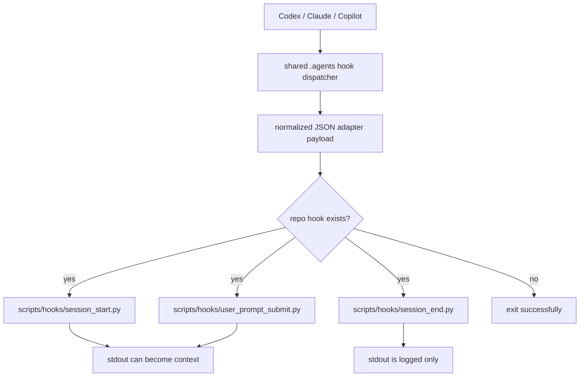

# Repo Lifecycle Hook Adapter

Use this page when adding repo-specific behavior to agent lifecycle hooks.

The shared `.agents` control plane owns runtime integration and dispatch. Each
repository owns what it wants to do when a lifecycle event arrives.



## Rule Of Thumb

Put repo policy in the repo. Keep the shared control plane boring.

- Shared `.agents` layer:
  - receives runtime-specific hook payloads
  - resolves the Git repo root
  - normalizes the payload shape
  - runs a repo hook if it exists
  - enforces short, non-interactive execution
- Repo layer:
  - decides whether the event matters
  - reads repo files or local state
  - emits context or writes follow-up work
  - keeps expensive work out of blocking hooks

## Repo Hook Locations

Create these files only when a repo needs them:

```text
scripts/hooks/session_start.py
scripts/hooks/user_prompt_submit.py
scripts/hooks/session_end.py
```

All repo lifecycle hooks are Python. Do not add shell compatibility shims.

## Events

`SessionStart`

- Runs when a supported client starts or resumes a session.
- Codex and Claude can receive stdout as startup context.
- Copilot JSON hooks currently ignore startup stdout.
- Good for loading compact repo-local orientation.

`UserPromptSubmit`

- Runs before a user prompt is processed.
- Codex and Claude can receive stdout as additional prompt context.
- Copilot JSON hooks currently ignore prompt-submit stdout.
- Good for very small, current-time or current-state context.

`SessionEnd`

- Runs for Claude and Copilot where supported.
- Codex does not currently expose a separate documented `SessionEnd` hook.
- Stdout is logged, not injected into context, because the session is ending.
- Good for enqueueing cleanup, summary, or memory jobs.
- Keep it fast. Do not do slow LLM summarization inline.

`Stop`

- This is the shared turn-end commit gate, not a repo lifecycle script.
- It stages, commits, runs repo `scripts/check-fast.sh` through Git, rebases,
  and pushes.
- Do not use `scripts/check-fast.sh` as a general after-turn hook.

## Payload Contract

Repo hooks receive one JSON object on stdin.

The shape is intentionally stable across Codex, Claude, Copilot JSON hooks, and
Copilot SDK adapters. Runtime-specific details are preserved under
`raw_payload`.

```json
{
  "schema_version": "1.0",
  "hook_event_name": "SessionEnd",
  "runtime": "claude",
  "cwd": "/Users/dobby/GitHub/example/services/api",
  "repo_root": "/Users/dobby/GitHub/example",
  "session_id": "optional",
  "turn_id": "optional",
  "model": "optional",
  "timestamp": 1760000000000,
  "source": "optional",
  "reason": "optional",
  "prompt": "optional",
  "initial_prompt": "optional",
  "final_message": "optional",
  "error": null,
  "transcript_path": "optional",
  "transcript_format": "optional",
  "raw_payload": {}
}
```

Important fields:

- `schema_version`: current adapter contract version. Today this is `1.0`.
- `hook_event_name`: `SessionStart`, `UserPromptSubmit`, or `SessionEnd`.
- `runtime`: `codex`, `claude`, or `copilot`.
- `cwd`: where the client session was running.
- `repo_root`: resolved Git top-level directory.
- `session_id`: present when the runtime or adapter provides one.
- `transcript_path`: present when a runtime or adapter exposes a transcript file.
- `transcript_format`: format label for `transcript_path`.
- `raw_payload`: original runtime-specific input.

Prefer top-level normalized fields in repo hooks. Read `raw_payload` only when a
runtime-specific detail is genuinely needed.

## Environment

Repo hooks also receive:

```text
AGENT_HOOK_EVENT=SessionStart | UserPromptSubmit | SessionEnd
AGENT_HOOK_RUNTIME=codex | claude | copilot
AGENT_REPO_ROOT=/absolute/repo/root
AGENT_HOOK_SCHEMA_VERSION=1.0
```

Use `AGENT_REPO_ROOT` or payload `repo_root` for stable repo files. Use payload
`cwd` only when behavior should depend on the subdirectory where the session was
started.

## Minimal Python Helper

This helper is enough for most repo hooks:

```python
#!/usr/bin/env python3
from __future__ import annotations

import json
import os
import sys
from pathlib import Path
from typing import Any


def read_payload() -> dict[str, Any]:
    raw = sys.stdin.read()
    if not raw.strip():
        return {}
    try:
        payload = json.loads(raw)
    except json.JSONDecodeError:
        return {}
    return payload if isinstance(payload, dict) else {}


def repo_root(payload: dict[str, Any]) -> Path:
    return Path(
        payload.get("repo_root")
        or os.environ.get("AGENT_REPO_ROOT")
        or "."
    ).resolve()


def main() -> int:
    payload = read_payload()
    if payload.get("schema_version") != "1.0":
        return 0

    root = repo_root(payload)
    event = payload.get("hook_event_name")

    # Add repo-specific behavior here.
    print(f"repo={root}")
    print(f"event={event}")
    return 0


if __name__ == "__main__":
    raise SystemExit(main())
```

For `session_start.py` and `user_prompt_submit.py`, stdout may become model
context for Codex and Claude. Print only concise context that should be shown to
the agent.

For `session_end.py`, stdout is only logged. Use it for diagnostics, not model
instructions.

## Session-End Pattern

Session end should be quick:

```text
session_end.py
  -> read normalized payload
  -> inspect transcript_path if present
  -> write a small local job or summary pointer
  -> return success quickly
```

Do not do this directly inside the hook:

```text
read entire transcript
call an LLM
rewrite memory
run slow validation
```

The better loop is:

```text
SessionEnd captures a transcript pointer
background worker or next SessionStart processes it
SessionStart injects the useful compact summary
```

## Runtime Notes

Claude:

- Native `SessionEnd` can provide `transcript_path`.
- Use that path instead of trying to reconstruct the conversation.

Copilot JSON hooks:

- Repo-local `.github/hooks/agent-control-plane.json` is rendered from the
  shared registry.
- Local Copilot CLI can run those hooks on this machine.
- GitHub cloud agent no-ops when `~/.agents` is absent.
- Transcript fields may be absent.

Copilot SDK adapters:

- SDK wrappers that own the session loop should emit the same normalized payload.
- If they persist or can locate a transcript, they should pass `transcript_path`
  and `transcript_format`.
- Codexclaw's mobile gateway uses this pattern for its Copilot SDK bridge.

Codex:

- `SessionStart` and `UserPromptSubmit` are supported by this control plane.
- A separate `SessionEnd` is not rendered for Codex today.
- Use `Stop` for turn-end commit/check automation.

## Local Smoke Tests

Run a repo hook directly:

```bash
cd /path/to/repo
printf '{"schema_version":"1.0","hook_event_name":"SessionStart","runtime":"claude","cwd":"%s","repo_root":"%s","raw_payload":{}}' "$PWD" "$PWD" \
  | python3 scripts/hooks/session_start.py
```

Run through the shared dispatcher:

```bash
cd /path/to/repo
printf '{"hook_event_name":"SessionStart","cwd":"%s","session_id":"test-session","source":"startup"}' "$PWD" \
  | python3 ~/.agents/hooks/scripts/session_start.py --runtime claude
```

For `SessionEnd`:

```bash
cd /path/to/repo
printf '{"hook_event_name":"SessionEnd","cwd":"%s","session_id":"test-session","reason":"other"}' "$PWD" \
  | python3 ~/.agents/hooks/scripts/session_end.py --runtime claude
```

Expected behavior:

- Missing repo hook: exits `0`, no output.
- `SessionStart` / `UserPromptSubmit`: stdout may be wrapped and forwarded for
  Codex or Claude.
- `SessionEnd`: stdout goes to
  `~/.local/state/agents-control-plane/log/hooks-session-end.log`.

## Change Checklist

When adding or changing repo lifecycle hooks:

- Keep hooks non-interactive.
- Keep hooks fast and deterministic.
- Prefer normalized payload fields over `raw_payload`.
- Use Python only.
- Avoid secrets in stdout, stderr, payload files, and logs.
- If the hook emits context, make it concise and directly useful.
- If the hook needs slow work, enqueue it and return.

When changing shared hook dispatchers in `.agents`, run:

```bash
cd ~/.agents
python3 -m py_compile hooks/scripts/hook_adapter.py hooks/scripts/session_start.py hooks/scripts/user_prompt_submit.py hooks/scripts/session_end.py
python3 -m unittest tests.control_plane.test_hooks_control_plane
./scripts/test-control-plane.sh
./scripts/bootstrap-machine-agent-control-planes.sh --apply
./scripts/check-agent-control-planes.sh
```

## Hand-Off Prompt

Use this when asking another agent to add repo-specific hook behavior:

```text
Use ~/.agents/docs/references/repo-lifecycle-hook-adapter.md.

Add repo-specific lifecycle behavior only under scripts/hooks/*.py.
Do not edit rendered .github/hooks/agent-control-plane.json.
Read the normalized JSON payload from stdin.
Prefer top-level fields over raw_payload.
Keep the hook non-interactive, fast, deterministic, and Python-only.
For SessionEnd, enqueue slow summary/memory work instead of doing it inline.
Run the repo's fast check before finishing.
```
