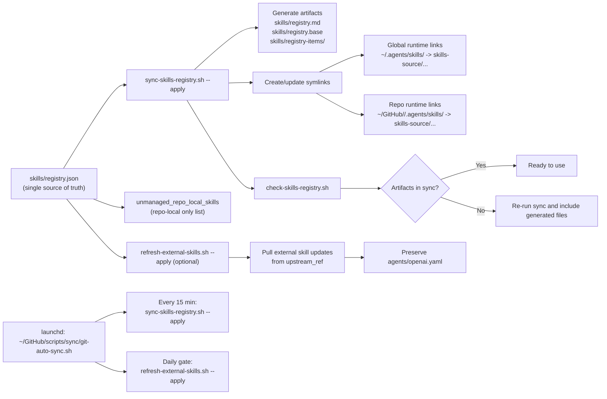

# Skills Registry Reference

Canonical source of truth is [`skills/registry.json`](/Users/dobby/.agents/skills/registry.json).

## System Overview Diagram

Source diagram: [`docs/references/skills-system-overview.mmd`](./skills-system-overview.mmd)

## What Each Field Means

- `managed_skills`: skills that are centrally managed and linked into global/runtime or repos.
- `unmanaged_repo_local_skills`: skills intentionally kept only inside specific repos.
- `skill`: stable skill folder name.
- `origin`: `external` (pulled/imported) or `owned` (authored by us).
- `scope`: `global` (links into `~/.agents/skills`) or `repo` (links into `<repo>/.agents/skills`).
- `repos`: list of repo names for `repo` scope.
- `source_path`: canonical folder path under `skills-source/...`.
- `upstream_ref`: where an external skill came from (or `-` for owned).

## Edit Workflow

1. Edit `skills/registry.json`.
2. Regenerate views and verify links:
   - `./scripts/sync-skills-registry.sh --apply`
3. Check generated artifacts are in sync:
   - `./scripts/check-skills-registry.sh`
4. For external upstream updates:
   - `./scripts/refresh-external-skills.sh --apply`
   - Local `agents/openai.yaml` is preserved across refresh.

## Generated Files (Do Not Edit Manually)

- `skills/registry.md`
- `skills/registry.base`
- `skills/registry-items/`
