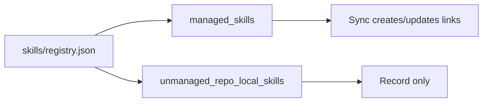
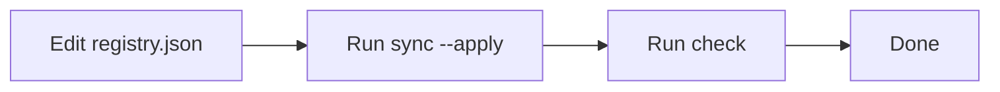
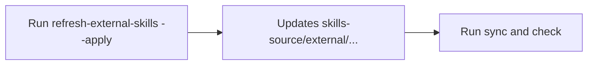

# Skills Registry Reference

Canonical source of truth: [`skills/registry.json`](/Users/dobby/.agents/skills/registry.json)

## 1) What Lives Where

- Real skill files (the files you edit) live in `skills-source/...`.
- Runtime discovery paths are symlinks, not real copies.
- The registry tells sync scripts what to link and where.

```mermaid
flowchart LR
    A[skills/registry.json] --> B[Real skill folder in skills-source/...]
    B --> C[Global symlink: ~/.agents/skills/{skill}]
    B --> D[Repo symlink: ~/GitHub/{repo}/.agents/skills/{skill}]
    A --> E[Generated Obsidian views in docs/references/registry/]
```

## 2) Two Entry Types

- `managed_skills`: actively synced by this repo (links are created/updated).
- `unmanaged_repo_local_skills`: tracked for visibility only (no managed links created here).



## 3) Normal Workflow

- Edit `skills/registry.json`.
- Run `./scripts/sync-skills-registry.sh --apply`.
- Run `./scripts/check-skills-registry.sh`.
- Generated Obsidian views land under [`docs/references/registry/`](/Users/dobby/.agents/docs/references/registry).



## 4) External Refresh (Optional)

- Use only for external skills that have `upstream_ref`.
- Run `./scripts/refresh-external-skills.sh --apply`.
- Then run sync + check again.



## Field Quick Reference

- `skill`: skill folder name.
- `origin`: `owned` or `external`.
- `scope`: `global` or `repo`.
- `repos`: target repos for repo-scoped links.
  - When a skill depends on a repo MCP preset, keep this list aligned with the repos that declare that preset in `codex/config/repo-bootstrap.json`.
  - Entries can be repo names under `~/GitHub` or explicit repo roots such as `~/.agents`.
- `source_path`: real source folder under `skills-source/...`.
- `upstream_ref`: upstream source for external skills.
