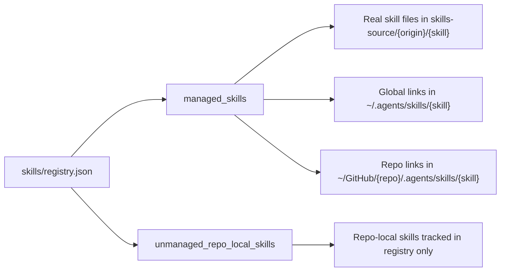
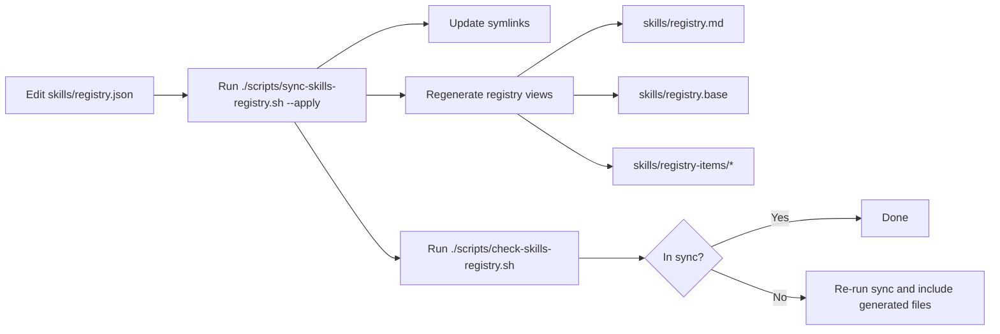
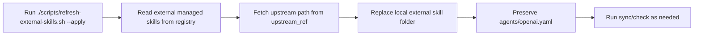
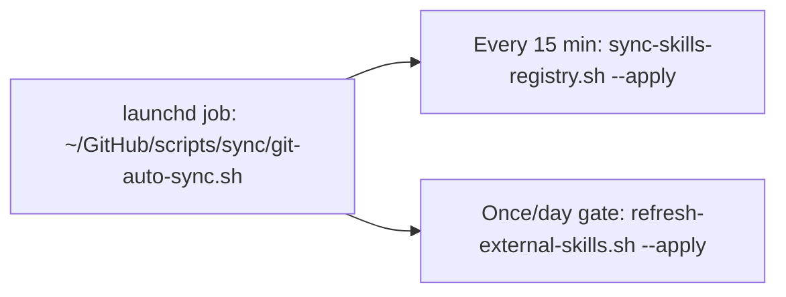

# Skills Registry Reference

Canonical source of truth is [`skills/registry.json`](/Users/dobby/.agents/skills/registry.json).

## System Overview Diagram

- `skills/registry.json` is the master list. Everything starts from this file.
- `managed_skills` means the skill is centrally managed here.
- `Canonical content` means the real skill files you edit, stored in `skills-source/...` (not the symlink locations).
- `Global links` and `Repo links` are symlinks created from that real source content.
- `unmanaged_repo_local_skills` is just a registry list for repo-local skills that stay in their own repos.

### Sync and Check Flow

- Use this flow after changing `skills/registry.json`.
- `sync-skills-registry.sh --apply` does two things: regenerates registry artifacts and fixes symlinks.
- `check-skills-registry.sh` verifies generated registry artifacts are up to date.
- If check fails, run sync again and include the generated file changes.

### External Skill Refresh Flow (Optional)

- This is only for externally sourced skills with an `upstream_ref`.
- It pulls the latest upstream version into `skills-source/external/...`.
- It preserves local `agents/openai.yaml` during replacement.
- After refresh, run sync/check so links and generated views stay consistent.

### Automation Cadence

- A launchd job runs from `~/GitHub/scripts/sync/git-auto-sync.sh`.
- Every 15 minutes it runs sync to keep symlinks/artifacts current.
- External refresh runs with a once-per-day gate.

## What Each Field Means

- `managed_skills`: skills that are centrally managed and linked into global/runtime or repos.
- `unmanaged_repo_local_skills`: skills intentionally kept only inside specific repos.
- `skill`: stable skill folder name.
- `origin`: `external` (pulled/imported) or `owned` (authored by us).
- `scope`: `global` (links into `~/.agents/skills`) or `repo` (links into `{repo}/.agents/skills`).
- `repos`: list of repo names for `repo` scope.
- `source_path`: canonical folder path under `skills-source/...`.
- `upstream_ref`: where an external skill came from (or `-` for owned).

## Edit Workflow

1. Edit `skills/registry.json`.
2. Regenerate views and verify links:
   - `./scripts/sync-skills-registry.sh --apply`
3. Check generated artifacts are in sync:
   - `./scripts/check-skills-registry.sh`
4. For external upstream updates:
   - `./scripts/refresh-external-skills.sh --apply`
   - Local `agents/openai.yaml` is preserved across refresh.

## Generated Files (Do Not Edit Manually)

- `skills/registry.md`
- `skills/registry.base`
- `skills/registry-items/`
