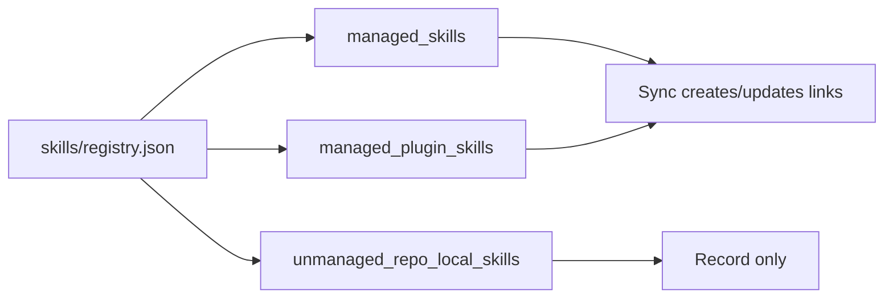
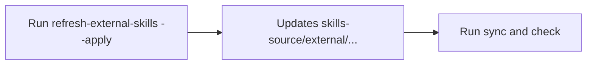

# Skills Registry Reference

Canonical source of truth: [`skills/registry.json`](/Users/dobby/GitHub/agents/skills/registry.json)

## 1) What Lives Where

- Real standalone skill files (the files you edit) live in `skills-source/...`.
- Plugin-derived skill files stay under `plugins-source/...` and are linked only through explicit `managed_plugin_skills` entries.
- Runtime discovery paths are symlinks, not real copies.
- The registry tells sync scripts what to link and where.

```mermaid
flowchart LR
    A[skills/registry.json] --> B[Real skill folder in skills-source/...]
    A --> C[Plugin skill folder in plugins-source/...]
    B --> D[Global symlink: ~/.agents/skills/{skill}]
    B --> E[Repo symlink: ~/GitHub/{repo}/.agents/skills/{skill}]
    C --> E
    A --> F[Dashboard API summary]
```

## 2) Entry Types

- `managed_skills`: actively synced by this repo (links are created/updated).
- `managed_plugin_skills`: plugin-bundled skills that are explicitly linked like managed skills without enabling the whole native plugin.
- `unmanaged_repo_local_skills`: tracked for visibility only (no managed links created here).
  - If the target repo exists locally, the repo must actually contain `.agents/skills/<skill>/SKILL.md`.
  - Registry sync fails early for stale repo-local entries instead of letting them leak into dashboard data or downstream runtime warnings.

```mermaid
flowchart LR
    A[skills/registry.json] --> B[managed_skills]
    A --> C[managed_plugin_skills]
    A --> D[unmanaged_repo_local_skills]
    B --> E[Sync creates/updates links]
    C --> E
    D --> F[Record only]
```

## 3) Normal Workflow

- Edit `skills/registry.json`.
- Run `./scripts/sync-skills-registry.sh --apply`. Missing repo checkouts are expected on sparse machines and are skipped silently; existing non-git folders still warn because they may be broken placeholders.
- Run `./scripts/check-skills-registry.sh`.

```mermaid
flowchart LR
    A[Edit registry.json] --> B[Run sync --apply]
    B --> C[Run check]
    C --> D[Done]
```

## 4) External Refresh (Optional)

- Use only for external skills that have `upstream_ref`.
- If an upstream repo has both raw skill source and generated provider bundles, point `upstream_ref` at the install-ready bundle for this runtime. For Codex/agents installs, prefer upstream paths like `.agents/skills/<skill>` when present, not raw template folders like `skill/` that may contain `SKILL.src.md`.
- Run `./scripts/refresh-external-skills.sh --apply`.
- Then run sync + check again.

```mermaid
flowchart LR
    A[Run refresh-external-skills --apply] --> B[Updates skills-source/external/...]
    B --> C[Run sync and check]
```

## Field Quick Reference

- `skill`: skill folder name.
- `origin`: `owned` or `external`.
- `scope`: `global`, `repo`, or `dormant`.
- `repos`: target repos for repo-scoped links.
  - When a skill depends on a repo MCP, keep this list aligned with that MCP's repo targets in `mcp/config/presets.json`.
  - Entries can be repo names under `~/GitHub` or explicit repo roots such as `~/GitHub/agents`.
  - Sync skips missing repo checkouts silently on the current machine. Existing non-git folders still warn because they may be broken placeholders. Sync must not create placeholder folders under `~/GitHub` just because a repo is listed in the registry.
  - Dormant skills keep their source tracked but must use an empty `repos` list and are not linked into any runtime.
- `source_path`: real source folder under `skills-source/...` or, for `managed_plugin_skills`, under `plugins-source/...`.
- `upstream_ref`: upstream source for external skills.
- `source_plugin`: for `managed_plugin_skills`, the native plugin whose bundled skill source is being linked.
