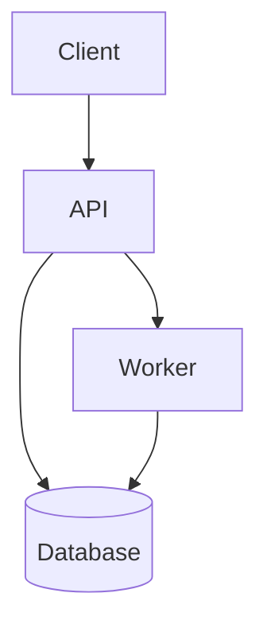

# Architecture Doc Shape

Use this as the default shape for a human-friendly architecture doc.

## Recommended structure

1. Title
2. Short overview
3. Mermaid diagram
4. Main parts
5. Main flow
6. Tradeoffs or important constraints
7. Links to deeper references

## Example skeleton

```markdown
# System Name

One short paragraph explaining what this system does and how to think about it.



## Main Parts

- `Client`: what the user or caller interacts with
- `API`: request entry point and orchestration layer
- `Worker`: background execution or async processing
- `Database`: stored state and durable records

## Main Flow

1. The client sends a request to the API.
2. The API validates input and decides whether work is synchronous or background.
3. Workers handle longer-running jobs.
4. Results are written to durable storage and surfaced back to the client.

## Notes

- Keep this doc high-level.
- Put exact contracts, schemas, and env vars in `docs/references/`.
```

## Writing guidance

- Prefer one strong diagram over many weak ones.
- Keep the intro short and concrete.
- Use bullets for parts and numbered steps for flow.
- Link to deeper docs instead of overstuffing the page.
