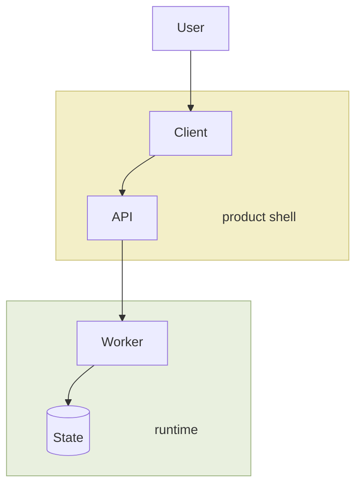

# Mermaid Guidelines

Architecture docs should use Mermaid to make the system easy to understand at a glance.

## Default

Use:

```mermaid
flowchart TD
```

Top-down is the default because it is usually easiest to scan quickly.

## Good defaults

- Keep node count modest.
- Prefer simple labels.
- Show the main path first.
- Group related nodes only when it improves understanding.
- Use subgraphs sparingly.
- Keep container labels passive.
  Arrows should connect actual components, not the names of groups or ownership blocks.
- Use consistent color by zone when it improves scanability.
  Color should reinforce grouping, not carry critical meaning by itself.
- If the diagram will be read in a specific renderer such as Obsidian, verify the real render when possible.

## Prefer

- `Client`
- `API`
- `Worker`
- `Queue`
- `Database`
- `Storage`
- `External API`

These kinds of labels are clearer than highly internal names unless the internal names matter.

## Avoid

- giant diagrams with every module shown
- crossing lines everywhere
- deeply nested subgraphs
- labels that require repo context to decode
- mixing too many concerns in one diagram
- making a block label look like a runtime step
- forcing overview, routing, and deep internals into one figure

## Rule of thumb

If a person cannot understand the diagram in a few seconds, it is too detailed.

If a reader has to parse the diagram before they understand the system, the diagram is doing too much at once.

## Progressive disclosure

When a system has more than one natural zoom level, prefer multiple small diagrams over one crowded diagram.

Good pattern:

- Level 1: simplest end-to-end overview
- Level 2: main ownership zones or major components
- Level 3: one important runtime path or boot path

Each diagram should explain one idea well.

## Grouping and labeling pattern

When you need to show ownership zones or major system blocks:

- group the components with a subtle background color
- keep the label as a passive zone label, not a flow step
- connect arrows to the real components inside the zone
- keep the same color for the same kind of zone within one doc

Good use:

- one color for product shell
- one color for runtime or execution engine
- one color for workspace, storage, or context layer

Do not rely on color alone.
The text labels and flow should still make sense in grayscale.

## Example pattern

Use a pattern like this when grouped zones help the reader:



This works because:

- the label reads as the block name
- the arrows hit the real components
- the color helps scanning without adding a second meaning system

## When to split diagrams

Split into more than one diagram only when:

- one diagram would be too dense
- there are clearly different flows
- one diagram is for system shape and another is for one key runtime path
- one diagram would mix overview with deeper boot or routing details
- the layout starts fighting the labels or container titles

Usually one diagram is enough.
