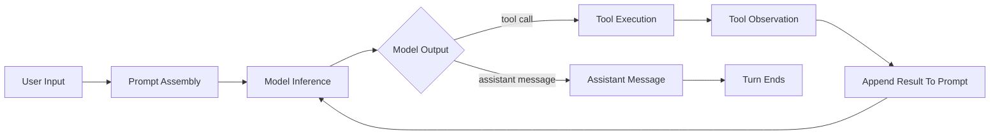
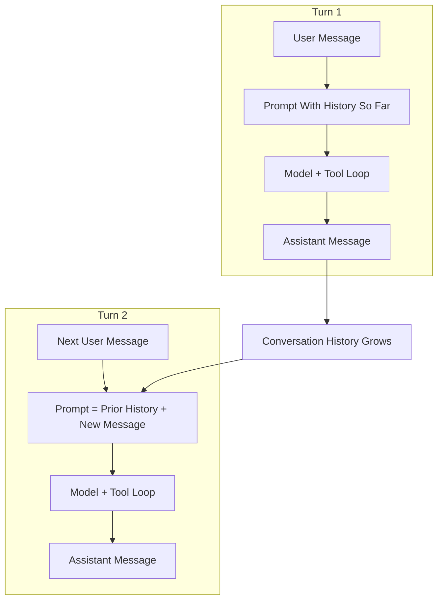
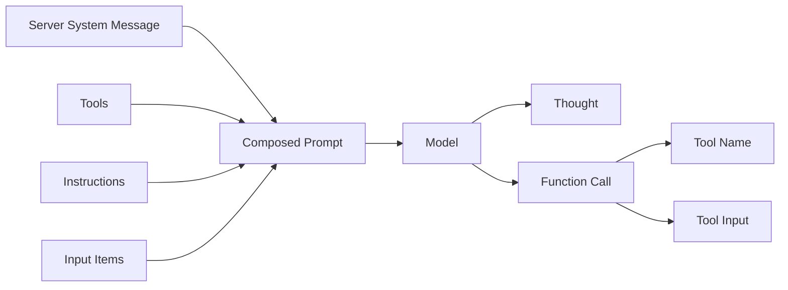
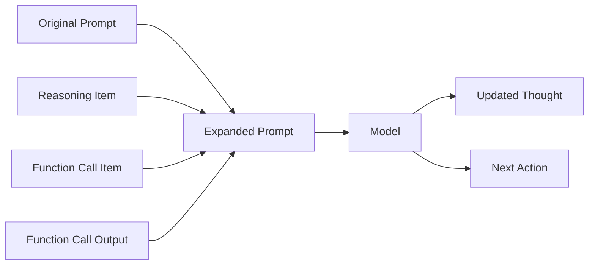
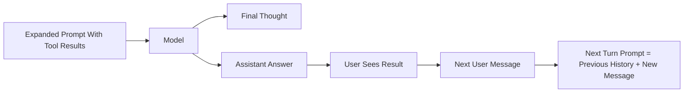

# Unrolling The Codex Agent Loop Diagrams

Source:

- `https://openai.com/index/unrolling-the-codex-agent-loop/`

These Mermaid diagrams are faithful structural reconstructions of the article's five main visuals. They preserve the logic and teaching intent of the original diagrams, not the exact illustration style.

## 1. Agent Loop

What it teaches:

- the model does not always answer directly
- tool use is part of the loop
- tool results feed back into the next model call

## 2. Multi-Turn Agent Loop

What it teaches:

- threads persist across turns
- every new turn includes prior conversation history
- prompt size grows over time

## 3. Snapshot 1: Initial Prompt To First Tool Call

What it teaches:

- prompt assembly includes multiple structured layers
- the first model step can end in a tool request instead of a user-facing answer

## 4. Snapshot 2: Tool Result Appended Back Into Prompt

What it teaches:

- the old prompt remains an exact prefix
- new items are appended after tool use
- the next model call reasons over the previous state plus the new observation

## 5. Snapshot 3: Final Answer And Next Turn Hand-Off

What it teaches:

- a turn ends with an assistant message
- the next user message starts a new turn
- prior turn artifacts remain part of the ongoing thread state

## Applying These Diagrams

- Use the thread/turn model when reasoning about long-lived personal assistants.
- Keep base assistant identity stable across turns.
- Treat local memory and context as information appended around the loop, not as a replacement for the loop.
- When boot behavior changes by mode or repository, prefer a local routing layer over rewriting the whole base prompt.
