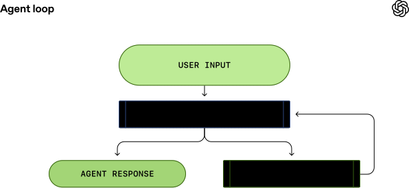
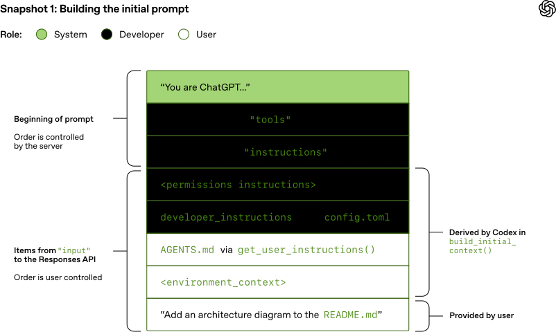
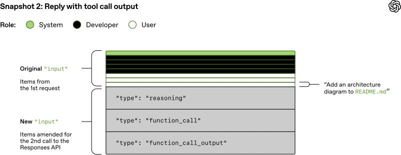

# Unrolling the Codex agent loop

Source: https://openai.com/index/unrolling-the-codex-agent-loop/
Date: January 23, 2026
By Michael Bolin, Member of the Technical Staff

This file is the local high-fidelity article capture. Use it when you want the original progression of the post plus the SVGs inline in article order.

## Contents

- The agent loop
- Model inference
- Building the initial prompt
- The first turn
- Performance considerations
- Coming next
- Acknowledgments

[Codex CLI](https://developers.openai.com/codex/cli) is our cross-platform local software agent, designed to produce high-quality, reliable software changes while operating safely and efficiently on your machine. We’ve learned a tremendous amount about how to build a world-class software agent [since we first launched the CLI in April](https://openai.com/index/introducing-o3-and-o4-mini/). To unpack those insights, this is the first post in an ongoing series where we’ll explore various aspects of how Codex works, as well as hard-earned lessons. (For an even more granular view on how the Codex CLI is built, check out our open source repository at [https://github.com/openai/codex](https://github.com/openai/codex). Many of the finer details of our design decisions are memorialized in GitHub issues and pull requests if you’d like to learn more.)

To kick off, we’ll focus on the agent loop, which is the core logic in Codex CLI that is responsible for orchestrating the interaction between the user, the model, and the tools the model invokes to perform meaningful software work. We hope this post gives you a good view into the role our agent (or “harness”) plays in making use of an LLM.

Before we dive in, a quick note on terminology: at OpenAI, “Codex” encompasses a suite of software agent offerings, including Codex CLI, Codex Cloud, and the Codex VS Code extension. This post focuses on the Codex harness, which provides the core agent loop and execution logic that underlies all Codex experiences and is surfaced through the Codex CLI. For ease here, we’ll use the terms “Codex” and “Codex CLI” interchangeably.

## The agent loop

At the heart of every AI agent is something called “the agent loop.” A simplified illustration of the agent loop looks like this:



To start, the agent takes input from the user to include in the set of textual instructions it prepares for the model known as a prompt.

The next step is to query the model by sending it our instructions and asking it to generate a response, a process known as inference. During inference, the textual prompt is first translated into a sequence of input [tokens](https://platform.openai.com/docs/concepts#tokens)—integers that index into the model’s vocabulary. These tokens are then used to sample the model, producing a new sequence of output tokens.

The output tokens are translated back into text, which becomes the model’s response. Because tokens are produced incrementally, this translation can happen as the model runs, which is why many LLM-based applications display streaming output. In practice, inference is usually encapsulated behind an API that operates on text, abstracting away the details of tokenization.

As the result of the inference step, the model either (1) produces a final response to the user’s original input, or (2) requests a tool call that the agent is expected to perform (e.g., “run `ls` and report the output”). In the case of (2), the agent executes the tool call and appends its output to the original prompt. This output is used to generate a new input that’s used to re-query the model; the agent can then take this new information into account and try again.

This process repeats until the model stops emitting tool calls and instead produces a message for the user (referred to as an assistant message in OpenAI models). In many cases, this message directly answers the user’s original request, but it may also be a follow-up question for the user.

Because the agent can execute tool calls that modify the local environment, its “output” is not limited to the assistant message. In many cases, the primary output of a software agent is the code it writes or edits on your machine. Nevertheless, each turn always ends with an assistant message—such as “I added the `architecture.md` you asked for”—which signals a termination state in the agent loop. From the agent’s perspective, its work is complete and control returns to the user.

The journey from user input to agent response shown in the diagram is referred to as one turn of a conversation (a thread in Codex). Though this conversation turn can include many iterations between the model inference and tool calls. Every time you send a new message to an existing conversation, the conversation history is included as part of the prompt for the new turn, which includes the messages and tool calls from previous turns:


This means that as the conversation grows, so does the length of the prompt used to sample the model. This length matters because every model has a context window, which is the maximum number of tokens it can use for one inference call. Note this window includes both input and output tokens. As you might imagine, an agent could decide to make hundreds of tool calls in a single turn, potentially exhausting the context window. For this reason, context window management is one of the agent’s many responsibilities. Now, let’s dive in to see how Codex runs the agent loop.

## Model inference

The Codex CLI sends HTTP requests to the [Responses API](https://platform.openai.com/docs/api-reference/responses) to run model inference. We’ll examine how information flows through Codex, which uses the Responses API to drive the agent loop.

The Responses API endpoint that the Codex CLI uses is [configurable](https://developers.openai.com/codex/config-advanced#custom-model-providers), so it can be used with any endpoint that [implements the Responses API](https://www.openresponses.org):

- [When using ChatGPT login](https://github.com/openai/codex/blob/d886a8646cb8d3671c3029d08ae8f13fa6536899/codex-rs/core/src/model_provider_info.rs#L141) with the Codex CLI, it uses `https://chatgpt.com/backend-api/codex/responses` as the endpoint
- [When using API-key authentication](https://github.com/openai/codex/blob/d886a8646cb8d3671c3029d08ae8f13fa6536899/codex-rs/core/src/model_provider_info.rs#L143) with OpenAI hosted models, it uses `https://api.openai.com/v1/responses` as the endpoint
- When running Codex CLI with `--oss` to use [gpt-oss](https://openai.com/index/introducing-gpt-oss/) with [ollama 0.13.4+](https://github.com/openai/codex/pull/8798) or [LM Studio 0.3.39+](https://lmstudio.ai/blog/openresponses), it defaults to `http://localhost:11434/v1/responses` running locally on your computer
- Codex CLI can be used with the Responses API hosted by a cloud provider such as Azure

Let’s explore how Codex creates the prompt for the first inference call in a conversation.

### Building the initial prompt

As an end user, you don’t specify the prompt used to sample the model verbatim when you query the Responses API. Instead, you specify various input types as part of your query, and the Responses API server decides how to structure this information into a prompt that the model is designed to consume. You can think of the prompt as a “list of items”; this section will explain how your query gets transformed into that list.

In the initial prompt, every item in the list is associated with a role. The `role` indicates how much weight the associated content should have and is one of the following values (in decreasing order of priority): `system`, `developer`, `user`, `assistant`.

The [Responses API](https://platform.openai.com/docs/api-reference/responses/create) takes a JSON payload with many parameters. We’ll focus on these three:

- [`instructions`](https://platform.openai.com/docs/api-reference/responses/create#responses_create-instructions): system (or developer) message inserted into the model’s context
- [`tools`](https://platform.openai.com/docs/api-reference/responses/create#responses_create-tools): a list of tools the model may call while generating a response
- [`input`](https://platform.openai.com/docs/api-reference/responses/create#responses_create-input): a list of text, image, or file inputs to the model

In Codex, the `instructions` field is read from the [`model_instructions_file`](https://github.com/openai/codex/blob/338f2d634b2360ef3c899cac7e61a22c6b49c94f/codex-rs/core/src/config/mod.rs#L1474-L1483) in `~/.codex/config.toml`, if specified; otherwise, [the `base_instructions` associated with a model](https://github.com/openai/codex/blob/338f2d634b2360ef3c899cac7e61a22c6b49c94f/codex-rs/core/src/codex.rs#L279-L288) are used. Model-specific instructions live in the Codex repo and are bundled into the CLI (e.g., [`gpt-5.2-codex_prompt.md`](https://github.com/openai/codex/blob/e958d0337e98f6398771917867d7de689dab3b7a/codex-rs/core/gpt-5.2-codex_prompt.md)).

The `tools` field is a list of tool definitions that conform to a schema defined by the Responses API. For Codex, this includes tools that are provided by the Codex CLI, tools that are provided by the Responses API that should be made available to Codex, as well as tools provided by the user, usually via MCP servers:

```javascript
[
  // Codex's default shell tool for spawning new processes locally.
  {
    "type": "function",
    "name": "shell",
    "description": "Runs a shell command and returns its output...",
    "strict": false,
    "parameters": {
      "type": "object",
      "properties": {
        "command": {"type": "array", "description": "The command to execute", ...},
        "workdir": {"description": "The working directory...", ...},
        "timeout_ms": {"description": "The timeout for the command...", ...},
        ...
      },
      "required": ["command"],
    }
  }

  // Codex's built-in plan tool.
  {
    "type": "function",
    "name": "update_plan",
    "description": "Updates the task plan...",
    "strict": false,
    "parameters": {
      "type": "object",
      "properties": {"plan":..., "explanation":...},
      "required": ["plan"]
    }
  },

  // Web search tool provided by the Responses API.
  {
    "type": "web_search",
    "external_web_access": false
  },

  // MCP server for getting weather as configured in the
  // user's ~/.codex/config.toml.
  {
    "type": "function",
    "name": "mcp__weather__get-forecast",
    "description": "Get weather alerts for a US state",
    "strict": false,
    "parameters": {
      "type": "object",
      "properties": {"latitude": {...}, "longitude": {...}},
      "required": ["latitude", "longitude"]
    }
  }
]
```

Finally, the `input` field of the JSON payload is a list of items. Codex [inserts the following items](https://github.com/openai/codex/blob/99f47d6e9a3546c14c43af99c7a58fa6bd130548/codex-rs/core/src/codex.rs#L1387-L1415) into the `input` before adding the user message:

1. A message with `role=developer` that describes the sandbox that applies only to the Codex-provided `shell` tool defined in the `tools` section. That is, other tools, such as those provided from MCP servers, are not sandboxed by Codex and are responsible for enforcing their own guardrails.

The message is built from a template where the key pieces of content come from snippets of Markdown bundled into the Codex CLI, such as [`workspace_write.md`](https://github.com/openai/codex/blob/1fc72c647fd52e3e73d4309c3b568d4d5fe012b5/codex-rs/protocol/src/prompts/permissions/sandbox_mode/workspace_write.md) and [`on_request.md`](https://github.com/openai/codex/blob/1fc72c647fd52e3e73d4309c3b568d4d5fe012b5/codex-rs/protocol/src/prompts/permissions/approval_policy/on_request.md):

```text
<permissions instructions>
  - description of the sandbox explaining file permissions and network access
  - instructions for when to ask the user for permissions to run a shell command
  - list of folders writable by Codex, if any
</permissions instructions>
```

2. (Optional) A message with `role=developer` whose contents are the `developer_instructions` value read from the user’s `config.toml` file.

3. (Optional) A message with `role=user` whose contents are the “user instructions,” which are not sourced from a single file but are [aggregated across multiple sources](https://github.com/openai/codex/blob/99f47d6e9a3546c14c43af99c7a58fa6bd130548/codex-rs/core/src/project_doc.rs#L37-L42). In general, more specific instructions appear later:

- Contents of `AGENTS.override.md` and `AGENTS.md` in `$CODEX_HOME`
- Subject to a limit (32 KiB, by default), look in each folder from the Git/project root of the `cwd` (if it it exists) up to the `cwd` itself: add the contents of any of `AGENTS.override.md`, `AGENTS.md`, or any filename specified by `project_doc_fallback_filenames in config.toml`
- If any [skills](https://developers.openai.com/codex/skills/) have been configured:
- a short preamble about skills
- the [skill metadata](https://github.com/openai/codex/blob/99f47d6e9a3546c14c43af99c7a58fa6bd130548/codex-rs/core/src/skills/model.rs#L6-L13) for each skill
- a section on [how to use skills](https://github.com/openai/codex/blob/99f47d6e9a3546c14c43af99c7a58fa6bd130548/codex-rs/core/src/skills/render.rs#L20)

4. A message with `role=user` that describes the local environment in which the agent is currently operating. This [specifies the current working directory and the user’s shell](https://github.com/openai/codex/blob/99f47d6e9a3546c14c43af99c7a58fa6bd130548/codex-rs/core/src/environment_context.rs#L51-L71):

```text
<environment_context>
  <cwd>/Users/mbolin/code/codex5</cwd>
  <shell>zsh</shell>
</environment_context>
```

Once Codex has done all of the above computation to initialize the `input`, it appends the user message to start the conversation.

The previous examples focused on the content of each message, but note that each element of `input` is a JSON object with `type`, [`role`](https://www.reddit.com/r/OpenAI/comments/1hgxcgi/what_is_the_purpose_of_the_new_developer_role_in/), and `content` as follows:

```json
{
  "type": "message",
  "role": "user",
  "content": [
    {
      "type": "input_text",
      "text": "Add an architecture diagram to the README.md"
    }
  ]
}
```

Once Codex builds up the full JSON payload to send to the Responses API, it then makes the HTTP POST request with an `Authorization` header depending on how the Responses API endpoint is configured in `~/.codex/config.toml` (additional HTTP headers and query parameters are added if specified).

When an OpenAI Responses API server receives the request, it uses the JSON to derive the prompt for the model as follows (to be sure, a custom implementation of the Responses API could make a different choice):



As you can see, the order of the first three items in the prompt is determined by the server, not the client. That said, of those three items, only the content of the system message is also controlled by the server, as the `tools` and `instructions` are determined by the client. These are followed by the `input` from the JSON payload to complete the prompt.

Now that we have our prompt, we are ready to sample the model.

### The first turn

This HTTP request to the Responses API initiates the first “turn” of a conversation in Codex. The server replies with a Server-Sent Events ([SSE](https://en.wikipedia.org/wiki/Server-sent_events)) stream. The `data` of each event is a JSON payload with a `"type"` that starts with `"response"`, which could be something like this (a full list of events can be found in our [API docs](https://platform.openai.com/docs/api-reference/responses-streaming)):

```text
data: {"type":"response.reasoning_summary_text.delta","delta":"ah ", ...}
data: {"type":"response.reasoning_summary_text.delta","delta":"ha!", ...}
data: {"type":"response.reasoning_summary_text.done", "item_id":...}
data: {"type":"response.output_item.added", "item":{...}}
data: {"type":"response.output_text.delta", "delta":"forty-", ...}
data: {"type":"response.output_text.delta", "delta":"two!", ...}
data: {"type":"response.completed","response":{...}}
```

Codex [consumes the stream of events](https://github.com/openai/codex/blob/2a68b74b9bf16b64e285495c1b149d7d6ac8bdf4/codex-rs/codex-api/src/sse/responses.rs#L334-L342) and republishes them as internal event objects that can be used by a client. Events like `response.output_text.delta` are used to support streaming in the UI, whereas other events like `response.output_item.added` are transformed into objects that are appended to the `input` for subsequent Responses API calls.

Suppose the first request to the Responses API includes two `response.output_item.done` events: one with `type=reasoning` and one with `type=function_call`. These events must be represented in the `input` field of the JSON when we query the model again with the response to the tool call:

```javascript
[
  /* ... original 5 items from the input array ... */
  {
    "type": "reasoning",
    "summary": [
      "type": "summary_text",
      "text": "**Adding an architecture diagram for README.md**\n\nI need to..."
    ],
    "encrypted_content": "gAAAAABpaDWNMxMeLw..."
  },
  {
    "type": "function_call",
    "name": "shell",
    "arguments": "{\"command\":\"cat README.md\",\"workdir\":\"/Users/mbolin/code/codex5\"}",
    "call_id": "call_8675309..."
  },
  {
    "type": "function_call_output",
    "call_id": "call_8675309...",
    "output": "<p align=\"center\"><code>npm i -g @openai/codex</code>..."
  }
]
```

The resulting prompt used to sample the model as part of the subsequent query would look like this:



In particular, note how the old prompt is an exact prefix of the new prompt. This is intentional, as this makes subsequent requests much more efficient because it enables us to take advantage of prompt caching (which we’ll discuss in the next section on performance).

Looking back at our first diagram of the agent loop, we see that there could be many iterations between inference and tool calling. The prompt may continue to grow until we finally receive an assistant message, indicating the end of the turn:

```text
data: {"type":"response.output_text.done","text": "I added a diagram to explain...", ...}
data: {"type":"response.completed","response":{...}}
```

In the Codex CLI, we present the assistant message to the user and focus the composer to indicate to the user that it’s their “turn” to continue the conversation. If the user responds, both the assistant message from the previous turn, as well as the user’s new message, must be appended to the `input` in the Responses API request to start the new turn:

```javascript
[
  /* ... all items from the last Responses API request ... */
  {
    "type": "message",
    "role": "assistant",
    "content": [
      {
        "type": "output_text",
        "text": "I added a diagram to explain the client/server architecture."
      }
    ]
  },
  {
    "type": "message",
    "role": "user",
    "content": [
      {
        "type": "input_text",
        "text": "That's not bad, but the diagram is missing the bike shed."
      }
    ]
  }
]
```

Once again, because we are continuing a conversation, the length of the `input` we send to the Responses API keeps increasing:


Let’s examine what this ever-growing prompt means for performance.

### Performance considerations

You might be asking yourself, “Wait, isn’t the agent loop quadratic in terms of the amount of JSON sent to the Responses API over the course of the conversation?” And you would be right. While the Responses API does support an optional [`previous_response_id`](https://platform.openai.com/docs/api-reference/responses/create#responses_create-previous_response_id) parameter to mitigate this issue, Codex does not use it today, primarily to keep requests fully stateless and to support Zero Data Retention (ZDR) configurations.

Avoiding `previous_response_id` simplifies things for the provider of the Responses API because it ensures that every request is stateless. This also makes it straightforward to support customers who have opted into [Zero Data Retention (ZDR)](https://platform.openai.com/docs/guides/migrate-to-responses#4-decide-when-to-use-statefulness), as storing the data required to support `previous_response_id` would be at odds with ZDR. Note that ZDR customers do not sacrifice the ability to benefit from proprietary reasoning messages from prior turns, as the associated `encrypted_content` can be decrypted on the server. (OpenAI persists a ZDR customer’s decryption key, but not their data.) See PRs [#642](https://github.com/openai/codex/pull/642) and [#1641](https://github.com/openai/codex/pull/1641) for the related changes to Codex to support ZDR.

Generally, the cost of sampling the model dominates the cost of network traffic, making sampling the primary target of our efficiency efforts. This is why prompt caching is so important, as it enables us to reuse computation from a previous inference call. When we get cache hits, sampling the model is linear rather than quadratic. Our [prompt caching documentation](https://platform.openai.com/docs/guides/prompt-caching#structuring-prompts) explains this in more detail:

Cache hits are only possible for exact prefix matches within a prompt. To realize caching benefits, place static content like instructions and examples at the beginning of your prompt, and put variable content, such as user-specific information, at the end. This also applies to images and tools, which must be identical between requests.

With this in mind, let’s consider what types of operations could cause a “cache miss” in Codex:

- Changing the `tools` available to the model in the middle of the conversation.
- Changing the `model` that is the target of the Responses API request (in practice, this changes the third item in the original prompt, as it contains model-specific instructions).
- Changing the sandbox configuration, approval mode, or current working directory.

The Codex team must be diligent when introducing new features in the Codex CLI that could compromise prompt caching. As an example, our initial support for MCP tools introduced a [bug where we failed to enumerate the tools in a consistent order](https://github.com/openai/codex/pull/2611), causing cache misses. Note that MCP tools can be particularly tricky because MCP servers can change the list of tools they provide on the fly via a [`notifications/tools/list_changed`](https://modelcontextprotocol.io/specification/2025-11-25/server/tools#list-changed-notification) notification. Honoring this notification in the middle of a long conversation can cause an expensive cache miss.

When possible, we handle configuration changes that happen mid-conversation by appending a new message to `input` to reflect the change rather than modifying an earlier message:

- If the sandbox configuration or approval mode changes, we [insert](https://github.com/openai/codex/blob/99f47d6e9a3546c14c43af99c7a58fa6bd130548/codex-rs/core/src/codex.rs#L1037-L1057) a new `role=developer` message with the same format as the original `<permissions instructions>` item.
- If the current working directory changes, we [insert](https://github.com/openai/codex/blob/99f47d6e9a3546c14c43af99c7a58fa6bd130548/codex-rs/core/src/codex.rs#L1017-L1035) a new `role=user` message with the same format as the original `<environment_context>`.

We go to great lengths to ensure cache hits for performance. There’s another key resource we have to manage: the context window.

Our general strategy to avoid running out of context window is to compact the conversation once the number of tokens exceeds some threshold. Specifically, we replace the `input` with a new, smaller list of items that is representative of the conversation, enabling the agent to continue with an understanding of what has happened thus far. An early [implementation of compaction](https://github.com/openai/codex/pull/1527) required the user to manually invoke the `/compact` command, which would query the Responses API using the existing conversation plus custom instructions for [summarization](https://github.com/openai/codex/blob/e2c994e32a31415e87070bef28ed698968d2e549/SUMMARY.md). Codex used the resulting assistant message containing the summary [as the new `input`](https://github.com/openai/codex/blob/e2c994e32a31415e87070bef28ed698968d2e549/codex-rs/core/src/codex.rs#L1424) for subsequent conversation turns.

Since then, the Responses API has evolved to support a special [`/responses/compact` endpoint](https://platform.openai.com/docs/guides/conversation-state#compaction-advanced) that performs compaction more efficiently. It returns [a list of items](https://platform.openai.com/docs/api-reference/responses/compacted-object) that can be used in place of the previous `input` to continue the conversation while freeing up the context window. This list includes a special `type=compaction` item with an opaque `encrypted_content` item that preserves the model’s latent understanding of the original conversation. Now, Codex automatically uses this endpoint to compact the conversation when the [`auto_compact_limit`](https://github.com/openai/codex/blob/99f47d6e9a3546c14c43af99c7a58fa6bd130548/codex-rs/core/src/codex.rs#L2558-L2560) is exceeded.

## Coming next

We’ve introduced the Codex agent loop and walked through how Codex crafts and manages its context when querying a model. Along the way, we highlighted practical considerations and best practices that apply to anyone building an agent loop on top of the Responses API.

While the agent loop provides the foundation for Codex, it’s only the beginning. In upcoming posts, we’ll dig into the CLI’s architecture, explore how tool use is implemented, and take a closer look at Codex’s sandboxing model.

## Acknowledgments

Special thanks to the entire team that built the Codex CLI.
