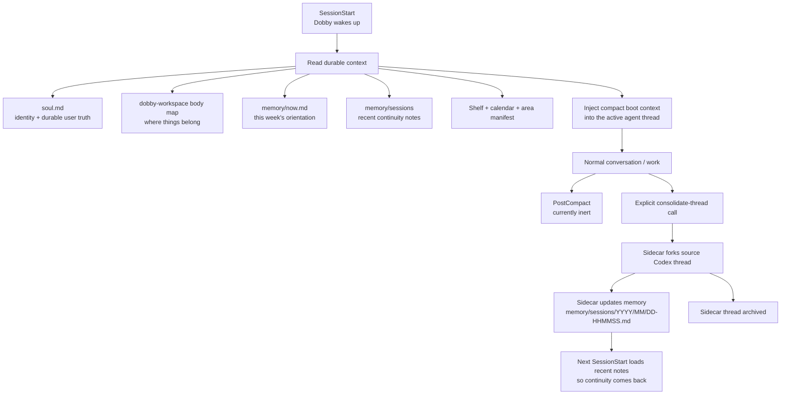

# Dobby lifecycle hooks

Lifecycle details live here so the shared `dobby-workspace` body map can stay
focused on workspace meaning instead of becoming a hook runbook.

## Simple lifecycle map



Short version:

- **SessionStart is read/inject.** It gathers the current Dobby context and
  gives the agent enough memory to continue well.
- **PostCompact is inert for now.** It does not record events, launch sidecars,
  or write memory.
- **SessionEnd is handoff-only.** It records shutdown metadata without launching
  a second consolidation sidecar.
- **`memory/sessions` is the bridge.** End-of-session notes become part of the
  next boot context.
- **`memory/now.md`, area files, and `soul.md` are promotion targets only.**
  They should be updated when something durable changes, not for every session.

## Boot

Boot context is delivered by the repo's `SessionStart` hook
(`scripts/hooks/session_start.py`), which delegates to the skill-bundled hook.
The hook reads the shared `dobby-workspace` body map, `now.md`,
`state/shelf.json`, walks `memory/areas/`, reads recent session notes, and calls
the `dobby-calendar` skill CLI for upcoming events.

What boot context should include:

1. `soul.md` / identity context through the runtime system-prompt mechanism.
2. Shared `dobby-workspace/references/body-map.md` as the common Dobby body map.
3. `memory/now.md`.
4. Recent session notes: last 3 plus notes from the last 7 days, capped at 10.
5. Shelf snapshot.
6. Calendar snapshot for the next 2 days.
7. Area manifest.

Operational limits:

- filename format: `memory/sessions/YYYY/MM/DD-HHMMSS.md` with numeric suffixes on collision
- shared body-map boot cap: 12000 chars
- boot context: last 3 notes plus notes from the last 7 days, capped at 10
- per-note boot cap: 2500 chars
- total recent-session boot block cap: 12000 chars

## Session notes

Session continuity lives in `memory/sessions/YYYY/MM/DD-HHMMSS.md`, not in
`memory/now.md`.

## Consolidate-thread primitive

`scripts/hooks/consolidate-thread` is the reusable memory-consolidation
primitive.

It takes a source Codex/App Server thread, forks it into a sidecar thread, runs
a memory-consolidation prompt inside that sidecar, and lets the forked Dobby
agent update workspace memory directly.

It is intentionally policy-free:

- it does not compact the source thread
- it does not archive or delete the source thread
- it does not decide when cleanup should happen
- it does not use transcript summarization
- after the sidecar turn finishes, it archives the sidecar thread it created
- it may write `memory/sessions/...` and may promote durable facts according to
  the shared `dobby-workspace` body map

Supported direct invocation shape:

```bash
$HOME/.agents/skills-source/owned/dobby-lifecycle/scripts/hooks/consolidate-thread \
  --workspace-root /Users/dobby/GitHub/adi \
  --thread-id <codex-thread-id>
```

Optional caller fields:

- `--source-turn-id <turn-id>`
- `--source-label <manual|post-compact|codexclaw-end-chat|...>`
- `--note-path <absolute-or-workspace-relative-path>`
- `--instruction <extra caller instruction>`
- `--job <payload.json>` for existing hook job records

PreCompact is intentionally not enabled for Dobby workspaces.

PostCompact is intentionally inert for now. It drains hook stdin and exits `0`.
It does not record a compaction event, launch `consolidate-thread`, or write
memory. Memory consolidation is an explicit primitive until a separate caller
policy is chosen.

SessionEnd writes a compact record under `tmp/hooks/session-end/` and exits
successfully. It does not launch a consolidation sidecar because Codex
continuity is handled only by explicit `consolidate-thread` calls.

Stored notes stay plain prose. Do not add templates/frontmatter. Durable
decisions still get promoted to `now.md`, area canon, or `soul.md` as
appropriate.

## Post-compaction hook

Repo-local `scripts/hooks/post_compact.py` wrappers delegate to the
skill-bundled `scripts/hooks/post-compact`. For now this hook is deliberately
boring:

1. Drain stdin.
2. Exit `0`.
3. Write no files.
4. Launch no workers.

Canonical IDs for PostCompact:

- `source_thread_id` — Codex/App Server thread being compacted
- `source_turn_id` — current turn if provided by the runtime

Do not put Dobby memory synthesis directly in the shared `~/.agents` dispatcher.
The dispatcher routes lifecycle events; this skill owns Dobby-specific behavior.
