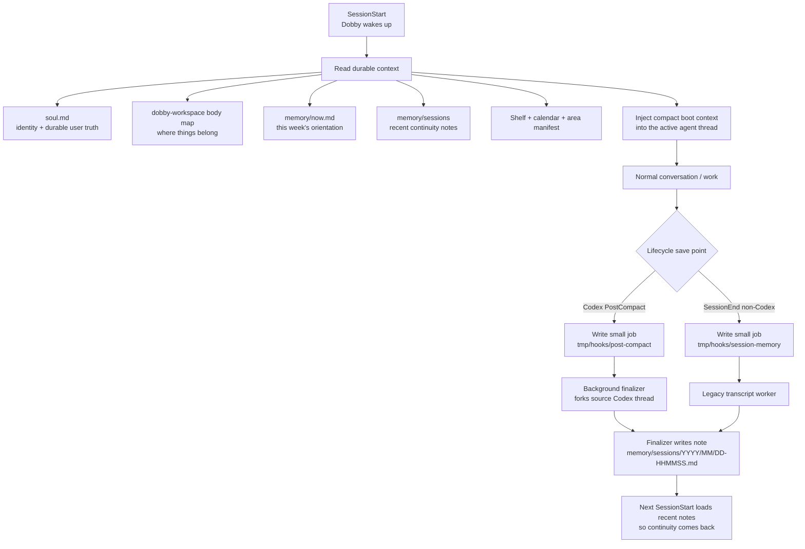

# Dobby lifecycle hooks

Lifecycle details live here so the shared `dobby-workspace` body map can stay
focused on workspace meaning instead of becoming a hook runbook.

## Simple lifecycle map

Short version:

- **SessionStart is read/inject.** It gathers the current Dobby context and
  gives the agent enough memory to continue well.
- **PostCompact / SessionEnd are write-back.** They preserve what would be lost
  by writing a compact session note under `memory/sessions/...`.
- **`memory/sessions` is the bridge.** End-of-session notes become part of the
  next boot context.
- **`memory/now.md`, area files, and `soul.md` are promotion targets only.**
  They should be updated when something durable changes, not for every session.

## Boot

Boot context is delivered by the repo's `SessionStart` hook
(`scripts/hooks/session_start.py`), which delegates to the skill-bundled hook.
The hook reads the shared `dobby-workspace` body map, `now.md`,
`state/shelf.json`, walks `memory/areas/`, reads recent session notes, and calls
the `dobby-calendar` skill CLI for upcoming events.

What boot context should include:

1. `soul.md` / identity context through the runtime system-prompt mechanism.
2. Shared `dobby-workspace/references/body-map.md` as the common Dobby body map.
3. `memory/now.md`.
4. Recent session notes: last 3 plus notes from the last 7 days, capped at 10.
5. Shelf snapshot.
6. Calendar snapshot for the next 2 days.
7. Area manifest.

Operational limits:

- filename format: `memory/sessions/YYYY/MM/DD-HHMMSS.md` with numeric suffixes on collision
- shared body-map boot cap: 12000 chars
- boot context: last 3 notes plus notes from the last 7 days, capped at 10
- per-note boot cap: 2500 chars
- total recent-session boot block cap: 12000 chars

## Session notes

Session continuity lives in `memory/sessions/YYYY/MM/DD-HHMMSS.md`, not in
`memory/now.md`.

PreCompact is intentionally not enabled for Dobby workspaces. For Codex runtimes, continuity finalization is owned by PostCompact. The
PostCompact hook records a small job under `tmp/hooks/post-compact/` and starts
`scripts/hooks/codex-finalize-session` in the background. That worker starts a
local `codex app-server`, forks the source thread, injects a finalization prompt
that points to the shared `dobby-workspace` body map, and lets the forked agent
write directly to `memory/sessions/...`. The worker starts its forked app-server
without special lifecycle environment flags for now. The Stop hook is
intentionally not disabled, so memory notes written by the sidecar can still be
committed by normal repo automation.

`DOBBY_CODEX_FINALIZER_DISABLED=1` remains a manual kill switch to prevent hooks
from launching Codex finalizer workers during debugging.

For non-Codex runtimes, `scripts/hooks/write-session-note` is the legacy
transcript path. It renders the transcript when the runtime provides
`transcript_path`, passes it to a note-generation placeholder, and writes one
new note when a generator returns text.

Neither worker blocks session shutdown. If finalization fails, the worker logs
to stderr/`tmp/hooks/session-finalizer/worker.log` for Codex or
`tmp/hooks/session-memory/worker.log` for the legacy worker and exits `0`.

Stored notes stay plain prose. Do not add templates/frontmatter. Durable
decisions still get promoted to `now.md`, area canon, or `soul.md` as
appropriate.

For smoke tests of the legacy worker only, `DOBBY_SESSION_MEMORY_FAKE_NOTE` or
`--fake-note` can supply the note body. To temporarily prevent the Codex worker
from launching from hooks, set `DOBBY_CODEX_FINALIZER_DISABLED=1`.

## Post-compaction hook

Repo-local `scripts/hooks/post_compact.py` wrappers delegate to the
skill-bundled `scripts/hooks/post-compact`. For Codex runtimes, this is the
simple sidecar design:

1. PostCompact writes one compact job record under `tmp/hooks/post-compact/`.
2. It starts `codex-finalize-session` in the background.
3. The sidecar forks the source Codex thread.
4. The sidecar writes one concise session note under `memory/sessions/...`.
5. Stop still runs normally and commits any resulting memory note.

Canonical IDs for PostCompact:

- `source_thread_id` — Codex/App Server thread being compacted
- `source_turn_id` — current turn if provided by the runtime

Do not put Dobby memory synthesis directly in the shared `~/.agents` dispatcher.
The dispatcher routes lifecycle events; this skill owns Dobby-specific behavior.
